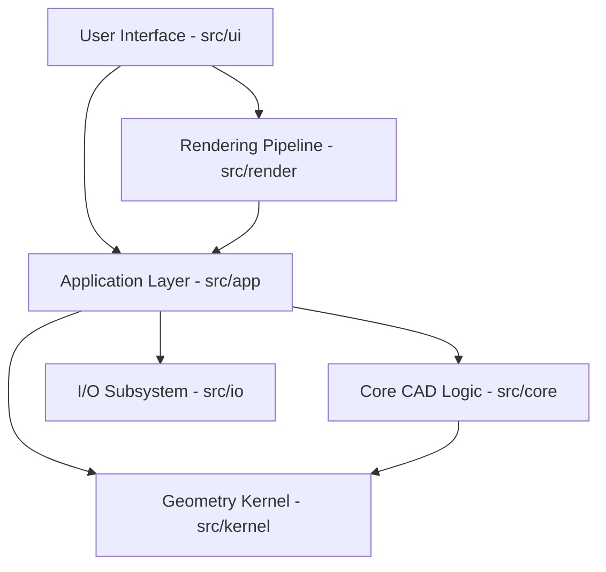
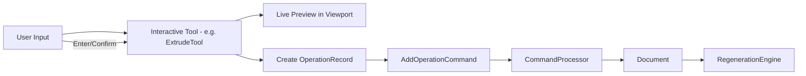

# OneCAD Architecture

This document describes the high-level architecture of OneCAD, an open-source 3D CAD application.

## System Overview

OneCAD follows a modular architecture where the application logic, geometric kernel, rendering, and user interface are decoupled. The system is built on top of **Qt 6** for UI and rendering, and **OpenCASCADE (OCCT)** for the geometry kernel.



---

## Core Modules

### 1. Application Layer (`src/app`)
The Application Layer serves as the central coordinator and manages the document lifecycle.

*   **`Application`**: Singleton managing global state and subsystem initialization.
*   **`Document`**: The "Single Source of Truth". It owns:
    *   **Sketches**: 2D parametric entities.
    *   **Bodies**: 3D solid geometry (`TopoDS_Shape`).
    *   **Operation History**: A sequence of `OperationRecord` objects representing the parametric design.
    *   **ElementMap**: The topological naming system.
*   **`RegenerationEngine`**: Rebuilds the 3D model by replaying the operation history. It uses a `DependencyGraph` to ensure operations are executed in the correct order.
*   **`CommandProcessor`**: Implements the Command Pattern for Undo/Redo functionality.

### 2. Core CAD Logic (`src/core`)
Contains the geometric algorithms and logic independent of the UI.

*   **Sketch Engine (`src/core/sketch`)**:
    *   Manages 2D entities (Points, Lines, Arcs, Circles, Ellipses).
    *   Integrates **PlaneGCS** for geometric constraint solving (Coincident, Parallel, Distance, etc.).
    *   Tracks Degrees of Freedom (DOF).
*   **Loop Detection (`src/core/loop`)**:
    *   Analyzes 2D sketch geometry to find closed, non-intersecting regions.
    *   Converts sketch curves into `TopoDS_Face` objects suitable for solid modeling operations.
*   **Modeling Operations (`src/core/modeling`)**:
    *   Wraps OCCT algorithms for Extrude, Revolve, Fillet, Chamfer, Shell, and Boolean operations.

### 3. Geometry Kernel & Topological Naming (`src/kernel`)
OneCAD uses **OpenCASCADE** as its underlying geometry kernel but adds a sophisticated topological naming layer.

*   **`ElementMap`**: 
    *   Provides persistent IDs for topological elements (Faces, Edges, Vertices).
    *   Tracks these elements through modeling operations using geometric and topological descriptors.
    *   Crucial for parametric stability (e.g., ensuring a fillet doesn't break when the base sketch is modified).
    *   **Descriptor Matching**: Uses properties like center of mass, area/length, normal/tangent, and adjacency hashes to identify "the same" face across model rebuilds.

### 4. Rendering Pipeline (`src/render`)
Handles the visualization of the CAD model using Qt's RHI (OpenGL/Metal/Vulkan).

*   **`SceneMeshStore`**: Manages the tessellated meshes for 3D bodies and 2D sketch curves.
*   **`BodyRenderer`**: Specialized renderer for solid geometry, supporting different shading modes, edge highlighting, and a Hemispherical Lighting model.
*   **`TessellationCache`**: Optimizes performance by caching triangulated geometry.
*   **Pipeline**: `TopoDS_Shape` -> `BRepMesh_IncrementalMesh` -> `SceneMeshStore` -> `BodyRenderer` (GPU).

### 5. User Interface (`src/ui`)
The UI is built with Qt Widgets and follows a modern, tool-centric design.

*   **`MainWindow`**: Main container for all UI components.
*   **`Viewport`**: The 3D interaction area, handling mouse input and selection.
*   **`ModelingToolManager`**: Manages the lifecycle of interactive tools (ExtrudeTool, FilletTool, etc.).
*   **`ModelNavigator`**: Provides a hierarchical view of the document content.
*   **`HistoryPanel`**: Displays and allows editing of the parametric operation sequence.

### 6. I/O Subsystem (`src/io`)
Handles data persistence and exchange.

*   **`.onecad` Format**: A ZIP-based package containing:
    *   `manifest.json`: Project metadata.
    *   `sketches.json`: All 2D sketch data.
    *   `history.json`: The parametric operation sequence.
    *   `elementmap.dat`: Persistent topological IDs.
    *   `bodies/*.brep`: Binary OpenCASCADE geometry (for fast loading/caching).
*   **STEP Support**: Import and export of industry-standard STEP files.

---

## Command & Tool Architecture

OneCAD uses a strict separation between user interaction and document modification.



*   **Interactive Tools**: Handle mouse events, raycasting for selection, and coordinate transformation. They maintain a transient state for live previewing.
*   **Command Pattern**: All document changes are encapsulated in `Command` objects. This ensures that the Undo/Redo stack remains consistent and that every modification is traceable.

---

## Key Data Flows

### 1. Parametric Regeneration
When a sketch is modified, the system triggers a regeneration:

```mermaid
sequenceDiagram
    participant UI as History UI / Viewport
    participant DOC as Document
    participant REGEN as RegenerationEngine
    participant SKETCH as Sketch / Solver
    participant LOOP as LoopDetector
    participant OCCT as OCCT Kernel
    participant EMAP as ElementMap

    UI->>DOC: Modify Sketch/Parameter
    DOC->>REGEN: triggerRegeneration()
    REGEN->>SKETCH: solve()
    REGEN->>LOOP: detectLoops()
    LOOP-->>REGEN: Face Regions
    loop For each Operation in History
        REGEN->>OCCT: Execute Modeling Op
        OCCT-->>REGEN: TopoDS_Shape
        REGEN->>EMAP: update(BooleanAlgo)
        EMAP-->>REGEN: Map Updated
    end
    REGEN->>DOC: updateBodyShapes()
    DOC->>UI: Signals Updated
```

### 2. Topological Naming (ElementMap)
How OneCAD maintains references to specific faces even after the model is rebuilt:

```mermaid
graph LR
    subgraph "Op 1: Extrude"
        S1[Sketch] --> E1[Extrude]
        E1 --> B1[Body V1]
        B1 --> F1[Face ID: "face-1"]
    end
    subgraph "Op 2: Fillet"
        F1 --> FIL[Fillet]
        FIL --> B2[Body V2]
    end
    subgraph "Regeneration"
        S2[Sketch Modified] --> E2[Extrude]
        E2 --> B1new[Body V1']
        B1new -- "Descriptor Match" --> F1new[Face ID: "face-1"]
        F1new --> FIL2[Fillet]
    end
```

---

## Architectural Principles

1.  **Immutability of History**: Operations are recorded and replayed. The 3D model is a derived state of the sketch data and operation sequence.
2.  **Topological Persistence**: All user selections (on faces/edges) are stored as persistent `ElementId`s via the `ElementMap`, not as raw pointers or transient indices.
3.  **Decoupled Rendering**: The rendering data (`SceneMeshStore`) is kept separate from the geometric data (`TopoDS_Shape`) to allow for asynchronous tessellation and UI responsiveness.
4.  **Command-Based Interaction**: All modifications to the document go through the `CommandProcessor`, enabling robust Undo/Redo and future collaboration features.
5.  **Fail-Safe Regeneration**: The `RegenerationEngine` can handle partial failures. If one operation fails, subsequent independent operations can still be attempted, and the user is notified through the UI.
