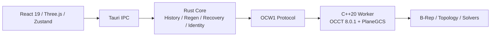
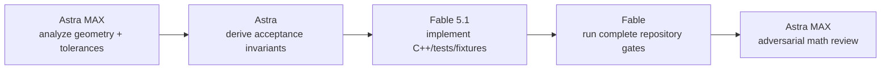
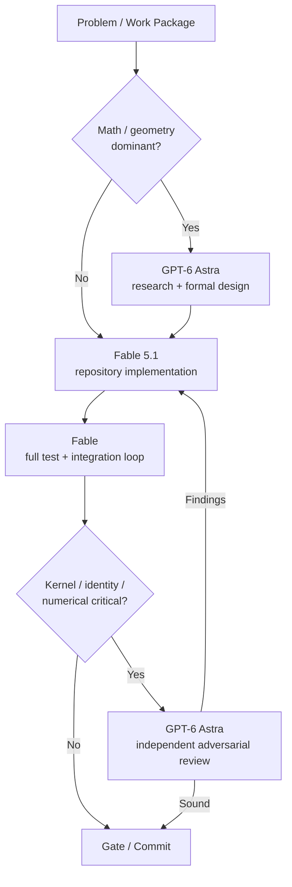

# Conclusion

For **OneCAD**, I would **not choose one model globally**.

The strongest setup is:

> **Fable 5.1 = implementation/orchestration engineer**
> **GPT-6 Astra = geometry/math/research architect + critical reviewer**

For normal repository work, I would give roughly **65–70% of engineering execution to Fable 5.1** and **30–35% of high-value reasoning/review to Astra**.

For mathematically difficult kernel work, I would invert that:

> **Astra designs the algorithm and invariants → Fable implements it → Astra adversarially reviews the result.**

That split fits both the published benchmark evidence and the actual structure of OneCAD.

---

# 1. What OneCAD has become

OneCAD is no longer a typical Tauri/React desktop project.

It is essentially a **small CAD platform with its own parametric modeling architecture**:

The repository explicitly enforces this four-layer separation. The frontend never sits on the kernel path; Rust owns regeneration, recovery and authoritative projection, while C++/OCCT owns geometric operations. The OCW1 protocol is treated as normative and implemented in both Rust and C++.

The Rust side is itself a sizable workspace with separate crates for `onecad-core`, `onecad-protocol`, worker stubbing/chaos testing, headless regeneration, kernel benchmarking, component libraries and component ingestion.

This matters because **different parts of OneCAD require genuinely different kinds of intelligence**.

---

# 2. The hardest parts of OneCAD

I would divide the intellectual difficulty into five categories.

| Area                                |    Difficulty | Type of reasoning                                                |
| ----------------------------------- | ------------: | ---------------------------------------------------------------- |
| CAD geometry/kernel                 |   **Extreme** | Computational geometry, differential geometry, numerical methods |
| Topological identity / history      |   **Extreme** | Algorithms, invariants, state evolution                          |
| Regen / protocol / worker lifecycle | **Very high** | Distributed-state reasoning, concurrency, failure handling       |
| Application architecture            | **Very high** | Large-codebase understanding                                     |
| Frontend / interaction / QA         |          High | Software engineering + visual/interaction reasoning              |

The most unusual part is that OneCAD has moved beyond simply calling OCCT operations.

You already have things such as:

* persistent topology identity,
* typed references,
* topology rebinding,
* `NeedsRepair`,
* region identity,
* analytic sketch intersections,
* tolerance policies,
* fillet/chamfer validation,
* deterministic regeneration,
* worker crash/wedge recovery,
* checkpoint fencing,
* protocol fixtures,
* preview/commit equivalence.

For example, the sketch/profile pipeline preserves analytic lines, circles, arcs and ellipses, refines intersections with `Geom2dAPI_InterCurveCurve`, handles periodic parameter intervals, and deliberately refuses coincident/overlapping supports rather than silently inventing topology.

That is exactly where model specialization starts to matter.

---

# 3. GPT-6 Astra vs Fable 5.1 — what the evidence says

The most important benchmark differences are these.

| Benchmark                    | GPT-6 Astra | Fable 5.1 | Interpretation for OneCAD                                  |
| ---------------------------- | ----------: | --------: | ---------------------------------------------------------- |
| **FrontierMath Tier 4**      |   **97.6%** |     87.8% | Huge Astra advantage for difficult mathematics             |
| **Terminal-Bench Science**   |   **64.6%** |     52.6% | Astra stronger on scientific workflows                     |
| GPQA Diamond                 |   **96.0%** |     93.7% | Astra slightly stronger scientific reasoning               |
| **BenchCAD**                 |   **95.9%** |     84.3% | Very interesting Astra advantage for CAD-related reasoning |
| Terminal-Bench 4             |   **57.9%** |     55.8% | Close, Astra ahead                                         |
| DeepSWE 1.1                  |   **74.1%** |     67.4% | Astra ahead on difficult software tasks                    |
| FrontierCode Extended        |   **64.5%** |     63.6% | Essentially close                                          |
| Humanity's Last Exam + tools |       57.2% | **65.0%** | Fable stronger on some broad research/problem-solving      |

These particular head-to-head numbers come from OpenAI's launch evaluations, so I would treat very small gaps as directional rather than absolute. The very large gaps, particularly **FrontierMath** and **BenchCAD**, are much more interesting. ([OpenAI][1])

Independent Artificial Analysis results make the story more nuanced. In the latest Intelligence Index v4.3, **Astra and Fable 5.1 are tied at 53**, ahead of most other frontier models. ([Artificial Analysis][2])

So this is **not**:

> Astra smart, Fable less smart.

It is closer to:

> Astra has a particularly strong **formal/scientific/mathematical reasoning profile**.
> Fable has a particularly strong **long-horizon agentic engineering profile**.

---

# 4. Complex mathematics: clear advantage to Astra

This is the area where I would make the strongest recommendation.

## Use GPT-6 Astra for the mathematical core

Especially for:

| OneCAD problem                       | Preferred model |
| ------------------------------------ | --------------- |
| Curve/curve intersections            | **Astra**       |
| Robust geometric predicates          | **Astra**       |
| Tolerance derivation                 | **Astra**       |
| Differential geometry                | **Astra**       |
| Surface normal / curvature reasoning | **Astra**       |
| Fillet feasibility mathematics       | **Astra**       |
| Blend continuity G0/G1/G2            | **Astra**       |
| Sweep framing / torsion              | **Astra**       |
| Loft correspondence                  | **Astra**       |
| Constraint solver mathematics        | **Astra**       |
| Numerical conditioning               | **Astra**       |
| Optimization algorithms              | **Astra**       |
| Geometric invariants / proofs        | **Astra**       |

Astra's **97.6% FrontierMath Tier 4** result is unusually strong evidence here. OpenAI also reports it substantially ahead of Fable 5.1 on scientific terminal tasks. ([openai.com][1])

BenchCAD deserves attention too. Astra scores **95.9% versus 84.3% for Fable 5.1**. BenchCAD is not the same thing as implementing a production B-Rep kernel—it reconstructs geometry using CAD code—but it is nevertheless unusually relevant evidence compared with generic programming benchmarks. ([openai.com][1])

---

# 5. Your current WP-G is almost a textbook Astra task

Your current repository state describes this:

> cylinder-cylinder tee and oblique elliptical rim fillets are being rejected by OneCAD's `1e-9` section validation gate at approximately `1e-3` residual, **despite OCCT successfully constructing them**.

This is not primarily a coding problem.

It is a **numerical geometry policy problem**.

You need to reason about things such as:

$$
\epsilon = f(
L,
R,
\kappa,
\text{OCCT tolerance},
\text{machine epsilon},
\text{construction history}
)
$$

rather than effectively saying:

$$
\epsilon = 10^{-9}
$$

for everything.

### I would assign WP-G like this

This should produce something much better than asking either model:

> Fix the fillet test.

Astra should instead answer questions such as:

**What property are we actually trying to prove?**

**Should error be absolute, relative, curvature-relative or tolerance-relative?**

**Which residuals should scale under similarity transforms?**

**Which predicates should detect topology failure versus numerical approximation?**

**What degeneracies need explicit classes rather than a single epsilon?**

Then Fable can turn that into robust production code.

---

# 6. Where Fable 5.1 is better suited

OneCAD also contains huge amounts of work where **deep mathematics isn't the bottleneck**.

This is where I would choose Fable.

Anthropic specifically positions Fable 5.1 for **long-running agentic coding, large codebase features, root-cause debugging and multi-stage implementation**. Its recommended `xhigh` effort is explicitly aimed at coding/agent tasks lasting more than 30 minutes. ([Claude Platform][3])

Your repository is unusually good evidence for this.

The recent OneCAD history already shows Fable 5.1 being used to execute very large cross-layer changes involving:

C++ worker → OCW1 schema → Rust → frontend → fixtures → adversarial reviews → thousands of tests.

And those aren't toy commits. Recent repository state records gates in the neighborhood of **186 CTest cases, 1,553 Rust tests and 5,618 frontend tests**, plus full browser E2E runs.

So I would not throw away that demonstrated working pattern.

---

# 7. Detailed OneCAD task assignment

This is the split I would actually use.

| OneCAD task                       | Primary      | Secondary / reviewer |
| --------------------------------- | ------------ | -------------------- |
| **Novel geometry algorithm**      | 🟢 **Astra** | Fable                |
| Numerical robustness              | 🟢 **Astra** | Fable                |
| Fillet/blend mathematics          | 🟢 **Astra** | Fable                |
| Sweep mathematical design         | 🟢 **Astra** | Fable                |
| Loft mathematical design          | 🟢 **Astra** | Fable                |
| PlaneGCS / constraint mathematics | 🟢 **Astra** | Fable                |
| Region/intersection algorithms    | 🟢 **Astra** | Fable                |
| Topology identity theory          | 🟢 **Astra** | Fable                |
| OCCT workaround research          | 🟢 Astra     | 🟢 Fable             |
| **Implement C++ OCCT operation**  | 🟣 **Fable** | Astra                |
| Implement Rust model/history      | 🟣 **Fable** | Astra                |
| Cross-language protocol update    | 🟣 **Fable** | Astra                |
| Worker lifecycle/concurrency      | 🟣 **Fable** | Astra                |
| Large refactor                    | 🟣 **Fable** | Astra                |
| Repository-wide migration         | 🟣 **Fable** | Astra                |
| React/Zustand frontend            | 🟣 **Fable** | Astra                |
| Three.js interaction code         | 🟣 Fable     | Astra                |
| CI / test infrastructure          | 🟣 **Fable** | Astra                |
| Regression-test expansion         | 🟣 **Fable** | Astra                |
| Property/invariant test design    | 🟢 **Astra** | Fable                |
| Adversarial kernel review         | 🟢 **Astra** | Fable                |
| Protocol completeness review      | 🟣 Fable     | Astra                |
| Architecture refactoring          | 🟣 **Fable** | Astra                |
| New platform/module architecture  | 🟣 **Fable** | Astra                |
| Algorithmic performance design    | 🟢 Astra     | Fable                |
| Profiling + implementation        | 🟣 Fable     | Astra                |
| UX implementation                 | 🟣 **Fable** | Astra                |
| Automated GUI QA                  | 🟢 Astra     | Fable                |

---

# 8. Rust architecture: mostly Fable

Your Rust layer contains difficult logic, but much of its difficulty is **state-machine complexity rather than mathematics**.

For example:

* `DocumentRuntime`,
* worker supervision,
* crash breakers,
* restored checkpoints,
* stale-preview fences,
* cancellation,
* transactional regen,
* undo/redo,
* reference persistence,
* save/reopen,
* library ingestion.

These require holding a very large number of repository-specific invariants simultaneously.

That is exactly the kind of work for which I would use **Fable 5.1 high/xhigh**.

The OneCAD architecture explicitly has a locked/unlocked/locked regeneration driver and a strict worker manager boundary.

Astra is still useful here, but primarily as an **adversarial reviewer**:

> Find a sequence of worker death + cancel + restore + stale reader events that violates the published state invariants.

That plays to Astra's abstract reasoning without asking it to own 50 files of plumbing.

---

# 9. Frontend: mostly Fable, with Astra for QA

React/Zustand implementation is not where I would spend Astra's expensive mathematical reasoning.

OneCAD's frontend stack is conventional enough:

**React 19 + Zustand 5 + Three.js + Tauri**, with Vitest, Playwright and WebdriverIO.

Fable should own:

* stores,
* components,
* tool state machines,
* IPC wiring,
* inspector UI,
* timeline behavior,
* unit/expression UI,
* test updates.

Astra becomes more attractive when the task becomes:

> Run the application and systematically find interaction failures.

Astra's computer-use results are extremely strong, including **72.6% OSWorld 2.0** and **92.7% ScreenSpot-Pro** in OpenAI's published evaluation. ([openai.com][1])

So I see Astra as a potentially very good **interactive QA engineer** for OneCAD.

---

# 10. Sweep, Loft and modeled threads

Your roadmap includes Sweep, Loft and modeled threads.

I would be very deliberate here.

### Sweep

Astra should define:

$$
T(s), N(s), B(s)
$$

and investigate whether the implementation should use Frenet frames, rotation-minimizing frames, fixed-normal frames or OCCT's own framing policy.

It should explicitly reason through:

* zero curvature,
* inflection points,
* closed paths,
* twist accumulation,
* self-intersection,
* cusp behavior,
* profile orientation.

Then Fable implements the OCCT integration.

### Loft

Astra first.

The difficult part isn't calling an OCCT loft function.

The difficult questions are:

* profile correspondence,
* seam placement,
* orientation,
* periodic profiles,
* vertex correspondence,
* continuity expectations,
* topology stability after profile edits.

Then Fable integrates that design across protocol/Rust/UI/tests.

### Modeled threads

Again:

**Astra for geometry.**

**Fable for integration.**

Helical sweeps introduce plenty of numerical and topological edge cases.

---

# 11. Topological naming / identity

This is interesting because I would use **both almost equally**.

OneCAD's current system already includes descriptor evidence, anchors, history images, sidedness, region identity and deterministic repair behavior.

This is effectively a specialized **semantic matching algorithm**.

Astra should reason about it as a mathematical/algorithmic problem:

$$
\operatorname{score}(e_\text{old},e_\text{new})
=
w_hH +
w_gG +
w_aA +
w_sS +
w_tT
$$

where features might include history lineage, geometry descriptors, anchors, adjacency, sidedness and topology class.

But Fable should probably own the actual repository change because identity touches:

C++ → protocol → Rust records → migration → recovery → frontend repair UI → save/reopen → tests.

That is precisely where Fable's long-horizon implementation advantage matters.

---

# 12. The most effective workflow

I would establish this as the standard OneCAD workflow:

This avoids the biggest mistake I see when using multiple frontier models:

**letting both models independently implement the same feature.**

That wastes context and produces competing designs.

Give them **different roles**.

---

# 13. Model effort levels

For Fable 5.1, Anthropic recommends `high` as the starting point and `xhigh`/`max` for the most capability-sensitive coding and long-running agentic work. ([Claude Platform][3])

I would use:

| Work                            | Fable effort     |
| ------------------------------- | ---------------- |
| Small frontend fix              | `medium`         |
| Normal feature                  | `high`           |
| Cross-layer feature             | `high` / `xhigh` |
| Kernel hardening implementation | `xhigh`          |
| Huge migration                  | `xhigh`          |
| Extremely difficult root cause  | `max`            |

For Astra:

| Work                            | Astra effort    |
| ------------------------------- | --------------- |
| Normal architecture review      | `high`          |
| Kernel review                   | `xhigh`         |
| Complex geometry research       | `xhigh`         |
| New mathematical algorithm      | **`max`**       |
| Tolerance/robustness derivation | **`max`**       |
| Critical adversarial review     | `xhigh` / `max` |

Astra supports `low` through `max`, with a **1.05M-token context** and **128K output**. ([OpenAI Developers][4])

---

# 14. There is also an important cost/context difference

Both models nominally cost:

**$10 / MTok input**
**$50 / MTok output**

and both have approximately **1M-token context windows**. ([OpenAI Developers][4])

But their long-repository economics differ substantially.

Fable 5.1:

**cache read = $0.25 / MTok**

and Anthropic explicitly says the entire **1M context remains at standard pricing**, even for e.g. a 900K-token request. ([Claude Platform][5])

Astra:

**cached input = $1 / MTok**, and requests exceeding **272K input tokens** are billed at **2× input/cache pricing and 1.5× output pricing** for the request. ([OpenAI Developers][4])

That is a significant advantage for **Fable as the persistent OneCAD coding agent**.

And OneCAD has enormous project context. The repository itself warns that `CURRENT_STATE.md` and `TODO.md` are thousands of lines long.

There is an interesting counterpoint: Astra is **much more token-efficient**. Artificial Analysis found Astra max using far fewer tokens and costing about **$3.26 per Intelligence Index task**, versus roughly **$7.63 for Fable 5.1 max** in their setup. ([Artificial Analysis][6])

So:

**persistent cached repository agent → Fable economics are attractive**

while

**single extremely hard reasoning task → Astra may actually cost less because it uses fewer tokens.**

---

# 15. The split I would use for OneCAD

| Responsibility                             |    Share |
| ------------------------------------------ | -------: |
| **Fable 5.1 implementation/orchestration** | **~65%** |
| **GPT-6 Astra research/design/review**     | **~35%** |

But inside `worker/src/kernel` I would shift toward:

| Kernel responsibility                      |       Share |
| ------------------------------------------ | ----------: |
| **Astra algorithm / mathematics / review** | **~60–70%** |
| **Fable implementation / integration**     | **~30–40%** |

That is the key distinction.

---

# 16. My model roles for OneCAD

I would mentally treat them as two members of the team.

|                            | GPT-6 Astra                                  | Fable 5.1                             |
| -------------------------- | -------------------------------------------- | ------------------------------------- |
| Role                       | **Research scientist / algorithm architect** | **Principal implementation engineer** |
| Mathematics                | ⭐⭐⭐⭐⭐                                        | ⭐⭐⭐⭐                                  |
| Computational geometry     | ⭐⭐⭐⭐⭐                                        | ⭐⭐⭐⭐                                  |
| Scientific reasoning       | ⭐⭐⭐⭐⭐                                        | ⭐⭐⭐⭐½                                 |
| Novel algorithms           | ⭐⭐⭐⭐⭐                                        | ⭐⭐⭐⭐½                                 |
| Repository navigation      | ⭐⭐⭐⭐½                                        | ⭐⭐⭐⭐⭐                                 |
| Multi-hour coding          | ⭐⭐⭐⭐½                                        | ⭐⭐⭐⭐⭐                                 |
| Large refactors            | ⭐⭐⭐⭐½                                        | ⭐⭐⭐⭐⭐                                 |
| Root-cause debugging       | ⭐⭐⭐⭐½                                        | ⭐⭐⭐⭐⭐                                 |
| Cross-layer implementation | ⭐⭐⭐⭐½                                        | ⭐⭐⭐⭐⭐                                 |
| Adversarial reasoning      | ⭐⭐⭐⭐⭐                                        | ⭐⭐⭐⭐½                                 |
| UI implementation          | ⭐⭐⭐⭐                                         | ⭐⭐⭐⭐⭐                                 |
| Interactive computer QA    | ⭐⭐⭐⭐⭐                                        | ⭐⭐⭐⭐                                  |
| Token efficiency           | ⭐⭐⭐⭐⭐                                        | ⭐⭐⭐                                   |
| Long cached repo sessions  | ⭐⭐⭐⭐                                         | ⭐⭐⭐⭐⭐                                 |

## Final recommendation

For **OneCAD specifically**, I would **keep Fable 5.1 as the main coding agent**. Your repository is almost a perfect match for its long-horizon agentic strengths, and you already have substantial project-specific evidence that this workflow works.

But I would start using **GPT-6 Astra much more aggressively before implementation** for the parts where OneCAD is trying to become more than a wrapper around OCCT:

**fillet robustness, blend algorithms, tolerance theory, topology identity, curve intersections, solver mathematics, Sweep, Loft, modeled threads, direct modeling and other novel geometry algorithms.**

The especially valuable loop is:

> **Astra discovers/derives → Fable builds → Astra tries to break it.**

For something like your **current WP-G fillet acceptance problem**, I would choose **Astra Max as the lead model without hesitation**. For implementing that design across C++, protocol fixtures, Rust integration and the complete OneCAD gate ladder, I would hand it back to **Fable 5.1 xhigh**.

[GPT-6 Astra announcement and benchmarks](https://openai.com/index/gpt-6-astra/?utm_source=chatgpt.com)
[GPT-6 Astra model documentation](https://developers.openai.com/api/docs/models/gpt-6-astra?utm_source=chatgpt.com)
[Claude Fable 5.1 overview](https://platform.claude.com/docs/en/models/fable-5-1/overview?utm_source=chatgpt.com)
[Fable 5.1 prompting guidance](https://platform.claude.com/docs/en/build-with-claude/prompt-engineering/prompting-claude-fable-5-1?utm_source=chatgpt.com)
[Artificial Analysis latest Intelligence Index](https://artificialanalysis.ai/articles/artificial-analysis-intelligence-index-v4-3?utm_source=chatgpt.com)

[1]: https://openai.com/index/gpt-6-astra/?utm_source=chatgpt.com "GPT-6 Astra: A new generation of intelligence | OpenAI"
[2]: https://artificialanalysis.ai/articles/artificial-analysis-intelligence-index-v4-3?utm_source=chatgpt.com "Announcing the Artificial Analysis Intelligence Index v4.3 | Artificial Analysis"
[3]: https://platform.claude.com/docs/en/build-with-claude/effort?utm_source=chatgpt.com "Effort - Claude Platform Docs"
[4]: https://developers.openai.com/api/docs/models/gpt-6-astra?utm_source=chatgpt.com "GPT-6 Astra Model | OpenAI API"
[5]: https://platform.claude.com/docs/en/about-claude/pricing?utm_source=chatgpt.com "Pricing - Claude Platform Docs"
[6]: https://artificialanalysis.ai/models/gpt-6-astra?utm_source=chatgpt.com "GPT-6 Astra (max) - Intelligence, Performance & Price Analysis | Artificial Analysis"
