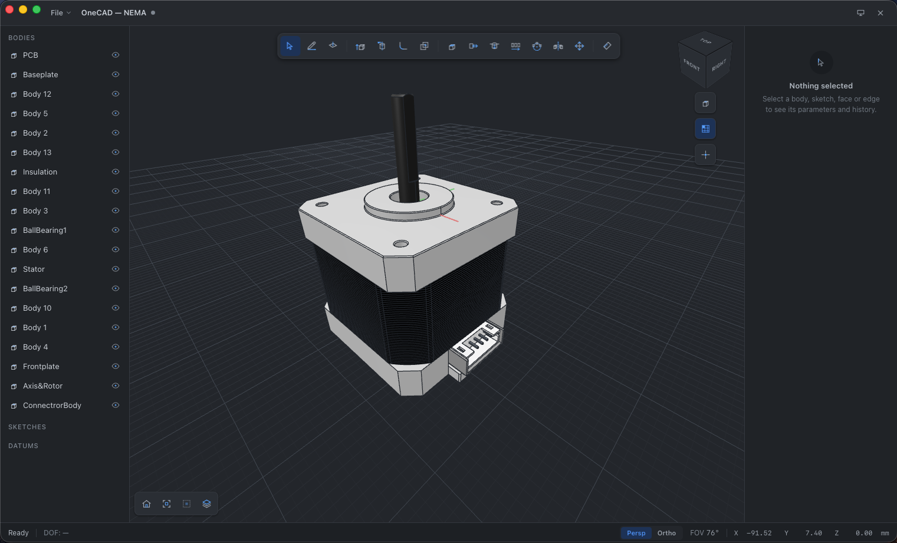
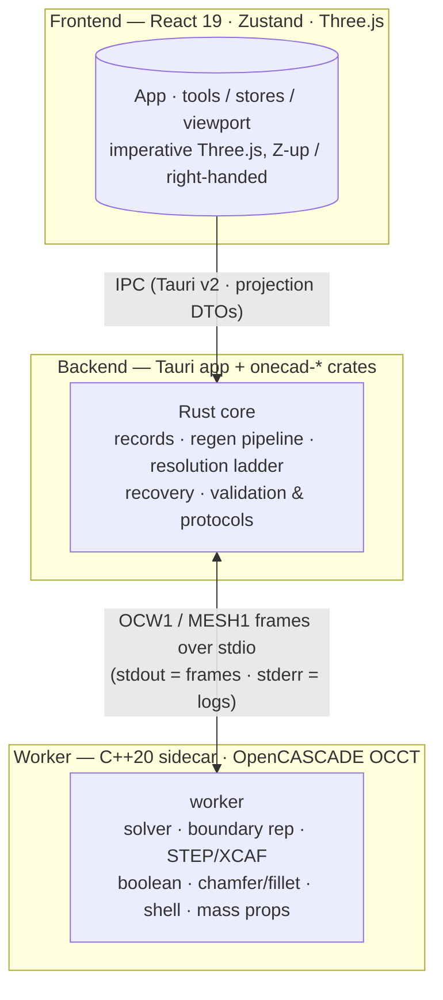

<p align="center">
  
</p>

<h1 align="center">OneCAD</h1>

<p align="center">
  A parametric, history-based CAD application.
  <br/>
  React &middot; TypeScript &middot; Three.js &middot; Rust &middot; C++20 / OCCT
</p>

<p align="center">
  
</p>

---

## About

OneCAD is a **four-layer parametric CAD tool** built like a professional package:
sketch, extrude, and edit past decisions with a full history timeline. It pairs a
modern React + Three.js frontend with a pure-Rust recovery/regeneration core and
a C++20 OpenCascade kernel sidecar.

The engineering model is simple and strict: every wire message is defined once in
`protocol/SCHEMA.md`, implemented verbatim by both the Rust core and the C++ worker,
and pinned by cross-track suites. There is **no JavaScript on the model kernel
path** — the frontend only ever sees projection DTOs produced by Rust, and the
C++ worker speaks frames over stdio.

Modeling-correctness roadmap and live implementation delta:
[`OneCAD-modeling-correctness-roadmap/README.md`](OneCAD-modeling-correctness-roadmap/README.md).

**Note:** `package-lock.json` is stale. Use Bun (see [Development](#development)).

---

## Features

- **Sketching** — lines, circles, arcs, ellipses, points, rectangles, slots,
  polygons; parametric constraints, snapping, construction geometry, marquee
  select, real parametric trim, H/V-distance dimensions.
- **Modeling** — extrude (Blind/Symmetric/ThroughAll/ToNext/ToFace, draft, mirror),
  revolve, fillet & chamfer (unify edge tool, drag direction flips type),
  shell, boolean (Add/Cut/Union), holes (ISO/DIN), patterns & mirror.
- **Body transform** — move / rotate / copy via an interactive gizmo, fold/align,
  with an edit-safety gate on transformed models.
- **Parametric history** — edit dimensions anywhere in the timeline, roll back,
  reorder, insert at the cursor, promote snapshots; undo/redo with checkpoint
  acceleration and draft suppression.
- **Everything has a kernel preview** — preview == commit proven per op.
- **STEP import** — XCAF product names + per-face colors, first-class bodies,
  identity survives process death.
- **Datum planes**, measure tool (area, length, distance), units
  (mm / cm / m / in), dark mode (light / dark / system), display modes with
  studio shading, keyboard-driven tools and mui surface.

---

## Architecture

All layers are deliberately decoupled. Pure domain crates live under
`src-tauri/crates/`, and the OCCT kernel runs as an external C++20 sidecar.



**Rules that hold the project together:**

- **No JS on the kernel path.** Only Rust (`serde_json`) and C++ (`nlohmann::json`)
  parse wire envelopes, so `u64` is safe; the frontend only receives DTOs.
- **Do not rotate the root scene groups.** The viewport is imperative Three.js and
  permanently Z-up / right-handed.
- **Treat the protocol as normative.** Any wire change requires a linked Rust/C++
  update, a fixture bump, and cross-track sign-off.
- **Frontend colors live only in `src/styles/tokens.css`** — no raw hex literals in
  TypeScript/TSX.
- The worker writes **frames to stdout and logs to stderr only**.

---

## Repository layout

```
src/                React 19 + Zustand + Three.js frontend (*.test.tsx colocated)
src-tauri/          Tauri app + Rust workspace (crates = pure domain)
src-tauri/crates/   onecad-core · onecad-regen · onecad-protocol · onecad-worker-stub
worker/             C++20 OCCT sidecar + its CTest suite
protocol/           SCHEMA.md (OCW1) and mesh_format.md (MESH1) normative contracts
corpus/             read-only legacy correctness oracle
e2e/                Playwright specs (mock-client lane)
docs/               DEBUGGING · PACKAGING · qa/ (release gates + triage) · postmortems
CURRENT_STATE.md    session history — read before changing code
TODO.md             gate records + follow-ups
```

---

## Getting started

Requires **Bun** (do not use `npm` — the lockfile is intentionally stale).

```bash
bun install
bun run dev          # Vite on port 1420
bun run tauri dev    # full desktop app (Tauri)
```

### Build / checks

```bash
bun run build        # TypeScript check + production bundle
bun run test         # Vitest (frontend)
bun run e2e          # Playwright (mock-client lane)
```

### Worker + Rust

The worker is bundled by Tauri as an external sidecar, so **stage it first**
before any Cargo run that compiles the app.

```bash
bash scripts/build-worker.sh Release
ctest --test-dir worker/build --output-on-failure
cd src-tauri
cargo fmt --all --check
cargo clippy --workspace --all-targets -- -D warnings
ONECAD_WORKER_PATH=$PWD/../worker/build/onecad-worker \
  ONECAD_REQUIRE_WORKER=1 cargo test --workspace
```

`ONECAD_REQUIRE_WORKER=1` guarantees worker-backed gates — a missing binary
cannot produce a skipped pass.

---

## Contributing / process notes

- Read `CURRENT_STATE.md` **before** changing code; record gate results and
  follow-ups in `TODO.md` and preserve unrelated worktree changes.
- Run the smallest relevant suite first, then the frontend, worker, and Rust gates.
- Commit at a completed gate with a concise conventional message
  (`feat: description`, `fix: ...`, `docs: ...`). Do not auto-commit, push, or pull.
