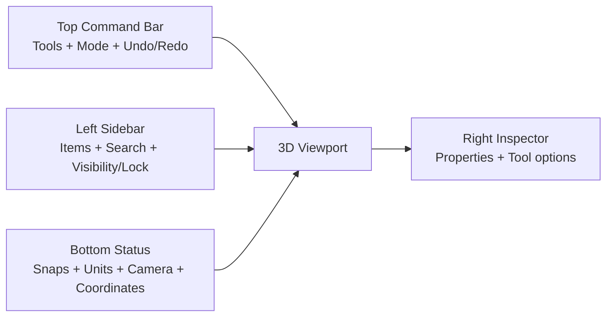

# ChatGPT analysis

Below is a “senior UI/UX teardown” of what’s on screen, plus a concrete upgrade plan to make OneCAD look like **premium CAD** (clean, calm, confident).

---

## 1) Sketch visualization (current)

### What I see

* Sketch is shown as **orange polylines** on the world grid.
* Control points are **small yellow dots**.
* No clear separation between:

  * **active sketch** vs **inactive sketches**
  * **construction** vs **real geometry**
  * **closed regions** vs **open chains**
* Sketch lives visually “inside” the 3D world, but there’s no obvious **sketch plane context**.

### What feels “cheap” right now

* Lines are thin and uniform → reads like debug drawing.
* No region fill / hover feedback → hard to understand what will extrude.
* Points don’t show *editability states* (hover/selected/locked/constrained).

### Make it “expensive”

**Sketch should have a clear visual state machine:**

* **Inactive sketches:** thin, low-contrast gray (barely there).
* **Active sketch:** brighter color + slightly thicker stroke.
* **Selected segment:** accent highlight + subtle glow/outline.
* **Construction geometry:** dashed + dim.
* **Closed profiles:** *soft translucent fill* (very important for “push/pull” UX).

**Add “region intelligence” (big premium signal):**

* On hover, show a **tinted face-like fill** for the region under cursor.
* Show tiny “region badges” for multiple loops (optional).

**Point rendering upgrade:**

* Endpoints: small circle.
* Midpoints: optional, only on hover.
* Selected point: larger + ring.
* Constrained point: small constraint glyph next to it (minimal).

**DOF & constraints (when ready):**

* If you show **DOF**, make it contextual:

  * A tiny label near the sketch (“DOF: 3”) not only in status bar.
  * Constraint icons appear only when zoomed in or when sketch is active.

---

## 2) Bodies visualization (current)

### What I see

* Bodies are **flat shaded gray** with strong outline edges.
* Cylinder shows many vertical lines → likely **tessellation edges** leaking through (reads as “mesh”, not “solid CAD”).

### What feels “cheap”

* Everything is the same material + same tone → no depth hierarchy.
* Too many edges on curved surfaces → visual noise.
* Selection/hover states aren’t clearly visible (no face tinting / silhouette emphasis).

### Make it “expensive”

**Default shading needs 3 things:**

1. **Better lighting** (simple, not “photoreal”):

   * Soft key light + subtle fill + faint rim highlight.
2. **Ambient occlusion** (even light SSAO) for contact depth.
3. **Edge policy** that matches CAD:

   * Show only:

     * **silhouette edges**
     * **feature edges** (by crease angle)
   * Hide tessellation edges.

**Selection visuals (must be premium):**

* Hovered face: slight tint + soft border.
* Selected face: stronger tint + crisp outline.
* Selected body: subtle silhouette glow (not neon).

**Material strategy:**

* Keep default **neutral gray**, but vary slightly per body (tiny hue shift) to help separation.
* Optional: “Matcap” style option (fast, looks great for CAD).

---

## 3) 3D environment visualization (current)

### What I see

* Dark background, dense grid.
* Axis lines visible (red/green), vertical axis line (blue).
* View cube exists but labels overlap (“FRONTRIGHT” looks cramped).

### What feels “cheap”

* Grid contrast is high → competes with geometry.
* No depth fade → scene feels flat.
* View cube typography/layout is not polished.

### Make it “expensive”

**Grid overhaul:**

* Use **adaptive grid**:

  * Major lines every N units (stronger).
  * Minor lines lighter.
  * Fade with distance from origin and with camera zoom.
* Grid should be a *tool*, not a texture.

**Background:**

* Add a subtle **vertical gradient** (slightly brighter near horizon).
* Optional: faint vignette. (Tiny, but makes it feel “cinematic”.)

**Origin marker:**

* Add a small, crisp **origin glyph** (not just axis lines).

**View cube polish:**

* Fix label placement:

  * Only show **one face label** at a time, or keep labels short (“FRONT”, “RIGHT”).
* Add hover highlight on faces/edges.
* Add a small “home” reset.

---

## 4) UI layout (current)

### What I see

* Left sidebar has a simple tree: **Bodies** and **Sketches**.
* Floating vertical tool palette in the viewport (3 buttons).
* Bottom bar has camera mode (Orthographic ↔ Perspective), angle, and XYZ readout.

### What feels “cheap”

* There’s no strong **top-level command area** (toolbar/command bar).
* Floating palette icons are unclear and look “placeholder”.
* Sidebar lacks common CAD affordances (visibility toggles, rename, isolate, filter).

### Make it “expensive”

**Recommended layout (simple + standard for CAD):**



**Sidebar upgrades (high impact):**

* Add per-item icons:

  * Body, sketch, plane, construction.
* Add inline toggles:

  * **👁 visibility**, **🔒 lock**
* Add quick actions:

  * Rename (slow double click)
  * Isolate
  * Color/material (later)
* Add a small **search bar** at top.

**Tool options should live in one predictable place:**

* When user activates a tool (Sketch / Extrude / Move):

  * Show tool settings in **right inspector** or **top bar**, not scattered.

---

## 5) UI element design (current)

### What I see

* Dark theme, rounded panels.
* Selection highlight in sidebar is strong blue.
* Icons look a bit soft / inconsistent in metaphor.

### What feels “cheap”

* Visual hierarchy is not consistent:

  * Some elements look macOS-native, others look custom.
* Icon set doesn’t feel like one family.
* Too many “same-weight” surfaces → no depth/elevation system.

### Make it “expensive”

**Adopt a small design system (tokens):**

* **Surface levels** (important in dark UI):

  * Base background
  * Elevated panels
  * Floating controls (highest)
* **One accent color** (blue is fine) used consistently:

  * selection
  * active tool
  * primary actions
* **Typography scale**:

  * Sidebar section title (medium/semibold)
  * Item labels (regular)
  * Secondary metadata (smaller/dimmer)

**Micro-interactions (premium feel):**

* Hover transitions (150–200ms)
* Soft shadow changes on floating panels
* Smooth camera-mode slider animation
* Tooltip on every tool icon (fast learning)

---

# Practical upgrade plan (highest ROI first)

## Phase 1 — “Instant premium” (1–3 days)

* Fix cylinder edge noise: show **silhouette + feature edges only**.
* Reduce grid contrast + add **major/minor** lines + fade.
* Add face hover/selection tinting.
* Polish view cube labels (no overlap).

## Phase 2 — “CAD-grade sketching” (3–7 days)

* Active sketch plane context (plane grid + fade world grid).
* Closed-profile **soft fill** + region hover highlight.
* Sketch line/point states (inactive/active/selected/constraint).

## Phase 3 — “Product-level UI” (1–2 weeks)

* Add top command bar (tool modes + undo/redo).
* Sidebar: visibility/lock, search, context menu.
* Tool settings in right inspector (consistent).

---

# References (UI systems worth borrowing from)

These are good for grounding decisions in proven patterns: ([Apple Developer][1])

```text
Apple HIG – Sidebars: https://developer.apple.com/design/human-interface-guidelines/sidebars
Apple HIG – Toolbars: https://developer.apple.com/design/human-interface-guidelines/toolbars
Material Design – Dark theme: https://m2.material.io/design/color/dark-theme.html
Material 3 – Color system: https://m3.material.io/styles/color/overview
Fluent 2 – Typography: https://fluent2.microsoft.design/typography
Fluent 2 – Iconography: https://fluent2.microsoft.design/iconography
```

---

## One “north star” rule

Premium CAD UI is **quiet**.
Geometry should be the loudest thing on screen, then selection, then tools, then everything else.

If you want, the next step is I can write a **UI style guide** for OneCAD (colors, spacing, typography, icon rules, selection states) so implementation stays consistent as features explode.

[1]: https://developer.apple.com/design/human-interface-guidelines/sidebars?utm_source=chatgpt.com "Sidebars | Apple Developer Documentation"


----


# Gemini Analysis

This analysis provides a professional critique of your current CAD interface and a roadmap to elevate it to a "pro-grade" expensive software aesthetic.

---

## 1. Sketch Visualization Analysis

* **Current State:** Sketches use a thick orange stroke with circular vertices. The semi-transparent dark fill helps distinguish the shape but lacks depth.
* **The "Expensive" Upgrade:** Professional CAD (e.g., Fusion 360, Shapr3D) treats sketches as high-precision mathematical data, not just drawings.
* **Refined Line Weights:** Use a 1px crisp line for the geometry. Thicker lines look "toy-like."
* **Constraint Glyphs:** Add small, elegant icons (parallel, perpendicular, tangent) that appear near the lines. This communicates power and precision.
* **Active vs. Inactive:** When a sketch is not being edited, it should fade to a ghostly light blue or grey with a 0.5px line weight.
* **Vertex Design:** Instead of large orange circles, use small "crosshair" dots or tiny squares that only appear on hover or selection.


## 2. Object & Body Visualization

* **Current State:** Solid grey bodies with white "wireframe" edges. It looks like a basic OpenGL "flat" shader.
* **The "Expensive" Upgrade:**
* **Matte PBR Shading:** Move away from flat grey. Implement a "Physically Based Rendering" (PBR) shader in the viewport. This adds a subtle "satin" or "anodized aluminum" look to the grey bodies.
* **Ambient Occlusion (SSAO):** Add soft shadows in the corners where objects meet the ground or each other. This is the #1 trick to making software look "expensive."
* **Edge Treatment:** Instead of white lines (which look like a 90s wireframe), use a slightly darker or lighter version of the body color for edges. Only highlight edges in high-contrast (e.g., cyan or bright white) when selected.
* **Transparency:** Use "Liquid Glass" effects for transparent bodies. 2026 design trends favor refraction and blurred background transparency over simple "alpha" transparency.


## 3. 3D Environment Visualization

* **Current State:** A basic infinite grid on a dark grey background. The axis widget in the top right is functional but looks dated.
* **The "Expensive" Upgrade:**
* **Gradient Backdrop:** Use a subtle vertical gradient (e.g., Deep Charcoal to Soft Slate) instead of a flat color to give a sense of horizon.
* **Ground Plane Reflection:** Add a very faint, blurred reflection on the "floor" to ground the objects.
* **Modern Viewcube:** Redesign the "Top/Front/Right" widget. Use a translucent glass cube with minimalist typography (e.g., Inter or a custom sleek sans-serif).
* **Dynamic Grid:** The grid should fade out at the edges (vignette) rather than ending abruptly.


## 4. Layout & UI Structure

* **Current State:** A "floating" sidebar on the left and a few disconnected floating icons. This creates "visual clutter" because the eye doesn't know where the edge of the workspace is.
* **The "Expensive" Upgrade:**
* **Glassmorphism Panels:** Instead of a solid black sidebar, use a "Frosted Glass" (Backdrop Blur) effect. This makes the UI feel light and integrated into the 3D space.
* **Logical Grouping:**
* **Left:** "Object Browser" (Hierarchy).
* **Top:** "Tool Ribbon" (Context-sensitive).
* **Bottom:** "Timeline" or "History" (Essential for pro CAD).


* **Dyslexia-Friendly Spacing:** Increase the "Line Height" in your tree view (Bodies/Sketches). Use a minimum of **8px to 12px** of padding between items to prevent text from "swimming."


## 5. UI Element Design

* **Current State:** The icons look like basic vectors inside rounded squares. The font is standard and small.
* **The "Expensive" Upgrade:**
* **Iconography:** Use a consistent "monoline" icon set (thin lines, no fills). Professional software avoids "filled" icons as they look heavy.
* **Typography:** Switch to a high-end typeface like **Inter**, **Roboto Flex**, or **SF Pro**. For your dyslexia-friendly requirement, ensure wide character spacing (letter-spacing: 0.05em).
* **Status Indicators:** In the "Bodies" list, add tiny "Eye" icons for visibility and "Padlock" icons for locking.
* **Color Palette:** Limit your "Action Color" (the color used for buttons and selections). Currently, you have orange (sketch) and blue (selection). Stick to one "Brand Color" (e.g., Electric Blue or Vivid Purple) for all primary actions.


---

### Comparison Table: Standard vs. Professional

| Feature | Current "Standard" Look | Proposed "Professional" Look |
| --- | --- | --- |
| **Edges** | Stark White / High Contrast | Color-matched / Sub-pixel lines |
| **Shadows** | None | Real-time SSAO / Contact Shadows |
| **Sidebar** | Solid Black / Flat | Frosted Glass / Translucent |
| **Icons** | Heavy / Rounded Squares | Thin-line / Floating / Minimalist |
| **Grid** | Infinite / Hard Edges | Faded / Vignette / Adaptive |

Would you like me to generate a detailed **color palette and typography specification** (including specific hex codes and font weights) that aligns with these 2026 "Premium" trends?