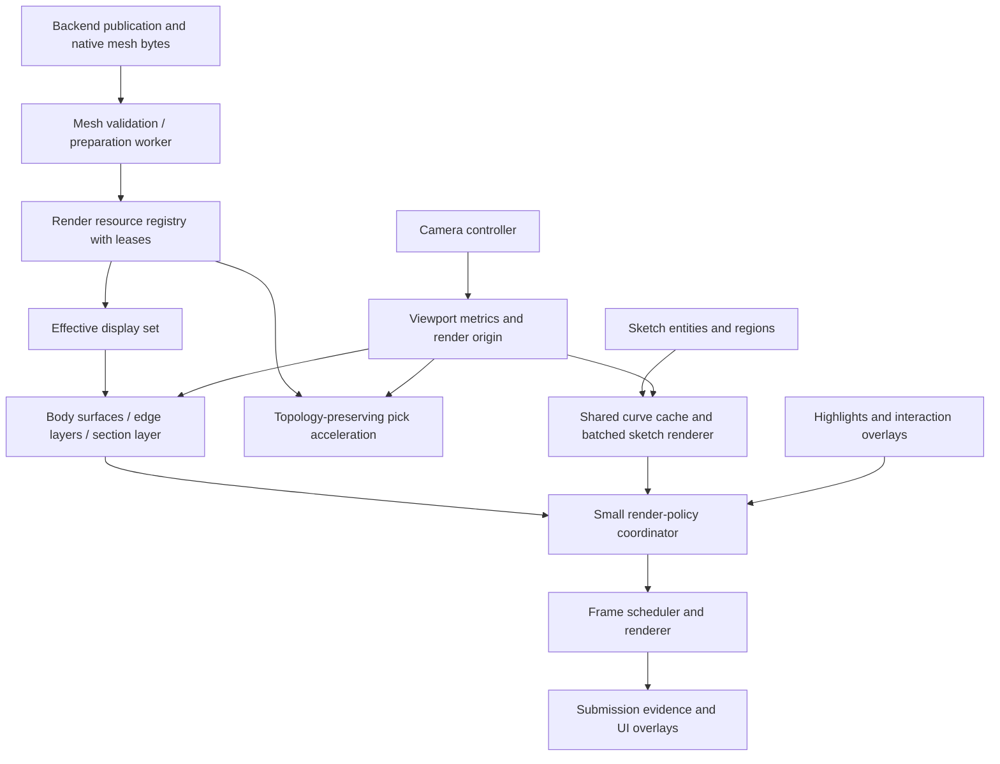

# OneCAD professional viewport — normative specification

**Specification:** VP-HARDENING 1.0  
**Date:** 2026-09-13  
**Baseline:** `andrejvysny/OneCAD`, `master`, `65b4c60eb226a201f2fa3eb565d7283b1c63b5ac`  
**Implementation owner:** Claude Code, with Fable 5.1 orchestrating implementation and verification  
**Status:** Normative selected design; implementation and native acceptance are NOT established.

## 1. Purpose and authority

Make OneCAD's viewport dependable for mechanical-part modeling and modest assemblies. The quality references are the clarity, predictability, and interaction polish the user associates with Shapr3D and Fusion 360. This is not a claim about their internal renderer architecture, nor a requirement to copy their branding, assets, or every interaction.

The principal rule is **visual, selection, and modeling truth must agree**. A beautiful image of the wrong boundary is a failure. Fast picking of a hidden or stale face is a failure. A test that checks a flag while the GPU renders something else is insufficient.

`MUST`, `MUST NOT`, `SHOULD`, and `MAY` express implementation requirements. This document resolves product choices left open by the original review. The coding agent implements these decisions; it must not replace them with a new architecture or choose easier numerical heuristics. A discovered contradiction requires a short deviation record containing a counterexample and impact. Continue independent work; do not silently weaken the specification.

Read together with:

- [Implementation guide](02-IMPLEMENTATION-GUIDE.md): sequencing, file boundaries, and patch-level instructions.
- [Numerical and protocol contracts](03-NUMERICS-AND-PROTOCOL.md): mathematical definitions, representation, and wire migration.
- [Acceptance plan](04-ACCEPTANCE-AND-TESTS.md): executable release criteria and evidence.
- [Decisions and traceability](06-DECISIONS-AND-TRACEABILITY.md): all review findings mapped to work.
- [Sources](08-SOURCES-AND-BASELINE.md): inspected repository and primary documentation.

Existing repository safety, persistence, transaction, and semantic-reference rules remain binding. The intentional changes to rendering, camera state, and mesh representation must be documented in repository ADRs and canonical protocol files. A new mesh version is not permission to reinterpret old MESH1 bytes.

## 2. Scope, non-goals, and supported envelope

### 2.1 Included in this program

The program includes renderer lifecycle and scheduling; screen metrics; body/edge/highlight ownership; shading and color semantics; section/preview composition; camera and input arbitration; sketch tessellation and incremental updates; mesh validation; local-coordinate precision; topology-preserving acceleration; controlled display refinement; benchmark fixtures; native and browser acceptance.

All work packages WP00–WP16 are in scope. Some are scheduled later, but they are not optional substitutes for fixing high-priority defects. Complete one usable, tested slice at a time.

### 2.2 Explicit non-goals

Do not replace Three.js, React, Tauri, Rust, OCCT, or PlaneGCS. Do not add react-three-fiber. Do not introduce a renderer-wide ECS, general-purpose render graph framework, custom CAD kernel, or new model-document architecture. Do not rewrite modeling transactions or persistent reference resolution.

This release does not add physically accurate glass, weighted order-independent transparency, photorealistic product rendering, SSAO, path tracing, arbitrary material texture editing, or a WebGPU production backend. Those are separate future capabilities, not prerequisites for a professional editing viewport. The default editor must look finished without them.

Touch and pen event correctness is included. A tablet/iPad product, touch-first UI redesign, or unsupported operating-system port is not implied. Test native Windows/Linux packages where the repository already supports them; never claim platform certification from a macOS or browser-only result.

### 2.3 Acceptance envelope — new product targets, not existing measurements

| Dimension | Required target |
|---|---|
| Primary native system | macOS Apple Silicon, real Tauri WKWebView and OCCT worker; macOS minimum follows the current app manifest |
| Primary reference machine | MacBook Pro M4 Pro, 24 GB unified memory; record exact OS, webview, power mode, and display for evidence |
| Browser diagnostic systems | Repository Chromium and WebKit lanes; these do not replace native acceptance |
| Main performance workload | 1,000,000 visible triangles, 100 visible bodies, 200,000 visible edge segments; separate 5,000-entity sketch fixture |
| Stress workload | 5,000,000 triangles or 1,000 bodies; 20,000 sketch entities; graceful bounded operation, not a 60 Hz guarantee |
| Document units | Authoritative millimeters; user-facing unit conversion remains outside renderer geometry |
| Validated visible extent | 0.1 mm to 10,000 mm bounding-box diagonal |
| Validated global translation | Magnitude up to 1,000,000,000 mm with local-origin representation |
| Minimum feature fixture | 0.01 mm gap/feature within the stated extent; this is a display/selection fixture, not a new kernel accuracy promise |
| DPR fixtures | 1, 1.5, 2, plus a device DPR above the rendering cap |
| Display resolution | Main acceptance at 1440×900 CSS pixels and DPR 2; resize tests cover narrow and wide layouts |

The envelope is multidimensional. Do not infer that every combination of maximum size, maximum triangle count, minimum feature size, and worst camera angle must satisfy the same performance target. Correctness remains required; expensive views may show an explicit quality/budget state. A camera closer than the qualified precision range must not invent certified geometry.

Large-coordinate support is not just moving the camera. Subtract a local double-precision origin before float32 conversion, then render relative to a current render origin. The precise contract is in NUM §4.

### 2.4 Release milestones

**M1 — correctness baseline:** WP00–WP07; reliable ownership, units, publication boundary, camera, material state, and picking. This is an interim milestone, not full acceptance.

**M2 — geometric fidelity:** WP08–WP10; surface normals, bounded curve sampling, mesh-v2 origins and metadata.

**M3 — integrated professional viewport:** WP11–WP15; incremental sketches, screen-space quality, feature edges, sections/previews, acceleration, input/grid finishing.

**M4 — qualification:** WP16 and every mandatory acceptance case. No open P1 defect and no unsupported native evidence claim.

## 3. Existing foundations that must survive

The baseline has an imperative Three.js engine, MESH1 topology ranges, asynchronous publication guards, and on-demand rendering. React provides UI and lifecycle wiring rather than per-frame geometry ownership. The worker uses OCCT 8.0.1 and C++20. These are verified baseline facts, not proposed changes. [Sources: REP-01–REP-05 in the sources document.]

Preserve these invariants:

1. The world is right-handed and Z-up. The world ground is XY at Z=0. No scene-root rotation or axis swap may compensate for a camera error.
2. The Rust/document layer remains authoritative. Camera changes, display refinement, colors used only for inspection, and GPU uploads must not modify modeling history.
3. Snapshot-scoped TopoKeys and persistent ElementIds remain distinct. A render mesh revision is not a persistent semantic identity.
4. Stale worker results cannot replace current publications. Runtime session and ownership fences survive every new asynchronous stage.
5. OCW1 framing remains the only stdout content from the worker. Logs go to stderr.
6. Rendering and expensive camera-dependent work are event-driven. No idle render loop, polling loop, or per-frame React state update.
7. Existing user files, prior failure evidence, unrelated worktree changes, and old document data must be preserved.
8. Preview, applied model, pending operation, failed operation, and cancellation remain separate states.

## 4. Target module boundaries

Use small services composed by `ViewportEngine`; do not simply move its entire body into one new class.



New service names in this package are **proposed implementation seams**, not claims that files already exist. Prefer these responsibilities even when existing repository naming justifies a nearby path:

| Service | Owns | Must not own |
|---|---|---|
| `ViewportMetrics` | Logical size, buffer size, DPR, camera matrices, projection revision | Body topology, model history |
| `FrameScheduler` | Dirty reasons, rAF scheduling, redraw/recovery state | Geometry creation inside idle callbacks |
| `RenderResourceRegistry` | Resource identity, memory accounting, leases, retirement | Semantic selection repair |
| `EffectiveDisplaySet` | Currently displayed committed/preview resources and roles | Hiding bodies by unrelated root mutations |
| `AppearanceResolver` | Authored/view-state precedence and effective material descriptors | Destructive edits to stored colors |
| `CameraController` | Camera state, fit, anchored zoom, transition cancellation | Tool parameter changes |
| `InteractionCoordinator` | Input ownership and navigation/tool arbitration | Guessing solver constraints |
| `CurveDisplayCache` | Entity-revision and quality-keyed samples | Solver or snap tolerances |
| `PickService` | Acquisition, visibility, sorting, explicit pick-through | Minting semantic IDs |
| `MeshPreparationWorker` | Validation, colors, acceleration building, cancel-safe CPU preparation | Native OCCT mutation or GPU context ownership |

## 5. VP01 — renderer and backend capability policy

**Decision:** WebGL2 is the supported production backend. Keep the pinned Three.js version through this hardening program unless a reproducible upstream bug makes a narrowly reviewed update necessary. Do not migrate dependencies opportunistically.

`experimentalWebGpu` must not select a partially functioning editing viewport. Hide it from normal settings or present it as unavailable until the capability suite passes. A saved experimental preference must fall back to WebGL with a once-per-session diagnostic, not an empty viewport.

At initialization, record actual context attributes, depth and stencil bits, antialias availability, maximum texture/renderbuffer limits, and the chosen depth convention. Querying these once is acceptable; querying them in every frame is not.

Request MSAA and stencil. Treat request and actual availability as different facts. Enable `localClippingEnabled`. Explicitly set output sRGB, neutral tone mapping, and exposure 1.0. Keep annotation materials unlit and not tone-mapped.

Use Three.js's supported reversed-depth option when the installed version and native context expose the required capability and the reverse-depth test lane passes. Otherwise use conventional depth with the adaptive clipping contract. Do not emulate reverse-Z by patching undocumented renderer internals. Do not enable logarithmic depth as a quick z-fighting fix. The exact constructor spelling and supported extension must be checked against the installed pinned package; the adapter owns the version-specific mapping. [EXT-01, EXT-02.]

Keep `preserveDrawingBuffer: true` through M1. In WP15, replace permanent preservation only when an immediate-render/capture fixture passes in real WKWebView and long idle compositing remains correct. If that optimization fails, retain preservation and report the measured cost. It is not a blocker to correctness.

## 6. VP02 — frame scheduling, submission, and recovery

Consume dirty reasons before running frame work. Invalidations raised during contributions, uploads, overlay layout, or after-render callbacks belong to the next frame and must not be cleared by the current frame.

Use a dirty-reason bitset (`camera`, `geometry`, `appearance`, `overlay`, `resize`, `quality`, `recovery`) plus a monotonic requested-frame revision. At most one scheduled rAF may exist. Coalesce reasons without dropping their latest revision.

There are three distinct milestones: **scheduled**, **submitted**, and **presented/observed**. `WebGLRenderer.render()` returning demonstrates submission from the application's perspective, not proof that a compositor presented the image. Preserve existing backend acknowledgment semantics, but rename misleading internal telemetry. A submit acknowledgment must include the publication actually included in that frame. Native capture and observation provide separate visual evidence.

Maintain `active → lost → restoring → active` lifecycle states and terminal `disposed`. On context loss, prevent default when recoverable, suspend GPU submissions, retain CPU resources within budget, and display a clear viewport message. On restoration, recreate PMREM and render targets after Three.js restores its own state, reapply capabilities, reupload surviving resources, and invalidate once. If recovery fails, keep model/document state safe and offer a renderer-retry action.

Dispose and init must remain idempotent across React StrictMode and an async construction/disposal race. No after-render callback may mutate a disposed engine. Throttle repeated identical diagnostics; never create an unbounded retry loop.

## 7. VP03 — one screen/pixel contract

### 7.1 Units

| Quantity | Required unit |
|---|---|
| DOM pointer coordinates | CSS pixels in client space |
| Viewport width/height, safe work area | CSS pixels |
| `LineMaterial.linewidth` with screen-space lines | CSS pixels |
| `LineMaterial.resolution` | Logical viewport pixels, matching Three.js draw-time callback |
| Screen-space pick radius | CSS pixels |
| Canvas buffer dimensions and screenshot readback | Physical pixels |
| Mesh coordinates | Millimeters in specified local/world frame |
| Plane Jacobian | CSS pixels per millimeter |

Do not run line widths through `cssToDevice`. Do not multiply pick radius by DPR. For stock Line2 raycasting, threshold is `max(0, 2*radiusCss - linewidthCss)` after setting logical viewport resolution and camera. That is the bootstrap path; candidate-based accelerated picking later uses the same CSS radius directly.

Use a `ScreenLineStyle` record with explicit CSS suffixes. All existing line families must be audited: body edges, highlights, active/static/draft sketch ink, construction curves, dimensions, snap guides, origin triad, gizmos, and section boundaries. Points and textures get separate adapters; do not assume their GPU size path matches LineMaterial.

### 7.2 Display changes

Subscribe to DPR changes using a re-armed resolution media query plus resize/visual-viewport hooks where available. An idle display change must schedule one redraw even when the CSS rectangle is unchanged. Recheck DPR inside a rendered frame as a safety net, not as the only detector.

Initial maximum rendering DPR is 2. A device DPR above 2 still uses CSS-authored line widths and a correct CSS acquisition radius. Resizing recomputes both projection modes, buffer allocation, metrics, render-target dimensions, and line resolution from one snapshot.

### 7.3 Baseline line hierarchy

| Element | CSS width |
|---|---:|
| Body feature edge | 1.25 |
| Tangent edge when explicitly displayed | 0.75 |
| Active sketch semantic ink | 1.25 |
| Static sketch ink | 1.0 |
| Draft geometry | 1.25 |
| Selection halo | 3.0 |
| Dimension/snap guide | 1.0 |
| Hidden selected edge | 1.0, dashed |

Keep color values in design tokens. Selection changes must retain constraint-state ink; draw a halo around it rather than replace every semantic color.

## 8. VP04 — explicit geometry/material ownership

### 8.1 Resource identity

Every installed mesh resource must carry:

```typescript
interface RenderResourceIdentity {
  documentId: string;
  runtimeSession: string;
  snapshotId: number;
  generation: number;
  bodyId: string;
  topologySignature: string;
  geometryRevision: number;
  qualityKey: string;
  meshFormatVersion: 1 | 2;
}
```

These fields have distinct purposes. `geometryRevision`/`qualityKey` can change without a semantic document edit. `topologySignature` is derived from the authoritative face/edge identity tables and incidence, not from triangle order. Snapshot-scoped keys must still be fenced to their snapshot even when signatures happen to match.

### 8.2 Leases and retirement

The registry is the unique disposer for installed face/edge geometries. Body objects, section stencils, and whole-body highlights borrow the **same geometry object** through leases. They do not create disposable wrappers sharing BufferAttributes.

Removal marks a resource retired. Dispose only after it is detached from the effective display set, all consumer leases are released, and no current application submission still references it. For WebGL, use ordered frame-end retirement; do not block on `gl.finish()`. Asynchronous backends, if introduced later, need a backend-specific completion token.

A mesh swap acquires new leases, updates consumers atomically, and releases old leases. A leaked lease is a test failure. Document close releases registry ownership but cannot invalidate a live borrower without first detaching it.

### 8.3 Fixed highlight strategy

- Whole-body highlight: another `Mesh` using the exact leased source `BufferGeometry` and a highlight material. No geometry wrapper and no body-buffer copy.
- Face highlight: compact **owned** geometry. Copy the selected face's positions and remapped indices into a dedicated buffer. It may omit normals for an unlit overlay. Disposal frees only highlight buffers.
- Edge highlight: owned segment geometry from the requested edge range, with explicit disposal.
- Cache owned face/edge highlight resources by full resource identity and element ordinal. Global cache cap: **64 MiB and 256 entries**, whichever is reached first. Evict unpinned least-recently-used entries.
- Group multi-face selection per body into a reusable compact owned selection buffer; update only when selection changes. Whole-body selection uses the whole-body path.

If an exact selection overlay exceeds the cap, keep semantic selection, show a once-per-change diagnostic, and use an explicitly documented body outline plus selection count while bounded exact overlays are prepared. Do not silently discard selected elements. Ordinary one-face hover must always use the exact face path within the qualified workload.

Replace marker attributes only through owned capacity-managed buffers, or dispose the old owning geometry. Garbage collection is not the GPU ownership protocol.

## 9. VP05 — validated mesh installation and stale-display policy

Parsing proves byte layout. Validation proves semantics. Only `ValidatedMesh` objects may enter the GPU registry.

Validate counts before multiplication/allocation, section overlap and padding, supported flags, finite positions and normals, index bounds, contiguous face/edge ranges, monotonic UTF-8 ID offsets, nonempty unique element identifiers, valid bounds, and declared quality/origin metadata. Do not allocate expanded edge/color/acceleration arrays before checking output budgets.

Initial limits are product safety budgets, not facts about GPU capacity:

| Limit | Initial value |
|---|---:|
| Single mesh payload | 256 MiB |
| Prepared CPU mesh resources, active document | 1,024 MiB |
| Estimated active geometry GPU buffers | 768 MiB |
| Highlight cache | 64 MiB, included in the GPU total |
| Render targets | 256 MiB estimated, separate from geometry |
| Concurrent frontend mesh-preparation jobs | 2 |
| Concurrent worker display-mesh jobs | 1 per native worker session |
| Queued refreshes | Latest request per body; no unbounded queue |

The transport's larger framing limit remains independent. Count estimates include copies, edge expansion, colors, pending old/new meshes, and acceleration indices. A double-buffer swap needs peak-budget admission, not merely steady-state admission.

On failed replacement, retain the last valid resource as `stale-inspection-only`, displaying a body-specific warning. Allow orbit, fit, inspection, and a clearly tagged historical measurement. Do not permit new modeling operations or persistent-reference acquisition from stale geometry. A selected old face cannot masquerade as current topology.

On a failed initial load, show an error/bounds proxy with no fabricated editable faces. Resource admission errors do not change document geometry. Pending geometry and failed geometry are separate UI states.

## 10. VP06 — appearance and color truth

### 10.1 Immutable appearance plus derived view state

Replace save/restore mutation chains with an `AppearanceResolver`. The input includes authored body/face colors, display mode, focus state, body kind, section state, and preview role. Resolve a deterministic material descriptor; cache descriptors, not mutable historical state.

Precedence from strongest view-only override to weakest base:

1. Diagnostics that require an explicit error/invalid appearance.
2. Exact replacement preview role and destructive/additive tint, as a view override.
3. `assemblyColors`: deterministic per-body diagnostic color, overriding authored colors without editing them.
4. Normal authored face override, imported face color, authored body color, theme neutral.
5. Focus transform applied to the selected base appearance.

Hover/selection is a separate overlay, not an authored-color mutation. Theme changes update only theme-dependent appearance. Assembly colors are stable by body ID and do not depend on hash-map traversal order.

Fix the additional confirmed ordinal defect: a loop over face ordinals must call `TopoIndex.idOf(faceOrdinal)`, not `idAt(faceOrdinal)`. The latter consumes a triangle ordinal. Add unequal-triangle-count fixtures including a zero-triangle face. [REP-06, REP-07.]

### 10.2 Focus, sidedness, and shading

Ordinary sketch focus remains opaque: `transparent=false`, `opacity=1`, `depthWrite=true`. Desaturate in linear working space using `gray = dot(rgb, [0.2126, 0.7152, 0.0722])`, then `focus = mix(rgb, grayVector, 0.55) * 0.75`. Keep edges less emphatic through a separate focus token/style; they must not become an opaque black cage around the active sketch.

For the vertex-color path, apply focus to GPU color evaluation through a narrowly owned material variant, rather than rebaking the whole mesh on every mode change. Store authored vertex colors unchanged. A shader variant must have a stable cache key and a fixture against the uncolored path.

Valid closed solids use front-sided surface materials. Open sheets may use double-sided rendering. Unknown/open topology must never be labeled watertight just because both sides render. Picking may inspect back faces according to sheet/section policy, separately from ordinary solid rendering.

Keep neutral studio shading: base roughness 0.5, metalness 0, environment intensity controlled by the existing light/dark rig. Surface normals and color-space correctness must be fixed before retuning the light table. PBR appearance is an editing cue, not a claim about manufactured material.

### 10.3 Indexed colors

Prefer indexed color attributes. Worker faces already normally have separate vertex ownership; validate that invariant. If a vertex is referenced by differently colored faces, split only conflicting vertex uses and remap indices without changing triangle order. Do not fully de-index every colored body. Theme rebakes affect only unset theme-neutral colors.

MESH1 alpha-zero means unset, not transparency. The initial professional viewport supports opaque authored face colors. Preserve non-opaque authored data where the document already stores it, but do not invent a glass renderer or silently redefine protocol alpha semantics.

## 11. VP07 — camera state, fitting, and exact sketch alignment

### 11.1 State

One canonical camera state contains document-space target, orientation quaternion, orbit heading metadata, perspective field of view, projection kind, and `halfHeightAtTarget`. Scale is primary; perspective distance derives from `halfHeight / tan(fovY/2)`.

Default new model views use **35° vertical FOV**, adjustable in preferences from 20° to 76°. Orthographic is a distinct mode, not a zero-FOV perspective camera. Preserve existing saved camera appearance during migration; never silently reframe an old document to the new default.

Default new documents open isometric with shaded feature edges. Entering sketch mode aligns the camera exactly to `(plane.u, plane.v, plane.normal)` and uses orthographic projection. Save and restore the complete prior model view, including orientation, target, scale, projection, and navigation metadata. Failed/skipped sketch entry must not leave a half-applied view.

### 11.2 Navigation

Keep the current mouse and trackpad mappings to avoid a surprise behavior migration. Model navigation is Z-up turntable. Exact plane alignment uses a full basis/quaternion; no epsilon-tilted "almost top" view. A model turntable can remember its yaw at a pole without imposing that yaw on an arbitrary sketch basis.

During a sketch session, temporary orbit may move away from the plane-normal view while retaining sketch readability. Provide `Look at sketch` to restore the exact basis. Exiting restores the saved model view, not a reconstruction from lossy yaw/pitch alone.

All accepted manual navigation cancels Home/Fit/snap transitions first. Freeze camera navigation while a tool owns an active geometry/parameter drag. A merely armed tool does not freeze navigation. A rejected navigation event must not change hidden wheel/pinch state in a way that causes a jump after release; reset/rebase the navigation recognizer on ownership changes.

### 11.3 Zoom, pan, resize, and fit

Zoom anchors to the nearest ordinary visible surface under the pointer, else the active sketch plane, else the camera target plane. An anchor carries document coordinates and a validity revision; never hold a stale triangle as authority.

Clamp requested scale before moving target and use the effective factor. At a limit, repeated zoom cannot pan the model. Touch pinch combines centroid translation and scale into one camera transaction. Pointer and wheel operations must not update distance and target in separate observable states.

Pan uses the actual projection scale, not a separate approximate sensitivity proportional to distance. At the target plane the scale is `2*halfHeightAtTarget / viewportHeightCss` world units per CSS pixel. User sensitivity defaults to 1 and scales both axes consistently.

Resize recomputes both cameras and the safe work area even when stationary. Fit uses all eight bounds corners in the camera basis and the measured safe rectangle excluding panels/chips. Preserve the existing refusal of impossible fits. Fit-selection, fit-visible, fit-preview, and Home remain distinct actions. Home fits the effective displayed model center rather than blindly returning to world origin when a model is translated.

Near/far use NUM §5. Camera navigation does not mutate document history; view persistence follows the existing session/settings contract.

## 12. VP08 — interaction ownership and pointer correctness

Create one ownership coordinator for navigation, tool drag, selection, canvas UI, and modal action. UI-interactive boundaries always win over viewport acquisition. Do not take pointer capture on every pointer-down before determining ownership.

Mouse LMB belongs to selection/tools; RMB+Shift orbits, RMB/MMB pans. Trackpad mapping stays as in the existing reducer: scroll pan, Shift-scroll orbit, pinch zoom. Device override remains available because event streams do not reliably identify every physical device.

Touch model mode: one finger orbits unless a tool explicitly owns it; two fingers pan and pinch from a centroid/distance baseline. Touch sketch mode: one finger selects/draws with the active tool; two fingers navigate when no tool drag is active. Pen belongs to the active drawing tool; incidental touch must not interrupt a pen drag. This is a deterministic event policy, not an assertion that browser palm rejection is perfect.

`pointercancel`, lost capture, window blur, visibility change, disposal, and pointer count transitions release or rebase ownership. Thresholds are in CSS pixels. Honor a 4 CSS-pixel mouse click-slop radius: a single tiny pointermove with a pressed button must not automatically turn a click into a drag.

Hover depends on pointer position **and** camera, geometry, visibility, section, and relevant modifier revisions. Recompute at the last pointer when any of those changes, at most once per rendered interaction frame. No permanent stationary-pointer polling.

## 13. VP09 — depth-aware, topology-safe picking

Acquisition and visibility are separate operations.

Ordinary face picking returns the nearest unclipped visible face in the effective committed display set. Ordinary edge acquisition searches a 6 CSS-pixel disk, but an acquired edge wins only after visibility testing at its own projected closest point. Do not reuse a screen acquisition radius as a world-depth allowance.

For an edge candidate, recover its perspective-correct closest point on the polyline segment, cast a matched ray through that projected point, and compare against unclipped surface intersections. Use numerical roundoff and declared approximation uncertainty only. If visibility is ambiguous within approximation error, request local refinement and keep the face candidate; do not choose a hidden edge speculatively. NUM §6 defines the query.

Cap surfaces occlude geometry behind them but are **not editable BRep faces**. Return a `sectionSurface` inspection target with body ID and world point, not an invented `f:N`. Exact preview geometry is inspectable but not promotable to committed topology. Stale resources are never promotable.

Explicit overlap/pick-through retains complete ordered candidates and supports hidden tangent/seam topology on demand. Sorting is deterministic by visibility class, screen distance, depth, semantic kind priority, then stable ID. Every candidate carries installed-resource proof; recheck it before invoking an operation.

Do not reorder source triangles while building acceleration. Preserve an indirect primitive-index mapping and validate it through every quality swap.

## 14. VP10 — worker surface tessellation and normals

Use OCCT's mesher on immutable/scratch geometry for the requested display quality. Display jobs must not alter semantic geometry, IDs, or the document's history. OCCT may cache triangulation on shapes; isolate mutable triangulation state from concurrent document operations and exports.

Initial committed quality preserves a 0.05 mm maximum linear target and 5° angular target until view-driven quality requests arrive. These are tessellation requests, not universal certified surface-error bounds. Report requested versus verified error separately. Export tessellation has its own policy and does not reuse screen-display tolerances.

Each triangulated node should have a normal from its supporting surface at the node UV. Apply location and face orientation exactly once. Handle mirrored placement and winding together. Analytic sphere/cylinder/plane/torus normals are preferred at known analytic singularities. For general singular nodes use NUM §7's documented fallback and provenance; never inject world +Z as a universal answer.

Preserve face-owned vertices and persistent/snapshot topology IDs. Tangent continuity does not require welding different BRep faces. Real creases remain split. Native fixtures must compare normal directions independently, not merely assert finite lengths.

Incomplete display tessellation must be diagnostic. A nondegenerate face unexpectedly missing all triangles invalidates an "exact complete display" result. Known degenerate topology can retain a zero range with an explicit reason. Partial output must not be silently labeled complete.

## 15. VP11 — bounded curve sampling and boundary agreement

Replace the single-midpoint/endpoint-tangent algorithm. Use exact rational Bézier spans for supported analytic/conic/B-spline curves and subdivision with a control-hull distance bound. Implement the derivative-cone criterion in NUM §2 for angular quality. Exact split intervals preserve endpoints, knot/continuity boundaries, orientation, and topology identity.

For general offset/procedural curves that cannot be exactly represented, use the fixed approximate fallback in NUM §2 and mark its certification state accurately. A dense sample check is evidence, not a proof of a universal bound. Failure to reach a budget produces a visible `quality-limited` status and never a false `certified` label.

World-space edge samples and face boundary samples must agree within the display budget. Use OCCT polygon-on-triangulation boundary data when adequate; otherwise refine the face boundary and edge together in a scratch tessellation. Do not shift an analytic edge off its curve merely to sit on an inaccurate triangle border. Independent boundary sample sets are allowed only with an explicitly tested combined error bound.

Closed curves retain exact closure and seam identity. Degenerate edges remain identifiable even when they contribute no drawable segment. Segment count/depth/resource caps are checked before allocations and recursive growth.

## 16. VP12 — one sketch display-quality system

Active, static, draft, trim, constraint-witness, and fill-boundary channels use a shared curve policy. Exact analytic entities still drive solver, hit testing, snapping, and dimensions. Display refinement cannot move semantic snap candidates.

**Settled target:** 0.25 CSS pixels chord error. **Refine threshold:** 0.35 CSS pixels. **Coarsen threshold:** 0.12 CSS pixels maintained for 250 ms. During active navigation an existing mesh may temporarily reach 0.75 CSS pixels; schedule refinement on navigation settle. Never claim the nominal 0.25 target is an absolute bound while a resource is quality-limited.

Use exact conic/rational Bézier projection for screen-bound certification where available. With positive homogeneous weights and an interval wholly in front of the near plane, project control points and use their hull. Subdivide intervals crossing the near plane; do not project through a singular denominator. A largest singular value of a local Jacobian is useful for estimates, but one origin metric is not a global bound on a large perspective sketch.

Track quality per entity or per owned curve leaf, not the session maximum. A capped giant circle must not stop a small circle from refining. Cache by entity geometry revision, plane transform, projection class, quantized requested quality, and context needed for validity. Camera motion invalidates quality estimates, not every geometry allocation.

Fills must reuse the same boundary samples as curves and preserve backend region/hole semantics. Active provisional closure fills are explicitly visual cues; do not feed their inferred loops back as authoritative regions. Nested holes and multiple loops must not be filled by an unrelated triangulation heuristic.

Caps: 8,192 segments per sketch curve; 1,000,000 resident sketch segments per document under the main memory admission limits. Offscreen leaves may be culled/refined lazily, but never silently omitted from analytic selection or modeling data.

## 17. VP13 — incremental and batched sketch rendering

Keep geometry identity stable when only hover, selection, theme, or constraint style changes. `setHover` must not call a full entity-geometry rebuild.

Build chunked segment batches with up to 4,096 segments per chunk. Maintain `entityId → chunk spans`, stable CPU sample arrays, style keys, and semantic IDs outside GPU geometry. Group compatible solid/dashed and depth-policy families. Use per-segment colors/style attributes when appropriate. Keep selection halos in a separate small buffer so one hover affects only old/new entity spans.

A deleted/changed entity updates affected spans; compact fragmented chunks only at a controlled maintenance point after interaction, subject to a work budget. Capacity growth uses bounded geometric growth and replaces/disposes the old owned buffer deliberately. Do not retain obsolete arrays through both caches and job closures.

Draft/trim previews use reusable buffers. Changing a radius updates positions/count, not a new scene graph per pointer move. Selection of many entities updates a batched overlay rather than one expensive draw call per endpoint or primitive.

Chunking is an implementation rule, not permission to connect unrelated entity segments. Preserve dash phase per entity, closed-loop joins, and endpoint markers. NUM §3 and TEST-SK cases define near-plane and dash details.

## 18. VP14 — feature edges and visible surface boundaries

Preserve current display-mode IDs for compatibility. `shadedEdges` becomes the polished shaded-feature-edge mode. Add a separate topology-edge policy setting:

- `features` (default): open boundaries, verified hard creases, nonmanifold/unknown edges; hide verified periodic seams and tangent boundaries.
- `all`: all topological edges, with tangent/seam edges subdued.
- `none`: shaded surfaces only, matching the shaded mode.

Wireframe uses all topological edges and does not make invisible faces ordinary selectable surfaces. Assembly colors uses the selected edge policy.

Classify using adjacency, seam metadata, and face continuity. Only hide an edge as tangent when continuity is established; uncertain classification remains visible. Do not infer smoothness solely from one normal sample or a broad 5° threshold that erases shallow real creases. Exact criteria and metadata bits are in NUM §8.

Visible smooth silhouettes come from surface/background contrast in this release. Do not substitute screen-space outlines for semantic edge picking. A dedicated silhouette stroke is a separate future visual extension; it must not delay reliable topology edges or introduce a misleading pickable outline.

Selected occluded edges may be shown as subdued dashed inspection overlays, distinct from visible selected edges. Ordinary hover is always visibility-tested. All overlays use explicit depth-write policy.

## 19. VP15 — effective display set, sections, and previews

Build one effective display snapshot per frame. It contains visible committed resources minus bodies replaced by an accepted exact preview, plus the preview replacements. Visibility, isolation, layer state, and replacement ownership are resolved before render/pick/section traversal. Do not maintain competing hidden-body maps in independent layers.

Exact preview publication and rollback are atomic at the display level. On cancellation, stale result, or preview failure, release preview resources and restore the latest committed visibility state, not a stale boolean captured before a user eye-toggle.

Section clipping applies to the effective displayed solids, edge overlays, face highlights, and exact previews. The cap continues to show during ordinary opaque sketch-focus mode. Active sketch ink renders in the readability overlay pass and remains deliberately visible through bodies during editing.

Use per-body stencil accumulation and cap draw/clear, in stable display order, rather than treating arbitrary overlapping solids as one unchecked signed union. For each closed oriented solid: render its clipped back/front stencil pair, draw its plane cap where stencil is nonzero, clear stencil, then proceed. For a multi-solid compound, process verified solid partitions. Open/nonmanifold sheets are clipped but not presented as watertight capped solids; show that limitation.

Cap geometry is visualization only. Cap material uses a section token plus subtle screen-stable hatch. Hatch identity is based on body/solid grouping and is independent of mesh triangles. Section caps and clipping share the same plane equation and render-origin transform.

Support the current single axis-aligned section plane plus a stable numerical offset/flip. Arbitrary multi-plane sections are out of scope. Offsets update uniforms/plane state without remeshing the BRep. CPU cap occlusion queries for picking are derived from closed-solid ray parity on the current displayed triangulation, with boundary ambiguity failing to an inspection result rather than selecting hidden topology.

## 20. VP16 — explicit render/depth policy

Keep a lightweight policy coordinator; do not rely on arbitrary `renderOrder` numbers spread through files. The logical stages are:

| Stage | Typical content | Depth test | Depth write |
|---|---|---|---|
| Base | Clear, ground/sketch grid, background | As defined for grid | No for grid |
| Solid scene | Opaque body surfaces, exact previews | Yes | Yes |
| Sections | Stencil and cap subpasses | Explicit per stencil algorithm | Cap yes; stencil no |
| Surface decoration | Visible topology lines, static sketches, face highlights | Yes | No |
| Hidden inspection | Explicit hidden selected-edge dashes | Behind-surface comparison | No |
| Active sketch | Fill cues, semantic ink, halos, points | No for active ink | No |
| Interaction | Handles, snap glyphs, depth-policy-controlled annotations | Role-specific | No |
| DOM | Labels/chips | Projected visibility and safe-area policy | Not applicable |

Opaque surfaces and caps must be completed before depth-aware decoration. Extra render calls are permitted where necessary for correct per-body stencil clearing; update renderer stats across the entire frame. Avoid introducing full-screen postprocessing merely to emulate order that a few explicit layers can establish.

Do not push all faces backward with a large polygon offset to hide edge problems. Centralize a small depth-bias policy, test both depth conventions, and measure it against the thin-gap fixture. Bias must never make geometry across a 0.01 mm gap appear coplanar at a qualified view. Lines test the actual scene depth; x-ray behavior is explicit.

## 21. VP17 — precision, origins, and protocol migration

MESH1 binary version 1 retains its exact meaning. Add binary version 2 with mandatory local origin and quality metadata through the canonical protocol, C++, Rust, TS, mocks, caches, and executable fixtures in lockstep. See NUM §9 for exact layout and capability negotiation.

Compute local origins from double-precision body bounds. Choose the bounds center for each render resource. Store positions and edge points relative to that origin. Normals remain vectors. Store document-space bounds/origin in float64 metadata. Build transforms in JS double precision; pass only render-relative translations to float32 GPU matrices.

At the beginning of a frame, a `RenderOrigin` service chooses a stable origin near the camera target. Rebase camera and all display objects together. Plane constants, lights, pick conversions, static/active sketches, preview roots, markers, and HTML projection must use that same origin revision. Rebasing is a view operation and changes no document coordinates.

Precision-limited cases outside the envelope remain inspectable with a diagnostic. Do not silently clamp document coordinates or change units. Existing version-1 cached meshes may display during open with legacy quality status, but must be regenerated to version 2 before being called large-offset-qualified. Do not rewrite user BRep/document files merely to migrate disposable display caches.

## 22. VP18 — controlled display refinement and quality status

Display quality is separate from document revision. A `MeshQualityRequest` includes desired chord budget, angular budget, policy version, and original publication fence. The cache key includes all fields that can change produced bytes.

During navigation, retain a current valid finer mesh rather than deliberately downgrade it. Quality reduction applies to expensive optional overlays and to new previews under interaction, not to making a previously crisp edge visibly worse for no benefit. After 150 ms of navigation quiet, schedule prioritized refinement for visible bodies whose estimated projected error exceeds 0.35 CSS pixels. Quantize world tolerance downward to a power-of-two ladder so the request is never coarser than intended. Coarsening is a memory-pressure operation after 1 second idle, not a per-frame oscillation.

Limit native tessellation to one display job per worker session; preserve document-operation priority. If native operations are not safely interruptible, use latest-wins result rejection and cooperative checkpoints, not killing the worker holding the document. Never mutate a shared OCCT triangulation concurrently.

Quality status is one of `verified`, `kernel-estimated`, `refining`, `limited`, `failed`, or `legacy`. This is separate from semantic validity and stale publication. Show a concise status only when it affects trust or requested inspection; do not turn the viewport into a diagnostics dashboard during normal successful operation.

## 23. VP19 — scalable picking and preparation

Adopt `three-mesh-bvh` through a narrow adapter, with an exact dependency version resolved and pinned during WP00. Require indirect indexing mode so source triangle order is preserved. This is the only pre-approved added runtime dependency; choose the exact compatible version from its published package and record it, not an invented version in this document. Validate the adapter against the pinned Three.js package. [EXT-06.]

Build body-level spatial bounds and per-resource triangle BVHs in the frontend preparation worker. Build an edge-segment AABB tree with indirect segment IDs; a straightforward deterministic median split is sufficient for edges. The native kernel remains authoritative; a JS acceleration structure is only a display/pick index.

Normal picks use nearest-visible queries, not complete intersection arrays for the whole document. Explicit overlap selection can request all relevant candidates with limits and continuation. Section clipping must be tested while traversing; the nearest unfiltered triangle is not necessarily the nearest visible triangle. BVH job outputs are fenced by full resource identity, and detached/transferred buffers cannot still be used by the sender.

Avoid synchronous GPU readback in ordinary hover. GPU depth-ID picking is not the selected architecture for this program. This keeps CPU/native/browser tests inspectable and prevents a new readback latency dependency.

## 24. VP20 — grid, annotations, and visual finishing

Replace the distance-only finite line grid with a small plane shader using analytic line distance and derivatives for antialiasing. Choose 1/2/5 decade spacing from projected scale, targeting approximately 32 CSS pixels per minor cell. Use hysteresis and a 150 ms transition between adjacent spacings. Only the transition schedules frames; the grid is idle afterward.

Do not draw a ground grid through opaque solids. Depth-write stays off. Fade toward the horizon using view angle and projected spacing. Use plane-local coordinates relative to the render origin to avoid large-coordinate shimmer. Axes and major/minor grid colors stay tokenized.

Grid visibility does not change snapping. When adaptive grid snapping is enabled, snap spacing must use the committed effective grid step, not an intermediate crossfade. Display that step. Freeze the snapping step during an active tool drag to prevent parameter jumps.

Preserve stable tool chips, panel-aware safe bounds, and existing value-handle avoidance. Annotation layout must not force a DOM read after every transform write. Cache sizes through ResizeObserver. Report anchor visibility/clipping explicitly; measurements over a section cap are inspection measurements, not fabricated persistent face constraints.

## 25. VP21 — testing, telemetry, and completion

Use the full acceptance plan. A passing jsdom test proves logic at most; a passing browser-WebGL test proves browser rendering at most; real Tauri+OCCT tests prove native integration for that platform. Physical trackpad, display movement, pen, and touch require physical input evidence where claimed.

Telemetry must include frame CPU stages, submission count, interaction latency proxy, resource allocations/retirements, uploaded bytes, draw calls, resident bytes, quality status, rejected stale jobs, and pick-stage time. `renderer.info` counts are useful but are not an exact VRAM measurement. GPU timer results must be discarded when disjoint; missing timer support is reported, not faked.

Initial main-workload targets: p95 active-frame interval ≤17.5 ms on a 60 Hz reference display; p99 ≤33.4 ms; pick CPU p95 ≤4 ms and p99 ≤8 ms; pointer-to-next-submission p95 ≤33.4 ms. No repeated >50 ms frontend long task during warmed navigation/hover. An isolated initial load is measured separately. These are qualification targets, not current measurements or universal guarantees.

At settled idle for two seconds after all bounded transitions finish: zero application rAF requests, zero renders, zero mesh jobs, and zero recurring renderer timers. A legitimate DPR, context, visibility, or model event may wake one bounded burst.

All mandatory tests, evidence paths, known limits, and deviations must be recorded. "Implemented" and "native-accepted" are independent columns. Do not publish a professional-readiness claim based solely on code size, a green focused suite, or a generated screenshot.
