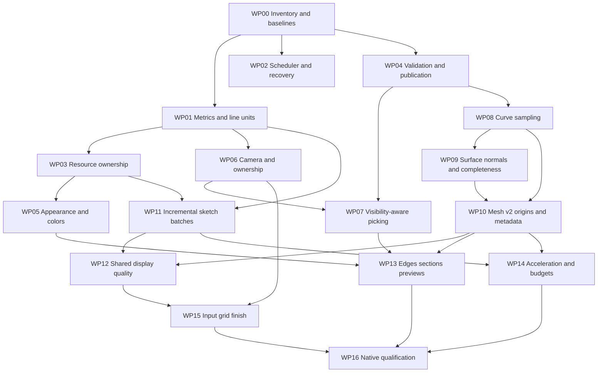

# Implementation guide — Claude Code / Fable 5.1

**Program:** OneCAD VP-HARDENING 1.0  
**Role:** Implement the specified design, integrate it carefully, and provide reproducible evidence. Do not redesign the program.  
**Required companions:** [Specification](01-SPECIFICATION.md), [numerical/protocol contracts](03-NUMERICS-AND-PROTOCOL.md), [acceptance plan](04-ACCEPTANCE-AND-TESTS.md).

## 1. Start here

The repository is not an empty project. It already has extensive UX, identity, publication, and camera work. Read actual source and current worktree changes before modifying anything. The baseline for this package is `65b4c60eb226a201f2fa3eb565d7283b1c63b5ac`; never reset the checkout to that commit.

The original review is evidence about that baseline, not a mandate to replay fixes that newer source already contains. If an issue is fixed, add/execute the relevant acceptance case, document the exact source and commit, and move on.

This package selects the architecture and algorithms. Fable's discretion is limited to local naming, adapting to actual source signatures, making safe incremental patches, and implementing tests. It may discover evidence that invalidates a design assumption. In that case, write a deviation record with an executable counterexample and keep unrelated packages moving. Do not silently lower quality or turn a required gate into a TODO.

### 1.1 Documents and source precedence

Apply these rules in order:

1. User data preservation and existing safety/transaction constraints.
2. Current canonical document/protocol meaning for existing persisted or wire versions.
3. New target requirements in this package for deliberately introduced behavior/versions.
4. Actual source APIs and installed dependency behavior.
5. Historical comments, old handoffs, and prior model summaries.

A stale comment saying device-pixel linewidth is required does not outrank a tested installed Three.js contract. Conversely, a design document cannot silently change the meaning of persisted MESH1 version-1 coordinates.

### 1.2 Initial read set

Read root `AGENTS.md`, `CLAUDE.md`, and heads/relevant sections of `CURRENT_STATE.md`, `TODO.md`, `HANDOFF.md`, `PLAN.md`, and `CLAUDE-CODE-HANDOFF-2026-09-12.md`. Read `docs/ARCHITECTURE.md`, viewport engine README, and the mesh/geometry sections of the canonical protocol.

Do not ingest enormous ledgers blindly into every subagent. Extract exact relevant ranges and pass a bounded work brief, but do not omit constraints that govern the edited layer.

Keep the historical measurement/annotation/pattern acceptance gaps visible. This viewport program does not declare unrelated native UX work accepted.

## 2. Operating model and evidence discipline

### 2.1 Team structure

Use one Fable orchestrator and at most **three concurrent work streams total**. The recommended arrangement is two disjoint implementation streams plus one read-only review/test stream. If the orchestrator edits a shared integration file, that edit consumes its file ownership and cannot overlap a subagent's edit.

All custom worker templates use `model: inherit`. Select Fable 5.1 in the main session and verify actual routing in the installed Claude Code version. Do not hardcode an unverified provider-specific model ID. Do not invoke paid external models, Codex, or another API unless separately authorized.

Use these roles:

| Role | Ownership |
|---|---|
| Rendering implementer | Scheduler, metrics, resources, materials, sections, render policy |
| Geometry implementer | C++ tessellation, normals, classification, protocol fixtures |
| Interaction implementer | Camera, input, picking, sketch cache/batches, grid |
| Gate reviewer | Read-only diff/correctness review and serialized gate execution |

Only activate compatible roles within the concurrency limit. A role name does not grant access to every file in its general area.

### 2.2 File locks

The orchestrator maintains an ownership table in `execution/STATUS.md`. Columns: package, owner, exact files/directories, integration seams, start hash, current state.

`ViewportEngine.ts`, `ViewportRoot.tsx`, `meshSync.ts`, `SketchObject.ts`, `settingsStore.ts`, `protocol/SCHEMA.md`, `protocol/mesh_format.md`, Rust DTOs, and worker Dispatcher are **single-owner files**. Do not split ownership by vague method names unless the orchestrator integrates patches serially.

Subagents return a diff summary and tests. They do not commit, push, rebase, reset, delete caches globally, edit registry dependencies in place, or clean unrelated files. No automatic worktree creation that makes unauthorized commits. Worktrees may be used only under the user's existing authorization and repository policy.

### 2.3 Heavy-build lane

Only one heavy build/test process runs at a time: Cargo, CMake, full Vitest, Playwright, or native WebdriverIO. Use the status ledger as a human/agent mutex. A stale lock needs process inspection, not blind deletion.

Small pure helper tests can run in an isolated lightweight lane only when they do not compete for the same build outputs or browser port. Keep CMake parallelism at the existing repository-supported value; do not launch all CPU cores merely to save agent waiting time.

### 2.4 Evidence states

Every package has independent states:

```text
not-started → reproducing → implementing → focused-pass → integrated-pass → native-accepted
                                               ↘ blocked-native
```

`blocked-native` is not accepted. An implementation can be merged for further testing if the user authorizes a merge, but this agent may not claim a platform release passed.

Every test record contains timestamp, source/dirty-tree hash, exact command, environment, exit code, passed/failed/skipped counts, log/artifact paths, and what the result does NOT prove. Preserve first red reproductions.

## 3. Repository command discipline

Use current checked-in scripts and Bun's frozen lockfile. These commands are grounded in the inspected repository guidelines; recheck names and options if the checkout has changed.

```bash
# Read-only inventory. Capture output in a new evidence directory, not over old logs.
git status --short
git rev-parse HEAD
git diff --stat
git diff --check
bun --version
node --version
cmake --version
rustc --version
```

Install only into the intended checkout using `bun install --frozen-lockfile`. The pre-approved acceleration dependency is introduced in its own change and then pinned with an updated `bun.lock`; do not touch stale `package-lock.json`.

```bash
# Frontend type and unit gates, using the local compiler.
npx --no-install tsc --noEmit
bun run test
bun run build

# Worker must be built/staged before app-crate Cargo builds.
scripts/build-worker.sh Release
ctest --test-dir worker/build --output-on-failure

# Execute from src-tauri; verify the configured worker path actually exists.
cargo fmt --all --check
cargo clippy --workspace --all-targets -- -D warnings
ONECAD_WORKER_PATH="$PWD/../worker/build/onecad-worker" \
  ONECAD_REQUIRE_WORKER=1 cargo test --workspace
```

The current worker build uses pinned OCCT 8.0.1 and explicit artifact provenance. Read `scripts/build-pinned-occt.sh`, `scripts/build-worker.sh`, and active configuration; do not substitute a random system OCCT install. A missing dependency is an environment blocker, not permission to mock native acceptance.

```bash
# Existing browser lane: real app and WebGL, mock backend.
bun run e2e -- --project=chromium
bun run e2e -- --project=webkit

# Native test build and real-stack lane, on an appropriate native machine.
bun run tauri build --features tauri-e2e \
  --config src-tauri/tauri.e2e.conf.json --bundles app
bun run e2e:tauri
```

Tauri build flags are not placed after an extra `--`, which would forward them to Cargo. Confirm free ports and never kill unrelated processes to obtain them. Logging commands must preserve pipeline exit status (`set -o pipefail` where applicable); a successful `tee` is not a passing test.

Run current stdout hygiene and modeling contract/coverage verification scripts after cross-layer changes. Do not weaken an existing unrelated red gate or delete its fixture; preserve baseline evidence and report whether this package affects it.

## 4. Work-package graph and sequencing



WP08/09 numerical helpers may begin while frontend packages are in progress, but there is one owner for worker tessellation and the schema. Avoid introducing v2 production requests until every consumer can interpret the origin correctly.

## 5. WP00 — inventory, reproducible failures, and baseline gallery

**Purpose:** Establish the facts that implementation will be measured against.  
**Dependencies:** None.  
**Main files:** Read-only repository inventory; new `docs/qa/viewport/`, fixture helpers, focused tests.

### Steps

1. Capture current commit, worktree status, active dependency versions, kernel fingerprint, worker path, native app build, and available test devices.
2. Map every R01–R18 finding to source. Distinguish still-present, changed, already-fixed, and uncertain. Do not spend the package rewriting unrelated code.
3. Introduce a deterministic fixture gallery with model IDs, exact dimensions, camera state, light state, and scripted actions. Use generated primitive models plus checked-in small fixtures; do not depend on personal documents.
4. Add instrumentation boundaries around frame stages, mesh creation/retirement, and pick queries without changing behavior.
5. Convert the mathematical counterexamples in the original review into pure regressions. Add a real-WebGL linewidth probe that executes `onBeforeRender` and a rendered-hover lifecycle loop.
6. Record baseline test failures and current geometry counts. Do not baseline a broken image as the desired final image.
7. Verify `three-mesh-bvh` compatibility and exact available version from its package metadata/official source. Pin the selected compatible version in a narrow dependency change only when WP14 is ready to use it; record that version in the dependency lock record.

**Exit:** Test harness can identify the installed binary/resource used; red reproductions are preserved; no claimed native result relies on the mock backend. QA case IDs exist even for blocked physical-device cases.

**Reject:** "The review says it is broken" with no current source mapping; screenshots without deterministic state; acceptance percentages inferred from code size.

## 6. WP01 — metrics and CSS-line units

**Requirements:** VP03. **Findings:** R01.  
**Main existing files:** `engine/dpr.ts`, `bodyMaterials.ts`, `SketchObject.ts`, `SketchStaticLayer.ts`, `HighlightLayer.ts`, `Picker.ts`, `ViewportEngine.ts`, all line/gizmo modules.  
**New seam:** `engine/ViewportMetrics.ts`, `engine/screenLineStyle.ts` or equivalent narrow modules.

### Patch sequence

1. Add immutable metrics snapshots with `revision`, CSS dimensions, buffer dimensions, capped DPR, and camera projection revision. Explicit unit suffixes are required.
2. Add line creation/update helpers using CSS linewidth and logical resolution. Test against installed addon draw behavior.
3. Change body edges and body-edge pick threshold together. Do not ship a draw fix with old device-pixel hit radius.
4. Migrate sketch active/static/draft/highlight/construction/dimension/triad/gizmo families. Maintain a coverage checklist of every `LineMaterial` constructor.
5. Introduce an idle DPR watcher. Re-arm its media query after each change and remove it on disposal. Repaint without moving the camera.
6. Keep points/textures/drawing buffers on their own unit adapters. Audit each marker's actual Three.js scaling path.
7. Update misleading comments and tests; tests must assert CSS results, not the old pre-draw uniforms.

**Focused tests:** TEST-LINE-01–04, TEST-LIFE-04.  
**Integration test:** Pick an edge immediately after mesh installation, before its first rendered frame; then repeat after a DPR change.

**Exit:** Measured widths and acquisition radius stay stable in CSS units across the DPR matrix. Every owned line family has one documented metric path.

## 7. WP02 — scheduler, submission truth, and context recovery

**Requirements:** VP01–VP02. **Findings:** R06, R17.  
**Files:** `ViewportEngine.ts`, `renderer.ts`, engine lifecycle tests; new `FrameScheduler.ts` if extraction reduces complexity.

### Patch sequence

1. Write reentrant-invalidation tests before extracting the scheduler. Add contribution and after-render callback cases.
2. Consume dirty state before render callbacks. Return separate changed/still-active transition flags.
3. Introduce requested/submitted revisions and a frame snapshot containing actual displayed publication IDs.
4. Preserve existing backend acknowledgment behavior without labeling submission as presentation. Update trace wording and tests.
5. Gate experimental WebGPU selection at capability admission. Saved preference fallback must remain clear and nonfatal.
6. Add context-lost/restoring/disposed state. Rebuild GPU-only environment resources after renderer restoration, retain valid CPU geometry, and handle failure once without a busy loop.
7. Verify constructor/dispose races and callback cleanup under StrictMode.

**Focused tests:** TEST-LIFE-01–05, TEST-BACKEND-01–03.  
**Exit:** No lost redraw; no idle loop; no callback into disposed engine; failure cannot acknowledge a frame that was never submitted.

**Reject:** Adding a permanent rAF to hide missing invalidations; emitting a mesh-rendered acknowledgment from a scheduled callback before a render.

## 8. WP03 — resource leases and bounded highlights

**Requirements:** VP04. **Findings:** R02.  
**Files:** `meshRegistry.ts`, `HighlightLayer.ts`, `BodyObject.ts`, section resource sharing, transient marker owners.

### Patch sequence

1. Add resource identity and accounting without changing payload parsing. Introduce acquire/release leases and debug owner tags.
2. Migrate body and section geometry borrowers to exact geometry-object leases. One registry ownership entry controls disposal.
3. Replace face wrappers with compact owned face geometry. Build a local vertex remap from the face's triangle slice; copy only required attributes. Keep topology ordinal external to the new compact vertex numbering.
4. Whole-body highlights borrow the exact source geometry. Edge highlights own their segment buffers.
5. Implement the bounded highlight cache and explicit pinned/unpinned lifetime. Retire cache entries when their source resource is retired.
6. Make multi-face selection use a per-body owned combined buffer. Reuse capacity; do not build one full-body copy per selected face.
7. Audit point/preview attribute replacement. Count every owned GPU allocation, not only registry meshes.
8. Replace the existing "never dispose face wrapper" regression with a test for no shared-buffer deletion and bounded actual renderer geometries.

**Focused tests:** TEST-RES-01–05.  
**Exit:** 1,000 rendered alternating hovers plateau after warm-up; source body survives highlight disposal; 50 document cycles return to the allowed baseline.

**Reject:** Calling `dispose()` on shared-attribute wrappers; deleting attributes immediately before disposal as an undocumented renderer workaround; measuring only scene children.

## 9. WP04 — validation, admission, and publication freshness

**Requirements:** VP05. **Findings:** R11 and R15 publication boundary.  
**Files:** `parseMeshPayload.ts`, `meshRegistry.ts`, `meshSync.ts`, `faceRangeIndex.ts`, Rust mesh forwarding/cache code, worker diagnostics.

### Patch sequence

1. Add branded/opaque `ValidatedMesh` construction that can only be obtained from semantic validation. Keep low-level parsed views separate.
2. Check counts, ranges, finite values, IDs, and output expansion cost before GPU creation. Add maliciously large but structurally plausible fixtures.
3. Add resource-admission accounting for simultaneous old/new/prepared meshes. Enforce document and cache caps.
4. Add `current`, `stale-inspection-only`, `failed-initial`, and `pending-replacement` display states separate from document readiness.
5. Preserve current publication guards through validation and preparation. Every job captures a fence and rechecks before installation.
6. Discard queued older jobs early; cancellation releases transfer/copy buffers. Keep latest-wins reload per body.
7. Block semantic promotion from stale display resources; keep orbit/fit and tagged historical inspection.
8. Add body-specific diagnostics and keep last valid geometry visible on a failed replacement.

**Focused tests:** TEST-MESH-01–06, TEST-PUB-01–04.  
**Exit:** No structurally valid malformed payload reaches GPU construction; stale data is never stamped with a newer publication; failure is inspectable and non-destructive.

**Note:** Implement synchronous pure validation first. Move large preparation into the worker in WP14 without changing its contract. Small payloads do not need cross-thread overhead.

## 10. WP05 — appearance resolver, assembly colors, and color mapping

**Requirements:** VP06. **Findings:** R05, R14 focus behavior, R18 additional color defect.  
**Files:** `bodyMaterials.ts`, `renderModes.ts`, `BodyObject.ts`, `faceColors.ts`, `meshRegistry.ts`, token definitions.

### Patch sequence

1. Fix `TopoIndex.idAt(faceOrdinal)` to `idOf(faceOrdinal)` in face-color mapping. Prove with unequal face triangle counts and a zero-count face. Keep it as a small standalone patch.
2. Create the appearance input/descriptor model and a pure precedence resolver. Cover all combinations before wiring mutable Three materials.
3. Remove saved states keyed only by material kind. Apply focus/assembly/preview descriptors to every existing and newly created material set.
4. Implement opaque focus transformation for material and vertex-color variants. Keep authored arrays unchanged. Verify linear color space and tone mapping boundaries.
5. Make assembly mode override authored colors for diagnostic differentiation, then restore authored appearance exactly when leaving the mode.
6. Introduce topology-aware sidedness. Keep sheets double-sided; use front-sided closed solids after normal/winding acceptance. During the transition, guard the switch behind normal-correctness tests rather than exposing disappearing bodies.
7. Replace global de-indexing with indexed colors and minimal vertex splitting only when validated shared vertices have conflicting colors.
8. Ensure a color-only edit avoids unnecessary native retessellation or semantic selection rebinding.

**Focused tests:** TEST-APP-01–05, TEST-COLOR-01–03.  
**Exit:** Mode/theme/sketch/preview state transitions are reversible with no stale opacity, no changed authored colors, and correct per-face mapping.

## 11. WP06 — canonical camera and interaction ownership

**Requirements:** VP07–VP08. **Findings:** R07, R16.  
**Files:** `CameraRig.ts`, `CadOrbitControls.ts`, `cameraFit.ts`, `navInput.ts`, viewport bridge and settings migrations.

### Patch sequence

1. Add state-migration tests preserving the current saved model view. Define canonical half-height and full orientation; retain compatible public actions while migrating callers.
2. Unify camera commits, resize, projection switches, FOV changes, and matrix updates. Orthographic stationary resize is the first regression.
3. Implement effective-factor anchored zoom. Test both limits and both projection modes through projected pixel positions.
4. Cancel active transitions for every accepted manual input. Rebase navigation recognition when a tool acquires/releases a drag.
5. Add explicit interaction owner state; freeze camera during active tool drags and leave armed tools navigable.
6. Implement exact plane-basis sketch entry, full saved-view restoration, and `Look at sketch`. Preserve existing plane-axis conventions rather than relabeling world X/Y.
7. Route fit-visible/selection/preview/Home through the existing safe-rectangle math where valid. Home frames translated models, not an empty origin.
8. Add bounds-aware near/far and depth-convention adapter; verify before removing the fixed constants from production.
9. Update default new-view FOV to 35° with preference migration, without changing old saved appearance.

**Focused tests:** TEST-CAM-01–08, TEST-INPUT-01–04.  
**Exit:** No clamped drift, no user input overwritten by a tween, correct stationary resize, exact arbitrary-plane basis, and unchanged document history.

**Reject:** Recreating the viewport React component to switch projection; adding a scene-root rotation; reusing a yaw-only snapshot for a tilted sketch plane.

## 12. WP07 — visible picking and hover currentness

**Requirements:** VP09. **Findings:** R10 plus current hover/click edge cases.  
**Files:** `Picker.ts`, `ViewportEngine.ts` pick seams, viewport selection bridge; new candidate-visibility helpers.

### Patch sequence

1. Separate acquisition radius and occlusion tolerance types. Preserve the six-pixel UI radius.
2. Add the thin-wall counterexample and a neighboring visible-edge fixture.
3. Implement projected closest-point recovery and matched-ray visibility from NUM §6. Start with existing triangle queries; acceleration comes later.
4. Add explicit ambiguous/refining selection state rather than choosing hidden edges under meshing uncertainty.
5. Keep all-hit enumeration for explicit pick-through and deterministic sorting.
6. Extend candidate proof to full installed resource identity. Preserve fail-closed semantic promotion.
7. Add pointer slop, pointercancel/lost-capture handling, and stationary-pointer hover invalidation on camera/mesh/section/modifier changes.
8. Include cap/preview roles through the effective display snapshot once WP13 integrates them; keep that cross-package gate open until then.

**Focused tests:** TEST-PICK-01–07, TEST-PUB-03–04.  
**Exit:** Hidden edge cannot win ordinary picking through a pixel-radius-sized world bias; visible edges remain easy to acquire; stale candidates cannot operate.

## 13. WP08 — exact-span curve sampler

**Requirements:** VP11. **Findings:** R03.  
**Files:** `worker/src/tess/Tessellate.cpp`; new `worker/src/tess/CurveSampler.*`, unit fixtures, optional independent verification helper.

### Patch sequence

1. Extract curve sampling behind a typed result with samples, original parameter intervals, chord bound, angular status, certification class, and diagnostics.
2. Add the degree-five S-curve regression before replacing old logic.
3. Implement exact family conversion and homogeneous subdivision. Test splitting, weight normalization, orientation reversal, and periodic endpoints independently.
4. Implement the control-hull finite-segment bound. Add rational weight and near-degenerate chord cases.
5. Implement derivative-numerator Bernstein coefficients and tangent-cone checks. Cross-check derivatives against independently evaluated rational derivatives.
6. Implement caps/cancellation and `quality-limited` outcomes; no success at recursion depth alone.
7. Add the prescribed approximate fallback with clearly separate quality evidence. Do not characterize sampled error as certified.
8. Integrate into edge export without changing TopExp ordering, ElementIds, or TopoKeys.
9. Add face-edge boundary agreement fixtures; integrate scratch meshing changes in WP09/10.

**Focused tests:** TEST-CURVE-01–07.  
**Exit:** S-curve and rational/periodic fixtures meet their independently tested chord budgets; limits report honestly; topology identity remains stable.

**Reject:** Replacing one midpoint with three samples and calling it a proof; fixing only circles; dense sample oracle that calls the same new subdivision code.

## 14. WP09 — surface normals and complete tessellation

**Requirements:** VP10. **Findings:** R04, R11 producer completeness.  
**Files:** tessellator, worker surface-normal helper, shape-partition diagnostics.

### Patch sequence

1. Add normal provenance and completeness metadata internally before changing wire representation.
2. Read UV nodes/supporting surfaces and implement the chosen normal evaluation/transform contract. Isolate OCCT triangulation mutation.
3. Handle analytic singularities and general singular fallback as NUM §7 defines. Preserve face-owned vertex identity and triangle ordering.
4. Validate orientation and mirrored placement with closed solids. Do not flip normals twice because a model operation is named mirror.
5. Replace silent +Z fallback and silent nondegenerate missing-face success with diagnostics and explicit partial/failed states.
6. Verify current OCCT mesher invocation and remove redundant `Perform()` only if its constructor already performs the work in the pinned build and tests prove equivalence. This is a bounded cleanup, not a required speculative optimization.
7. Add incidence/solid partitions for section metadata and classification. Preserve native tolerance/provenance.
8. Validate edge-on-triangulation boundary alignment and refine where the two representations exceed the joint budget.

**Focused tests:** TEST-NORMAL-01–06, TEST-CURVE-06, TEST-MESH-06.  
**Exit:** Analytic normal fixtures pass, true creases remain, incomplete nondegenerate display cannot be called complete, and no document mutation occurs from display work.

## 15. WP10 — versioned local-origin mesh and quality metadata

**Requirements:** VP17–VP18 wire portion. **Findings:** R12, R13 metadata.  
**Files:** canonical mesh/schema documents; C++ encoder/Dispatcher; Rust protocol/DTO/cache/forwarding; TS parser/client/mock/registry; every world/local consumer.

### Patch sequence

1. Reserve and document v2 sections exactly as NUM §9. Add a source-level version discriminator; keep v1 bytes and tests unchanged.
2. Implement little-endian encoding with alignment/padding tests and tiny golden fixtures readable by C++, Rust, and TS.
3. Add hello capabilities, structured quality requests, explicit cache-key v2, and packaging admission. Do not reuse the legacy string parser for new keys.
4. Compute local origins before float32 conversion; emit true quantization errors and local bounds. Add large-translation fixtures.
5. Introduce a `RenderOrigin`/coordinate adapter and migrate body placement, ray casts, highlights, stencils, grids, lights, previews, sketch planes, markers, and DOM projection.
6. Add round-trip tests per consumer before enabling v2 requests globally.
7. Switch the application to request v2 with negotiated support. Old-worker mismatch must produce an explicit incompatibility/fallback policy, not mispositioned geometry.
8. Keep cached v1 rendering inspectable as legacy and regenerate. Never overwrite user BRep data to migrate a display cache.
9. Ensure LOD/display refinement has its own revision and no undo/document dirty effect.

**Focused tests:** TEST-PROTO-01–06, TEST-PREC-01–05, TEST-PUB-01–04.  
**Exit:** All three language lanes decode the same fixtures; large translation preserves local detail; every consumer uses one origin revision.

**Integration rule:** This is one owned cross-layer package. Do not publish a C++ v2 producer while TS still treats header bounds as world coordinates.

## 16. WP11 — stable sketch resources and batched updates

**Requirements:** VP13. **Findings:** R08.  
**Files:** `SketchObject.ts`, `SketchStaticLayer.ts`, draft/trim channels, marker and dimension layer owners; new sketch display-cache/batch modules.

### Patch sequence

1. Add entity geometry revisions and a stable display handle map without changing analytic entities or solver behavior.
2. Remove geometry rebuilding from hover and selection transitions. Use small separate halo/hover buffers.
3. Introduce chunked segment batches and entity-to-span mapping. Validate that unrelated entities never become connected.
4. Add per-segment colors and correct per-entity dash distance/phase. Keep semantic constraint colors visible inside selection halos.
5. Replace draft/trim allocation loops with capacity-managed owned buffers. Track writes/uploads by range.
6. Batch markers and dimension witnesses without per-frame React updates. Preserve separate active/static depth policies.
7. Add deletion/update/compaction paths and bounded memory behavior. Compaction after interaction must not invalidate semantic IDs or block input with an unbounded pass.
8. Remove compatibility scaffolding once all channels use the new lifetime model; do not keep two competing resource owners.

**Focused tests:** TEST-SK-01–04, TEST-RES-04.  
**Exit:** Hover across 5,000 entities does not recreate unchanged geometry; uploads are proportional to changed style/overlay spans; preview resource counts plateau.

## 17. WP12 — shared adaptive quality and controlled mesh refinement

**Requirements:** VP12, VP18. **Findings:** R09, R12 fixed tier.  
**Files:** `curveTessellation.ts`, sketch cache/channels/fill builders, screen metrics, mesh quality controller and cache seams.

### Patch sequence

1. Replace session-max retessellation state with per-entity/leaf state and explicit error/cap status.
2. Share the exact projected conic/Bézier path between active, static, draft, trim, and fill boundaries.
3. Implement near-plane handling, entity-local quality estimates, and refine/coarsen hysteresis. Preserve no-idle-loop behavior with bounded one-shot settle timers.
4. Reuse boundary samples for fills; reject mismatched curve/fill revisions.
5. Add latest-wins display quality requests and quantized tolerance levels. Keep current finer meshes during navigation.
6. Prioritize visible/selected/high-error resources; keep one native display job active and yield to document operations.
7. Reject old results after topology/quality changes; do not invalidate semantic selection for a pure LOD swap.
8. Surface limited/refining/legacy status only when meaningful. Measure requested versus observed/native error separately.

**Focused tests:** TEST-SK-05–08, TEST-LOD-01–05, TEST-PUB-04.  
**Exit:** Cap saturation of one curve cannot freeze another; all sketch channels meet the same settled contract; refinement produces no document edit and no idle polling.

## 18. WP13 — feature-edge policy, sections, and exact previews

**Requirements:** VP14–VP16. **Findings:** R13, R14.  
**Files:** `renderModes.ts`, `BodyObject.ts`, `SectionLayer.ts`, `HighlightLayer.ts`, preview replacement paths, `renderOrder.ts`; new effective-display snapshot helper.

### Patch sequence

1. Add classification metadata from worker incidence/continuity. Unknown edges remain visible. Test shallow real creases.
2. Implement features/all/none policy without losing topology acquisition in explicit inspection mode.
3. Build the effective display snapshot and migrate section, pick, and render traversal to it. Remove divergent visibility restoration maps.
4. Introduce the explicit depth/order policy with all overlay depth writes set deliberately.
5. Implement per-solid stencil/cap processing, hatch style, and cap persistence under opaque focus. Account for render stats across subpasses.
6. Include accepted exact replacement previews and their rollback in the cap/display set. Do not include stale/invalid previews as current geometry.
7. Add cap inspection targets and cap occlusion in picking. Cap clicks must not promote far-side faces.
8. Add visible and hidden selected-edge styles with proper section clipping. Ordinary hover never becomes x-ray.
9. Keep open sheets clipped but not falsely capped; report partition limitations.

**Focused tests:** TEST-EDGE-01–04, TEST-SECTION-01–07, TEST-PREVIEW-01–04.  
**Exit:** All render-mode/section/sketch/preview combinations have defined pixels and pick semantics; no fabricated editable cap topology.

## 19. WP14 — acceleration and bounded preparation

**Requirements:** VP19, VP05 budgets. **Findings:** R15.  
**Files:** mesh preparation worker, registry, picker adapter, BVH integration, job/cancellation tests.

### Patch sequence

1. Lock the exact verified compatible `three-mesh-bvh` version. Wrap it locally; do not globally monkey-patch all Three meshes.
2. Use indirect source-triangle mapping. Assert byte-for-byte preservation of source indices and unchanged face IDs after build/serialize/deserialize.
3. Build triangle acceleration in the frontend worker with full identity fences and bounded concurrency. Transfer ownership of buffers deliberately; never touch detached arrays.
4. Build deterministic indirect edge AABB trees and a body-level index. Preserve segment ordinals and analytic entity IDs.
5. Optimize ordinary nearest-visible queries without breaking section-clipped nearest hits or explicit all-hit enumeration.
6. Add cooperative cancellation between bounded preparation stages; an obsolete result must release every output buffer without installation.
7. Measure main/stress workloads. Investigate allocations, copies, upload bandwidth, and draw counts before claiming GPU limits.
8. Keep fallback queries for tiny meshes; avoid worker/BVH overhead for a trivial triangle fixture. Threshold is 2,000 triangles for initial background BVH admission; correctness does not change below it.

**Focused tests:** TEST-BVH-01–05, TEST-PERF-01–05.  
**Exit:** Main workload meets pick budgets, source topology mapping remains unchanged, and cancellation/memory pressure remains bounded.

## 20. WP15 — grid, touch/pen finishing, and capture

**Requirements:** VP08, VP20, VP01 capture optimization. **Findings:** R16, R17 capture opportunity.  
**Files:** `GridPlane.ts`, `navInput.ts`, controls/coordinator, overlay layout, renderer/capture helpers.

### Patch sequence

1. Complete two-pointer centroid/scale transaction and pen/touch arbitration. Use native physical input tests for claims about devices.
2. Implement the derivative-antialiased grid shader, projected-scale step policy, bounded transition timer, and horizon fade.
3. Share the effective grid step with optional adaptive grid snapping; freeze it during active drags. Do not tie visibility to snapping.
4. Audit overlay safe work areas, chip anchor transforms after origin rebase, and no forced-layout loop.
5. Measure capture without permanent drawing-buffer preservation on the native baseline. Change the default only when visual/capture/idle tests pass; otherwise retain the existing setting with evidence.
6. Run visual polish fixtures with finalized normals/materials. Adjust only tokenized styling within the fixed hierarchy; changes to quantitative thresholds need a deviation record.
7. Keep optional future effects out of this package.

**Focused tests:** TEST-INPUT-05–08, TEST-GRID-01–04, TEST-CAPTURE-01–03.  
**Exit:** Navigation policy matches actual event handling, grid is stable and idle, and capture accurately represents the latest submitted display without harming document save.

## 21. WP16 — native qualification and final handoff

**Requirements:** VP21 and all preceding requirements. **Findings:** R01–R18 closure.  
**Files:** Test evidence, coverage matrix, minimal fixes found by qualification, repository status/handoff documents.

### Steps

1. Run focused suites, then full frontend, worker, Rust, protocol, browser, and real Tauri suites serially.
2. Capture the exact packaged app/worker fingerprint and source hash for native evidence. Do not mix screenshots from one build with tests from another.
3. Execute physical mouse/trackpad/display changes and available touch/pen cases. Mark unsupported devices unqualified.
4. Run the deterministic main/stress workload measurements, resource soak, context recovery, and malformed/stale job cases.
5. Review every visual baseline manually against analytic/semantic expectations before accepting images. Compare pixels and topology selection together.
6. Reconcile original R01–R17 and added R18 in the traceability matrix. Each row names source changes, tests, native artifacts, and residual limitations.
7. Write a final report stating implemented, measured, failed, skipped, and unsupported items. No broad percentage replaces the matrix.
8. Keep existing unrelated native acceptance gaps separate. Do not label the entire CAD application production-ready merely because this viewport program passes.

**Exit:** Every mandatory qualified-platform case passes; no open P1 viewport defect; budgets and documented limitations are visible; no source/protocol drift; no unauthorized repository operations.

## 22. Common failure patterns the reviewer must actively reject

| Proposed shortcut | Why it is rejected |
|---|---|
| Permanent redraw loop | Hides missing invalidations and drains idle resources |
| Fixed 128/256/1024 segments everywhere | Does not establish screen/world error bounds |
| More sample points called a proof | Samples can miss an interior excursion |
| Dispose shared BufferAttributes indiscriminately | Can invalidate a body still being rendered |
| Never dispose shared wrappers | Leaves renderer geometry/binding resources unbounded |
| Higher polygon offset until lines look good | Can obscure thin gaps and conceal mismatched geometry |
| Normalize every bad normal to +Z | Creates false shading rather than surfacing invalid data |
| Treat all edges as equally important | Leaves seams/tangent clutter and no semantic display policy |
| Reorder triangles without mapping | Breaks face picking, colors, and persistent-reference acquisition |
| Bypass old publication checks for LOD | Allows stale geometry to become actionable |
| Green mock suite labeled native accepted | Does not test real OCCT or native input/compositor behavior |
| Delete a failing native test | Removes evidence rather than fixing behavior |
| Replace document geometry to migrate a cache | Violates data preservation |

## 23. Required package handoff format

Each package ends with this compact record in the execution ledger:

```markdown
## WPxx — <title>
Status: focused-pass / integrated-pass / native-accepted / blocked-native
Source checkpoint: <commit plus dirty-diff hash>
Owned/changed files: <exact paths>
Requirements and findings: <VP / R IDs>
Behavior changed: <observable contract>
First failing reproduction: <command and log>
Passing focused gates: <commands, exit codes, counts, paths>
Integrated/native evidence: <paths or explicit not-run>
Resource/performance delta: <measured values, not estimates>
Unresolved risks: <specific evidence gaps>
Next allowed package: <WP ID and dependency state>
```

Before compaction or a new session, update this ledger and record active file ownership, running heavy process, next command, and remaining acceptance cases. A new session must resume from evidence, not from an optimistic narrative.
