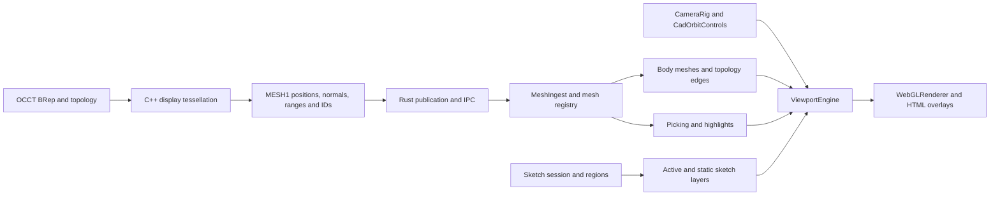
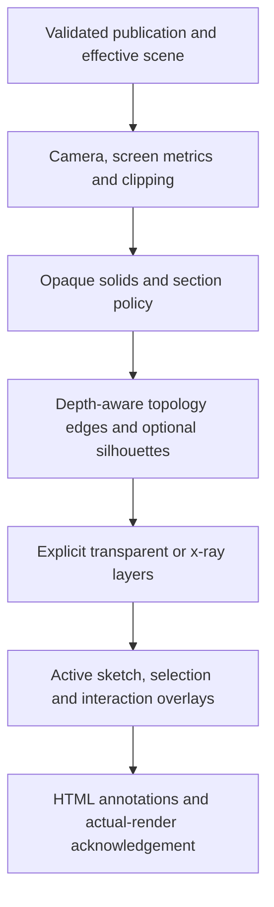

# OneCAD — rendering and viewport hardening review

**Review date:** 13 September 2026  
**Repository:** https://github.com/andrejvysny/OneCAD  
**Reviewed branch:** `master`  
**Pinned commit:** `65b4c60eb226a201f2fa3eb565d7283b1c63b5ac`  
**Commit date:** 12 September 2026, 13:27:35 UTC  
**Commit subject:** Record UX hardening handoff status

## 1. Executive recommendation

**Harden the existing architecture; do not replace the renderer.**

The inspected code has several valuable foundations: an imperative viewport outside React reconciliation, a Z-up coordinate invariant, topology-addressable meshes and edges, publication-aware mesh ingestion, on-demand rendering, a studio-lighting setup, and explicit section/picking behavior.

The main professional-readiness gaps are not missing photorealistic materials. They are inconsistent pixel units, resource ownership, incomplete geometric error guarantees, excessive geometry rebuilding, and camera/picking edge cases.

Prioritize deterministic behavior and geometric truth before ambient occlusion, richer environments, or a WebGPU migration.

### Scope and evidence limits

This is a **static source audit**, supported by upstream Three.js implementation checks and independent numerical reproductions. The native application, OCCT worker, repository test suite, and GPU pipeline were **not executed** during this review. No frame-rate measurements, native screenshot comparisons, or measured VRAM growth are claimed.

`reproduce_math.py` transcribes small decisions from inspected code. Its output is independent algorithm evidence, not an execution of OneCAD itself. These counterexamples should become native or frontend regression tests in the repository.

The review distinguishes:

- **Confirmed code defect:** control flow or source/upstream interaction establishes the problem.
- **Numerically reproduced:** an isolated mathematical decision fails on an explicit counterexample.
- **Implementation risk:** the mechanism exists, but visual severity requires native testing.
- **Product improvement:** a recommended capability, not a claim that the current contract is broken.

**P1** means high-priority hardening before a professional-readiness claim. **P2** means the next quality/scalability phase, or a feature whose priority depends on the supported workload. No P0 document-corruption issue is established by this viewport audit.

## 2. Current architecture



`package.json` pins Three.js to **0.185.1**. The current frontend is React/TypeScript with an imperative Three.js engine. WebGL is the default rendering path. Experimental WebGPU does not have equivalent line/material/environment support.

The existing material setup is not a primitive unlit prototype: `MeshStandardMaterial`, neutral tone mapping, a prefiltered room environment, and camera-relative key/fill lights already exist. Preserve these foundations while fixing their inputs and contracts.

Sources: [package.json](https://github.com/andrejvysny/OneCAD/blob/65b4c60eb226a201f2fa3eb565d7283b1c63b5ac/package.json), [engine architecture](https://github.com/andrejvysny/OneCAD/blob/65b4c60eb226a201f2fa3eb565d7283b1c63b5ac/src/viewport/engine/README.md), [ViewportEngine](https://github.com/andrejvysny/OneCAD/blob/65b4c60eb226a201f2fa3eb565d7283b1c63b5ac/src/viewport/engine/ViewportEngine.ts), [mesh ingestion](https://github.com/andrejvysny/OneCAD/blob/65b4c60eb226a201f2fa3eb565d7283b1c63b5ac/src/viewport/mesh/meshSync.ts).

## 3. Findings and implementation guidance

### R01 — Fat-line rendering uses an inconsistent pixel-unit contract

**Priority:** P1. **Evidence:** confirmed source/upstream mismatch; predicted width consequence, not a measured screenshot.

OneCAD multiplies authored line widths by device-pixel ratio through `cssLineWidth` / `cssToDevice`. It also writes device-pixel dimensions into `LineMaterial.resolution`.

However, the inspected upstream r185 `LineSegments2.onBeforeRender` overwrites that resolution using `renderer.getViewport()`. `WebGLRenderer` stores this viewport in **logical pixels**, even when its drawing buffer uses a higher pixel ratio. The current official `LineMaterial` documentation explicitly defines screen-space linewidth in CSS pixels.

With a 1.25-pixel authored line and DPR 2, the uploaded linewidth becomes 2.5 while the draw-time viewport resolution is logical-pixel sized. The resulting mathematical stroke width is approximately **2.5 CSS pixels**, rather than the intended 1.25. Anti-aliasing can affect the measured footprint, but not the underlying unit mismatch.

There is a second problem: body, static-sketch and highlight widths are evaluated at module import. Active-sketch DPR refresh updates only some material families. Moving between displays can therefore make different layers disagree even beyond the original scaling mistake.

**Implementation:** Define one adapter contract for screen-space `LineMaterial`: CSS linewidth, logical-pixel viewport resolution, and CSS picking tolerance. Reserve device pixels for renderer buffers and operations that explicitly require them. Update `Picker.flushEdgeResolution` and threshold derivation together. Do not remove DPR handling indiscriminately from points, textures, screenshots or the drawing buffer; they have different contracts.

**Acceptance:** On real rendered frames at DPR 1, 1.5 and 2, compare measured CSS widths for body edges, active/static sketches, highlights, construction lines and witnesses. Test display changes without camera motion. Include actual `onBeforeRender` execution; reading a material value before rendering is insufficient.

Sources: [body materials](https://github.com/andrejvysny/OneCAD/blob/65b4c60eb226a201f2fa3eb565d7283b1c63b5ac/src/viewport/engine/bodyMaterials.ts), [SketchObject](https://github.com/andrejvysny/OneCAD/blob/65b4c60eb226a201f2fa3eb565d7283b1c63b5ac/src/viewport/engine/SketchObject.ts), [Picker](https://github.com/andrejvysny/OneCAD/blob/65b4c60eb226a201f2fa3eb565d7283b1c63b5ac/src/viewport/engine/Picker.ts), [r185 LineSegments2](https://github.com/mrdoob/three.js/blob/r185/examples/jsm/lines/LineSegments2.js), [r185 WebGLRenderer](https://github.com/mrdoob/three.js/blob/r185/src/renderers/WebGLRenderer.js), [official LineMaterial contract](https://threejs.org/docs/pages/LineMaterial.html).

### R02 — Face/body highlight wrappers have unbounded renderer-side lifetime

**Priority:** P1. **Evidence:** confirmed ownership defect from OneCAD and upstream renderer source.

`HighlightLayer.shareIndexed()` creates a new `BufferGeometry` wrapper sharing the body's attributes. Hover and selection rebuild these wrappers. `clearObjects()` removes face/body wrappers from the scene but deliberately never disposes them.

Avoiding accidental disposal of shared vertex buffers is necessary. It does **not** make geometry-wrapper disposal unnecessary. In r185, `WebGLGeometries` registers each rendered geometry ID, increments `renderer.info.memory.geometries`, and releases geometry-specific binding states only on its disposal event. Repeated rendered hover changes therefore accumulate renderer bookkeeping/binding resources until renderer teardown. This is not a claim that every hover duplicates the body's entire vertex buffer.

The current unit test explicitly asserts that a face highlight's geometry is never disposed. The test encodes the incomplete ownership model; it does not demonstrate correct GPU lifetime.

**Implementation:** Replace the ambiguous ownership contract. A correctness-first option is compact, owned highlight geometry with explicit disposal, followed by pooling if benchmarks justify it. Alternatives include a dedicated highlight render pass using stable resources, or pooled wrappers with a proven shared-attribute lifetime strategy. Simply calling `dispose()` on the existing shared wrapper can release the body's shared buffers and is not a sufficient patch.

Audit marker-attribute replacement and other transient overlays under the same ownership policy. The mesh-registry leak counter alone cannot detect allocations outside that registry.

**Acceptance:** Render 1,000 alternating face hovers, clear selection, and repeat document open/close. After warm-up, geometry/binding counts must plateau. The underlying body must remain drawable and pickable after every highlight disposal. Measure actual renderer resources, not only scene-child counts or disposal spies.

Sources: [HighlightLayer](https://github.com/andrejvysny/OneCAD/blob/65b4c60eb226a201f2fa3eb565d7283b1c63b5ac/src/viewport/engine/HighlightLayer.ts), [current ownership tests](https://github.com/andrejvysny/OneCAD/blob/65b4c60eb226a201f2fa3eb565d7283b1c63b5ac/src/viewport/engine/HighlightLayer.test.ts), [r185 WebGLGeometries](https://github.com/mrdoob/three.js/blob/r185/src/renderers/webgl/WebGLGeometries.js), [mesh registry](https://github.com/andrejvysny/OneCAD/blob/65b4c60eb226a201f2fa3eb565d7283b1c63b5ac/src/viewport/mesh/meshRegistry.ts).

### R03 — The custom edge sampler can accept a very inaccurate straight segment

**Priority:** P1. **Evidence:** numerically reproduced algorithm failure.

`sample_edge()` subdivides only when the curve midpoint deviates from the endpoint chord or the endpoint tangents differ enough. These two checks do not bound error inside an arbitrary spline interval.

A specific counterexample is:

```text
C(t) = (t, 128*t²*(t - 0.5)*(t - 1)², 0),  0 ≤ t ≤ 1
```

Both endpoints and the midpoint lie on the x-axis. Both endpoint tangents point along +X. The current decision accepts one straight segment. Yet the curve deviates **1.125 mm** at t = 0.25 and t = 0.75, exceeding even a 0.05 mm linear budget.

For a native OCCT regression fixture, this is a degree-five Bézier curve with poles:

```text
(0.0,  0.0, 0)
(0.2,  0.0, 0)
(0.4, -6.4, 0)
(0.6,  6.4, 0)
(0.8,  0.0, 0)
(1.0,  0.0, 0)
```

**Implementation:** Split at spline spans and continuity boundaries, and use a curve-aware error strategy. Evaluate OCCT's supported sampling utilities against these fixtures; do not assume that replacing the function with a named utility automatically proves a global error bound. For Bézier spans, control-polygon bounds provide a stronger basis than one midpoint. Where appropriate, reuse face-boundary polygon data so rendered face borders and edge polylines agree. Keep an explicit budget-exhausted diagnostic rather than silently accepting failure at the depth cap.

**Acceptance:** Compare each output polyline against independent dense/adaptive reference evaluation across S-curves, rational curves, knot clusters, inflections, periodic seams and degenerate edges. Assert maximum deviation, not merely a minimum segment count. Keep topology IDs unchanged.

Sources: [Tessellate.cpp](https://github.com/andrejvysny/OneCAD/blob/65b4c60eb226a201f2fa3eb565d7283b1c63b5ac/worker/src/tess/Tessellate.cpp), [OCCT sampling API](https://occt3d.com/dev/doc/refman/html/class_g_c_pnts___tangential_deflection.html). The OCCT reference is current documentation, not proof that the repository uses that exact OCCT version.

### R04 — Surface shading normals are derived from triangles, not the underlying surface

**Priority:** P1 for visual quality. **Evidence:** confirmed implementation; artifact severity needs native visual fixtures.

The worker area-averages triangle normals within each BRep face. Every face has a separate vertex set. Degenerate accumulated normals fall back to `(0,0,1)`.

This is useful for flat primitives, but it does not establish smooth shading across geometrically tangent face boundaries or periodic seams. Independently averaged boundary normals can differ. Appearance can depend on triangulation density and distribution rather than only on surface shape. Increasing environment intensity or reducing roughness will not correct those inputs.

**Implementation:** Prefer normals evaluated from the underlying surface at the triangulation UV nodes, with face orientation and location transform applied correctly. Handle singularities and invalid evaluations explicitly. Preserve separate vertices and topology IDs where required; geometric continuity does not require indiscriminately welding adjacent faces. Permit real sharp creases to remain sharp.

**Acceptance:** Cylinder seam, sphere poles, torus seam, tangent fillet chain, trimmed spline patch, reversed face and transformed instance. Compare sampled normals against an independent geometric reference and inspect under both diffuse lighting and a narrow grazing highlight. Store screenshots only after native correctness is established.

Source: [Tessellate.cpp](https://github.com/andrejvysny/OneCAD/blob/65b4c60eb226a201f2fa3eb565d7283b1c63b5ac/worker/src/tess/Tessellate.cpp).

### R05 — Assembly-color material state is not dimmed/restored consistently

**Priority:** P1. **Evidence:** confirmed control-flow defect.

`BodyMaterialLibrary.setDimmed()` iterates `sets`, but not `assemblySets`. Existing assembly-colored bodies therefore skip the dim transition. An assembly material created while dimmed receives the dim state but is not restored through the same iteration when editing ends.

The saved state is keyed by `MaterialKind`, while multiple body-specific assembly material sets share the `assemblyColor` kind. Merely adding a second iteration can still cause state collisions.

**Implementation:** Centralize iteration across every material instance. Save transient state by instance or stable set identity, not only by material kind. Better still, derive effective state from immutable authored material data plus explicit view-state flags, rather than nested save/restore mutations.

Separately, `vertexColorKind('assemblyColor')` resolves to `shadedVertex`; imported/authored colors bypass assembly-color assignment. Decide whether the mode preserves authored appearance or intentionally overrides it for body differentiation. This precedence is a product decision, not automatically a bug.

**Acceptance:** Existing and newly created assembly sets; multiple bodies; enter/exit sketch; switch render modes during editing; mixed imported and neutral bodies; theme change while dimmed. Compare every relevant opacity/transparency/depth state before and after.

Sources: [bodyMaterials](https://github.com/andrejvysny/OneCAD/blob/65b4c60eb226a201f2fa3eb565d7283b1c63b5ac/src/viewport/engine/bodyMaterials.ts), [renderModes](https://github.com/andrejvysny/OneCAD/blob/65b4c60eb226a201f2fa3eb565d7283b1c63b5ac/src/viewport/engine/renderModes.ts), [BodyObject](https://github.com/andrejvysny/OneCAD/blob/65b4c60eb226a201f2fa3eb565d7283b1c63b5ac/src/viewport/engine/BodyObject.ts).

### R06 — Reentrant invalidation can be overwritten after a render

**Priority:** P1. **Evidence:** confirmed scheduler ordering defect.

The engine's `tick()` invokes `renderFrame()` and then assigns `dirty = false`. A contribution or synchronous after-render listener that calls `invalidate()` during that frame can schedule another callback and set `dirty = true`, only to have that flag overwritten when the current frame returns. The scheduled callback can then do no rendering.

**Implementation:** Consume the current dirty flag before executing frame work. Preserve new invalidation generated during that work. Reschedule when a tween remains active or newly dirty state remains. Keep idle zero-rAF behavior. Account explicitly for backend submission completion; do not treat a queued callback as an actual rendered frame.

**Acceptance:** A contribution invalidates during its frame hook; an after-render listener changes a visual state and invalidates; both must produce the necessary subsequent frame and then return to idle. Include disposal and asynchronous submission failure.

Source: [ViewportEngine.tick/renderFrame](https://github.com/andrejvysny/OneCAD/blob/65b4c60eb226a201f2fa3eb565d7283b1c63b5ac/src/viewport/engine/ViewportEngine.ts).

### R07 — Camera resize, clamped zoom and animation interruption have concrete gaps

**Priority:** P1. **Evidence:** confirmed code paths; zoom arithmetic reproduced independently.

**Orthographic resize:** `ViewportEngine.resize()` updates `CameraRig.setAspect()`, but `setAspect()` only updates the perspective projection. Orthographic extents are rebuilt in `CameraRig.apply()`. A resize does not itself invoke that method, so a stationary orthographic view can retain the old aspect until another camera operation occurs.

**Zoom at limits:** `zoomAtScreen()` moves the target using the requested factor, then independently clamps distance. At a minimum or maximum distance, the target can still drift despite zoom being unable to progress. The isolated example holds distance at 0.5 while moving target x from 0 to 0.5.

**Wheel during a tween:** Pointer-down cancels the tween; wheel/gesture operations do not. The next tween update can overwrite the user's wheel navigation.

**Drag arbitration:** Only wheel orbit is gated by `isDragActive`; pan and zoom still move the camera. Tool-specific projection behavior needs an explicit freeze-or-rebase policy rather than this asymmetric gate.

**Implementation:** Introduce a single camera-state commit path. Reapply both projection parameters on resize; use `effectiveFactor = clampedDistance / oldDistance` for anchored zoom; cancel navigation tweens for accepted manual camera operations. Freeze navigation during a tool drag or rebase the gesture against the changed camera, consistently.

**Acceptance:** Resize a stationary orthographic view in both aspect directions; zoom repeatedly at both limits; interrupt Home/Fit with wheel, trackpad and touch; navigate while each active manipulation tool owns a drag. Test projected anchors, not only state values.

Sources: [CameraRig](https://github.com/andrejvysny/OneCAD/blob/65b4c60eb226a201f2fa3eb565d7283b1c63b5ac/src/viewport/engine/CameraRig.ts), [CadOrbitControls](https://github.com/andrejvysny/OneCAD/blob/65b4c60eb226a201f2fa3eb565d7283b1c63b5ac/src/viewport/engine/CadOrbitControls.ts), [ViewportEngine](https://github.com/andrejvysny/OneCAD/blob/65b4c60eb226a201f2fa3eb565d7283b1c63b5ac/src/viewport/engine/ViewportEngine.ts).

### R08 — Hover and selection rebuild the entire active sketch's line geometry

**Priority:** P1. **Evidence:** confirmed algorithmic scaling problem; runtime cost not measured.

`SketchObject.setHover()` and `setSelection()` invoke `rebuildEntities()`. That function disposes and recreates line geometry for all committed entities, with additional geometry for selection halos. A change to one entity's appearance therefore touches the entire sketch.

The caller's hover deduplication helps when the pointer stays on one entity, but does not avoid a full rebuild on every actual hover transition. Draft/trim previews also allocate fresh geometry repeatedly.

**Implementation:** Separate geometry changes from appearance changes. Maintain stable entity handles or batched segment storage. Change only the affected material/style/index ranges for hover. Reuse preview buffers with capacity growth. Batch compatible line families while preserving topology-addressable selection. Audit replaced point attributes for explicit GPU lifetime; do not assume JavaScript garbage collection closes that issue.

**Acceptance:** Sweep over a sketch containing thousands of entities. Unchanged committed geometry must keep its identity, and hover must not upload the complete sketch again. Record CPU allocation, geometry creation/disposal, uploaded bytes, draw calls and p95/p99 latency.

Source: [SketchObject.setHover/rebuildEntities/setPreview](https://github.com/andrejvysny/OneCAD/blob/65b4c60eb226a201f2fa3eb565d7283b1c63b5ac/src/viewport/engine/SketchObject.ts).

### R09 — Curve quality differs between active, static and preview sketches

**Priority:** P1. **Evidence:** code-confirmed differences and reproduced adaptive-trigger failure.

Active sketch curves have a 0.35-CSS-pixel sagitta target. Static curves and draft/trim previews call the fixed-count polyline path instead. A circle with projected radius 1,000 CSS pixels and 64 segments has approximately **1.205 pixels** of chord error.

The active path has another defect: retessellation is triggered by the largest required segment count across the entire session. Once a large curve reaches the 2,048-segment cap, that maximum can remain unchanged while smaller curves need much finer geometry.

The reproduction uses two circle radii and a fourfold scale increase:

```text
Current counts: [2048, 38]
Required counts: [2048, 76]
Global-max rebuild decision: false
Small-circle remaining sagitta: 1.366 CSS pixels
Nominal target: 0.35 CSS pixels
```

The 25% hysteresis also means the nominal target is not a strict maximum. In addition, the maximum length of the two projected basis vectors is not a conservative upper bound on an arbitrary plane-to-screen Jacobian's scale; its largest singular value is. Evaluating only at the sketch origin misses perspective variation over large or offset sketches.

**Implementation:** Share curve geometry policy across active/static/draft channels. Track error or segment state per entity/batch, not only the session maximum. Specify separate refine/coarsen thresholds and an explicit cap-reached status. Use an appropriate conservative screen metric and bounds for each entity, with efficient caching. Keep analytic snapping and solver tolerances independent of display tessellation.

**Acceptance:** Mixed-radius sketches; cap saturation; large off-origin sketches; oblique perspective; nested fills; continuous zoom. Measure stroke-to-analytic-curve deviation. Keep fill boundaries and drawn curves synchronized, and keep snap points unchanged.

Sources: [curveTessellation](https://github.com/andrejvysny/OneCAD/blob/65b4c60eb226a201f2fa3eb565d7283b1c63b5ac/src/viewport/engine/curveTessellation.ts), [SketchObject](https://github.com/andrejvysny/OneCAD/blob/65b4c60eb226a201f2fa3eb565d7283b1c63b5ac/src/viewport/engine/SketchObject.ts), [SketchStaticLayer](https://github.com/andrejvysny/OneCAD/blob/65b4c60eb226a201f2fa3eb565d7283b1c63b5ac/src/viewport/engine/SketchStaticLayer.ts), [ViewportEngine screen metric](https://github.com/andrejvysny/OneCAD/blob/65b4c60eb226a201f2fa3eb565d7283b1c63b5ac/src/viewport/engine/ViewportEngine.ts).

### R10 — Screen pick radius is also used as a visibility-depth allowance

**Priority:** P1. **Evidence:** numerically reproduced preference-rule failure.

`Picker` converts a six-pixel tolerance into world units at the focus distance, then uses that quantity as the allowance in `edge.distance <= face.distance + bias`.

At a 260 mm focus distance, 76-degree vertical field of view and a 1,000-CSS-pixel viewport height, that allowance is **2.438 mm**. Given a face intersection at distance 260 mm and an otherwise valid edge intersection at 261 mm, the preference rule selects the edge even though it is behind the face. This demonstrates the rule's permissiveness; the full native fixture still needs rendering/picking validation.

**Implementation:** Separate two different concepts: screen-space acquisition radius and depth visibility. Keep the generous acquisition radius, but verify visibility at the candidate's projected location with a depth-aware query or appropriately matched ray, using a small numerical tolerance. A pointer-radius-sized world allowance is not a reliable occlusion test. Preserve intentional pick-through as an explicit mode/modifier.

**Acceptance:** Thin-walled solids, near-coplanar bodies, front/back edges, section cuts and zoom extremes. An occluded edge must not win ordinary selection simply because it lies within the numerical bias. Visible neighboring edges must remain easy to acquire.

Sources: [Picker.choosePreferredHit/linePickThreshold](https://github.com/andrejvysny/OneCAD/blob/65b4c60eb226a201f2fa3eb565d7283b1c63b5ac/src/viewport/engine/Picker.ts).

### R11 — Mesh validation is structurally strong but semantically incomplete

**Priority:** P1. **Evidence:** confirmed frontend boundary gap; no malicious-input exploit claim.

The MESH1 parser checks headers, flags, section sizes, overlap, alignment and presence. This is a good foundation. It does not establish all downstream semantic invariants: finite positions/normals, valid bounding boxes, triangle indices within vertex count, ordered/in-range face and edge spans, or monotonic ID offsets.

The ingestion path then calls `buildBodyObjects`, which trusts those arrays. For example, edge metadata drives segment-buffer allocation. Well-sized but invalid content can therefore produce incorrect geometry, invalid bounds or excessive work after structural parsing succeeds.

**Implementation:** Add a validated-mesh boundary before allocation/publication. Enforce explicit per-body and per-document budgets. Validate finite values, ranges, indices and ID tables. Keep zero-copy views where safe: validation need not copy payloads. Expensive validation can run in a frontend worker or trusted upstream boundary, but its ownership and contract must be explicit.

The tessellator's missing-face/unsamplable-edge branches also deserve diagnostics. This audit does not establish whether every outer native failure path rejects partial results; verify that behavior before promoting the local concern to a document-level defect.

**Acceptance:** Property-based/fuzz tests for structurally valid but semantically malformed buffers, over-budget edge counts and nonfinite coordinates. Preserve the last valid visible body on a failed replacement and show a body-specific diagnostic. Do not falsely associate stale geometry with a newer publication.

Sources: [parseMeshPayload](https://github.com/andrejvysny/OneCAD/blob/65b4c60eb226a201f2fa3eb565d7283b1c63b5ac/src/viewport/mesh/parseMeshPayload.ts), [meshRegistry](https://github.com/andrejvysny/OneCAD/blob/65b4c60eb226a201f2fa3eb565d7283b1c63b5ac/src/viewport/mesh/meshRegistry.ts), [meshSync](https://github.com/andrejvysny/OneCAD/blob/65b4c60eb226a201f2fa3eb565d7283b1c63b5ac/src/viewport/mesh/meshSync.ts), [Tessellate.cpp](https://github.com/andrejvysny/OneCAD/blob/65b4c60eb226a201f2fa3eb565d7283b1c63b5ac/worker/src/tess/Tessellate.cpp).

### R12 — The supported scale/precision envelope needs an explicit policy

**Priority:** P2, or P1 when large-offset/tiny-feature documents are supported. **Evidence:** confirmed constants and float conversion; representational spacing reproduced.

The cameras use fixed near/far values of 0.1 and 100,000. Navigation distance is limited to 0.5–50,000. The newer framing helper correctly refuses impossible fits instead of silently pretending they worked; preserve that behavior.

Two separate problems need separate solutions:

1. A large near/far ratio spends perspective depth precision inefficiently for many ordinary scenes. This is a risk of depth conflicts, not proof that every model currently flickers.
2. The worker converts transformed world coordinates directly to float32. Around 1,000,000 mm, adjacent float32 values are 0.0625 mm apart; around 10,000,000 mm they are 1 mm apart. Precision already lost in the payload cannot be recovered by moving the camera later.

**Implementation:** Define supported extent, coordinate offset and minimum visible feature size. Use bounds-aware clipping with a stable/hysteretic policy. For large offsets, introduce local mesh origins before conversion to float32, with authoritative double-precision placement and consistent render-origin mapping. Preserve global document coordinates and Z-up orientation. This is a protocol/coordinate-contract change across bodies, edges, picks, overlays, sections and previews—not a scene-root rotation trick.

Committed meshes currently request the fixed `fine` tier. Add view-driven refinement only with caching, cancellation and stable topology identity. Do not fully retessellate on every orbit frame, and do not conflate export accuracy with display detail.

**Acceptance:** Small parts, thin gaps, very large extents and small parts translated far from the origin. Separately measure geometric position error and depth visibility. Test both camera projections and section planes.

Sources: [CameraRig](https://github.com/andrejvysny/OneCAD/blob/65b4c60eb226a201f2fa3eb565d7283b1c63b5ac/src/viewport/engine/CameraRig.ts), [cameraFit](https://github.com/andrejvysny/OneCAD/blob/65b4c60eb226a201f2fa3eb565d7283b1c63b5ac/src/viewport/engine/cameraFit.ts), [Tessellate.cpp](https://github.com/andrejvysny/OneCAD/blob/65b4c60eb226a201f2fa3eb565d7283b1c63b5ac/worker/src/tess/Tessellate.cpp), [meshSync fine tier](https://github.com/andrejvysny/OneCAD/blob/65b4c60eb226a201f2fa3eb565d7283b1c63b5ac/src/viewport/mesh/meshSync.ts).

### R13 — Topology edges need display semantics, not merely uniform styling

**Priority:** P2. **Evidence:** product/visual-quality improvement based on the current edge payload.

The worker exports topology edges and the frontend draws them through a common edge path. This is better than displaying every triangle edge. However, topology boundaries are not equivalent to visually important creases. Tangent boundaries, periodic seams, open boundaries and hard edges have different meanings. A smooth object's silhouette is also view-dependent and is not necessarily a BRep edge.

**Implementation:** Add edge classification based on adjacency, continuity and seam status. Define modes such as all topology edges, hard/boundary edges, tangent edges subdued/hidden, and optional hidden-line display. Keep every edge addressable for modeling even when its normal display is suppressed. Add a separate silhouette strategy if the intended visual style requires it; a screen outline must not replace authoritative BRep picking.

**Acceptance:** Cylinder with periodic seam, tangent fillets, sphere, imported split-face solid, open shell and a true sharp corner. Verify that removing tangent clutter does not remove actual sharp edges or alter topology identities.

Sources: [Tessellate.cpp edge export](https://github.com/andrejvysny/OneCAD/blob/65b4c60eb226a201f2fa3eb565d7283b1c63b5ac/worker/src/tess/Tessellate.cpp), [BodyObject](https://github.com/andrejvysny/OneCAD/blob/65b4c60eb226a201f2fa3eb565d7283b1c63b5ac/src/viewport/engine/BodyObject.ts), [renderModes](https://github.com/andrejvysny/OneCAD/blob/65b4c60eb226a201f2fa3eb565d7283b1c63b5ac/src/viewport/engine/renderModes.ts).

### R14 — Transparency, section caps and previews need one explicit render policy

**Priority:** P1 for cross-mode defects; P2 for richer x-ray behavior. **Evidence:** confirmed state/layout choices; some resulting visual behavior requires fixtures.

Sketch dimming changes body opacity/transparency without changing the body's depth-write policy. The section implementation explicitly hides its cap during sketch editing because transparent-body ordering cannot satisfy the existing cap order. Active sketch x-ray rendering is deliberate; do not report it as an accidental missing depth test.

Section stencils are gathered from committed `bodiesRoot`. Exact replacement previews live in `previewRoot`, while their committed replacements can be hidden. The two populations should be tested together: clipping a preview is not the same as including it in section-cap generation.

Edge highlights disable depth testing but leave depth writing at its material default. Make overlay depth-write policy explicit rather than relying on default values or painter-order accidents.

**Implementation:** Prefer opaque desaturation/value dimming for the ordinary sketch-focus mode. Treat true x-ray/transparency as a separate visual mode with defined ordering. Define a render policy for opaque bodies, sections, depth-tested topology lines, replacement previews, x-ray overlays, active sketch content and interaction aids. Feed sections the effective displayed solid set, including replacement previews when that matches the product contract. Keep section caps identified as visualization, not fabricated editable topology.

**Acceptance:** Section enabled with sketch entry/exit, transparent overlapping bodies, Boolean replacement previews, selected hidden edges and every render mode. Assert both pixels and picking identities. Include intersecting/overlapping shells and document the supported section assumptions.

Sources: [bodyMaterials](https://github.com/andrejvysny/OneCAD/blob/65b4c60eb226a201f2fa3eb565d7283b1c63b5ac/src/viewport/engine/bodyMaterials.ts), [SectionLayer](https://github.com/andrejvysny/OneCAD/blob/65b4c60eb226a201f2fa3eb565d7283b1c63b5ac/src/viewport/engine/SectionLayer.ts), [preview roots and replacement visibility](https://github.com/andrejvysny/OneCAD/blob/65b4c60eb226a201f2fa3eb565d7283b1c63b5ac/src/viewport/engine/ViewportEngine.ts), [HighlightLayer](https://github.com/andrejvysny/OneCAD/blob/65b4c60eb226a201f2fa3eb565d7283b1c63b5ac/src/viewport/engine/HighlightLayer.ts).

### R15 — Large-model picking and colored-mesh memory need measured budgets

**Priority:** P2; move earlier if assemblies are the first release target. **Evidence:** confirmed work paths; performance magnitude unmeasured.

`Picker.raycastAll()` traverses visible scene objects, intersects face and edge collections, builds full hit arrays and filters clipped hits. Coalescing to one hover calculation per frame is good, but it does not bound the work inside one calculation. The inspected geometry construction does not build a picking acceleration structure.

Colored meshes are fully de-indexed even though the worker already separates vertices across BRep faces. This duplicates data that may not need duplication for face-constant colors. Edge polylines are also expanded to segment endpoints. None of these costs should be described as measured bottlenecks until profiled.

**Implementation:** Record per-stage costs first. Add body-level spatial culling and a topology-preserving triangle/segment acceleration structure when needed. Keep a mapping to original triangle order and face IDs if the acceleration builder reorders triangles. Retain the all-hit query for explicit pick-through/section use; optimize ordinary nearest-visible selection without losing clipping semantics. Evaluate indexed per-face vertex colors before accepting full de-indexing as the default. Offload expensive validation/build work without compromising publication freshness.

**Acceptance:** Measure one large body and many small bodies separately. Include ordinary hover, overlapping candidates, section cuts and color edits. Test stale/cancelled mesh jobs and unchanged picking identities after acceleration rebuilds.

Sources: [Picker](https://github.com/andrejvysny/OneCAD/blob/65b4c60eb226a201f2fa3eb565d7283b1c63b5ac/src/viewport/engine/Picker.ts), [meshRegistry](https://github.com/andrejvysny/OneCAD/blob/65b4c60eb226a201f2fa3eb565d7283b1c63b5ac/src/viewport/mesh/meshRegistry.ts), [meshSync publication guards](https://github.com/andrejvysny/OneCAD/blob/65b4c60eb226a201f2fa3eb565d7283b1c63b5ac/src/viewport/mesh/meshSync.ts).

### R16 — Arbitrary sketch alignment, touch navigation and grid behavior need separate contracts

**Priority:** P2, or P1 for a touch-first release. **Evidence:** code-confirmed limitations and interaction-policy gaps.

The model camera deliberately keeps its right vector horizontal. This turntable/no-roll choice can be useful for model inspection. It cannot express every arbitrary sketch-plane basis. Plane-normal alignment and plane-X/plane-Y screen alignment are different requirements; the existing special case only addresses some principal-plane orientations.

The controller comment promises one-finger touch orbit, but pointer handling does not distinguish touch from button-zero mouse input, and button zero never orbits. Two-pointer pan applies each moved pointer's full delta rather than the gesture centroid delta; common translation can therefore be counted twice. Touch pinch changes distance without centroid anchoring.

The grid is finite, uses ordinary line segments, and picks a discrete 1/2/5 step from camera distance rather than the actual projected plane scale. It is a reasonable baseline, but small-step transitions and shallow-angle readability need visual validation.

**Implementation:** Preserve turntable orbit for model mode, but support a full quaternion/basis state for exact sketch-plane views and restoration. Introduce an input-owner reducer distinguishing mouse, touch, pen, navigation and tools. Derive two-finger pan/pinch from centroid and separation together. Add lost-capture/cancel handling. Choose grid spacing from a screen-space plane metric with stable transitions; keep visibility separate from snap-to-grid.

**Acceptance:** Sketch on a tilted plane with a tilted X axis; enter/exit preserving prior view; single-touch and two-touch gestures; pen drawing with touch navigation; pointer cancellation; trackpad gestures in native WKWebView; low-angle and rapid grid zoom transitions.

Sources: [CameraRig](https://github.com/andrejvysny/OneCAD/blob/65b4c60eb226a201f2fa3eb565d7283b1c63b5ac/src/viewport/engine/CameraRig.ts), [CadOrbitControls](https://github.com/andrejvysny/OneCAD/blob/65b4c60eb226a201f2fa3eb565d7283b1c63b5ac/src/viewport/engine/CadOrbitControls.ts), [GridPlane](https://github.com/andrejvysny/OneCAD/blob/65b4c60eb226a201f2fa3eb565d7283b1c63b5ac/src/viewport/engine/GridPlane.ts).

### R17 — WebGPU is not a drop-in professionalization step

**Priority:** P1 release gating; P2 backend expansion. **Evidence:** explicit implementation limitations.

The default WebGL path has tone mapping, environment generation, local clipping and current addon lines. The experimental WebGPU branch does not establish equivalent behavior for those systems. Its initialization fallback does not prove that later line/shader/render operations will succeed. Official `LineMaterial` documentation distinguishes the WebGL material from the WebGPU node-material path.

**Implementation:** Keep a supported, fully tested WebGL baseline. Gate backend selection by a feature/capability matrix covering lines, highlights, section stencils, clipping, environment lighting, capture and device/context recovery. Do not expose a partially supported backend as a quality improvement. Add backend-specific implementations only when each capability has a regression fixture.

Treat `preserveDrawingBuffer: true` as a separate benchmarking opportunity, not an automatic defect. Thumbnail capture already renders immediately before copying the canvas. Evaluate whether permanent preservation is necessary on target webviews, with context/compositor tests, before changing it.

**Acceptance:** Unsupported combinations are rejected or clearly unavailable; no silent missing sketches/edges. For supported backends, run the same semantic and visual fixture suite. Test initialization failure, context/device loss and capture failures.

Sources: [renderer](https://github.com/andrejvysny/OneCAD/blob/65b4c60eb226a201f2fa3eb565d7283b1c63b5ac/src/viewport/engine/renderer.ts), [captureThumbnail](https://github.com/andrejvysny/OneCAD/blob/65b4c60eb226a201f2fa3eb565d7283b1c63b5ac/src/viewport/engine/ViewportEngine.ts), [official LineMaterial support](https://threejs.org/docs/pages/LineMaterial.html).

## 4. Recommended target contracts

Avoid another giant viewport class or a new rendering framework. Strengthen the existing modules behind a few explicit contracts.

### Geometry and identity

A render resource must name its document/session/publication, body, topology mapping, quality level and ownership policy. Validation must precede installation. An asynchronous older result must never overwrite a newer publication. Display-level refinement must not invalidate semantic selection simply because triangle density changed.

### Appearance

Derive effective appearance from authored color, render mode, selection/hover, focus dimming, section state and preview role. Define precedence once. Avoid independent ad-hoc material mutations in every layer.

### Screen metrics

One camera/viewport authority should provide logical-pixel size, drawing-buffer size, projection state, world-to-screen scale and plane metrics. Callers must request the units they need. Do not spread duplicated assumptions about DPR or focus-distance scaling.

### Rendering policy



These are logical policies, not a requirement to replace the existing single-render implementation with many expensive passes. Some policies can remain compatible within one renderer submission. Introduce additional passes only when necessary to guarantee the chosen behavior.

## 5. Hardening roadmap

### Phase A — Establish evidence and reproduce failures

Create a deterministic fixture gallery, renderer resource counters, upload counters and a native capture harness. Convert the numerical counterexamples into repository tests. Add real-frame tests for pixel-unit and highlight-lifetime contracts. Run the existing native lane as well as mocked frontend tests.

**Exit:** Every P1 finding has a reproducible test or an explicitly recorded native validation task. The supported backend, coordinate envelope and baseline workload are written down.

### Phase B — Correctness and lifetime

Implement R01, R02, R05, R06, R07, R10 and R11 first. These address wrong contracts and behavior without requiring a visual redesign. Add backend release gating from R17. Keep changes independently reviewable.

**Exit:** DPR-invariant lines; bounded highlight resources; reliable camera resize/interruption; no clamped-zoom drift; no unintended hidden-edge preference; semantic mesh validation; correct material state transitions; no lost invalidations.

### Phase C — Geometric and visual consistency

Implement R03, R04 and R09. Establish the depth/coordinate envelope from R12. Define edge categories and focus/transparency behavior before applying R13/R14. Add normal and tessellation diagnostics to the developer viewport.

**Exit:** Analytic/reference geometry agrees with the displayed approximation within the stated budget; tangent seams do not acquire accidental shading breaks; active/static/draft curves have a consistent quality contract; section/preview combinations match their defined policy.

### Phase D — Scalability and interaction refinement

Implement R08 and profile R15 on representative documents. R08 can run earlier in parallel because it directly improves ordinary sketch interaction. Complete arbitrary-plane/touch/grid work from R16 according to the target platform. Only then evaluate optional ambient occlusion, richer studio presets and backend expansion.

**Exit:** The supported workloads meet measured interaction budgets, resource use remains bounded, and navigation works on actual target devices.

### Suggested work boundaries

| Workstream | Main ownership | Important dependency |
|---|---|---|
| Render correctness | line units, material state, scheduler, resource lifetime, sections | coordinate/pixel contracts agreed first |
| Geometry quality | tessellation, normals, edge classification, mesh validation | topology IDs and publication format preserved |
| Navigation and sketch | camera commits, input arbitration, sketch caching/detail | shared screen metrics and appearance precedence |

Avoid simultaneous uncoordinated rewrites of `ViewportEngine` or the mesh payload schema. Each workstream should supply fixtures and contract tests, not just implementation diffs.

## 6. Acceptance matrix

These are proposed criteria, **not measured current performance**.

| Category | Required evidence |
|---|---|
| Line quality | Actual CSS widths at DPR 1/1.5/2 and after display changes; no draw/pick unit mismatch |
| Lifecycle | 1,000 rendered hover transitions and repeated open/close settle to a stable resource baseline |
| Tessellation | Independent maximum-error checks for curves, silhouettes and face boundaries; cap exhaustion reported |
| Shading | Native cylinder/sphere/torus/fillet/spline fixtures, including poles, seams and reversed orientation |
| Navigation | Stationary ortho resize; both zoom limits; interrupted tweens; active-tool camera policy; exact plane alignment |
| Picking | Thin walls, neighboring edges, occlusion, section clipping, pick-through and mixed display modes |
| Sketch | Large mixed-radius sketch; global-cap counterexample; active/static/draft agreement; hover with no unchanged geometry rebuild |
| Robustness | Invalid-but-well-sized mesh payloads, budgets, stale jobs, context loss, disposal races and capture failure |
| Performance | Active-frame p95/p99, CPU pick/build time, uploaded bytes, draw calls and memory—not only average FPS |

For an initial 60 Hz desktop target, use **p95 active frame interval around 16.7 ms** as a proposed interaction goal, with separate CPU/GPU and event-to-paint measurements. A provisional pick-CPU p95 target of **8 ms** is useful for investigation, not a universal guarantee. Choose representative triangle/body/sketch workloads before making either a release promise.

The engine already has `resetFrameTimes()` for measuring a drag. Use it appropriately; idle gaps in an on-demand renderer are not dropped frames. Extend instrumentation beyond that ring to execution cost, upload volume and renderer resources. Keep the existing zero-render-while-idle objective.

Test the native Tauri/webview path with the real worker. A mocked browser suite cannot establish OCCT tessellation quality or native trackpad/context-loss behavior. The repository already contains frontend and native test entry points; build on them rather than implying there are no tests.

Sources: [package test commands](https://github.com/andrejvysny/OneCAD/blob/65b4c60eb226a201f2fa3eb565d7283b1c63b5ac/package.json), [engine instrumentation](https://github.com/andrejvysny/OneCAD/blob/65b4c60eb226a201f2fa3eb565d7283b1c63b5ac/src/viewport/engine/ViewportEngine.ts), [repository README](https://github.com/andrejvysny/OneCAD/blob/65b4c60eb226a201f2fa3eb565d7283b1c63b5ac/README.md).

## 7. Product decisions to record

The following defaults are recommendations, not claims about existing requirements:

1. **Editing view:** neutral studio shading with crisp depth-aware feature edges; optional all-topology mode for inspection.
2. **Sketch focus:** opaque desaturation by default; true x-ray only as an explicit mode. Preserve the active sketch's deliberate readability override where appropriate.
3. **Appearance precedence:** diagnostic assembly colors may override authored colors, but the user must be able to return to authored appearance without modifying document data.
4. **Camera:** keep Z-up turntable inspection, add exact arbitrary-plane alignment for sketching, and make perspective strength configurable rather than presenting 76 degrees as a fixed CAD requirement.
5. **Release envelope:** desktop mechanical parts and modest assemblies are a sensible provisional starting point. Maximum body/triangle count, minimum feature size and far-from-origin support need explicit acceptance targets.
6. **Backend:** WebGL is the supported baseline until another backend passes the same feature matrix.

## 8. Immediate starting point

The first patch set should cover **line-unit consistency, highlight resource ownership, scheduler invalidation, camera resize/zoom/tween behavior, assembly material restoration and picking-depth separation**. These have clear evidence and small, testable contracts.

Follow with **the edge sampler, analytic surface normals and sketch-detail unification**. Those changes should produce a visibly more trustworthy model without replacing the rendering stack.

A professional CAD viewport must first make the displayed geometry, acquired geometry and edited geometry agree. Visual polish is valuable only after that agreement is dependable.
