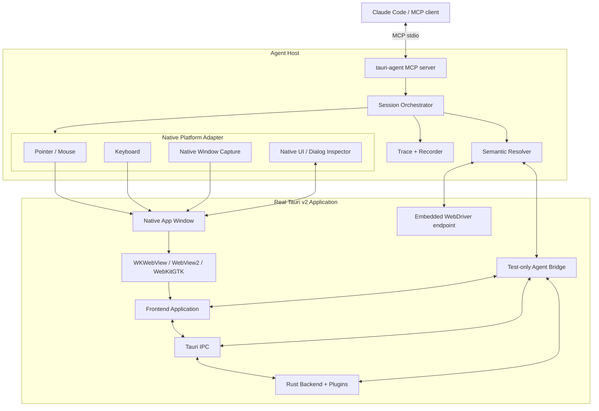
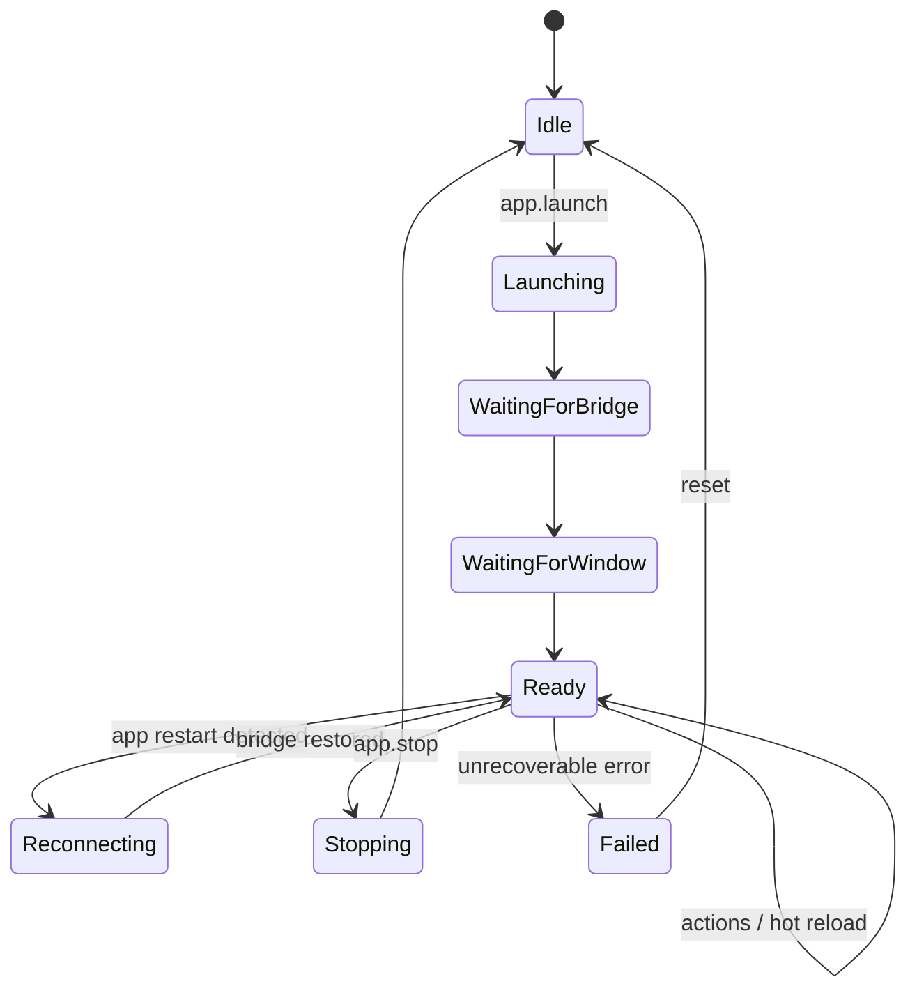
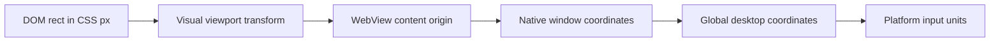
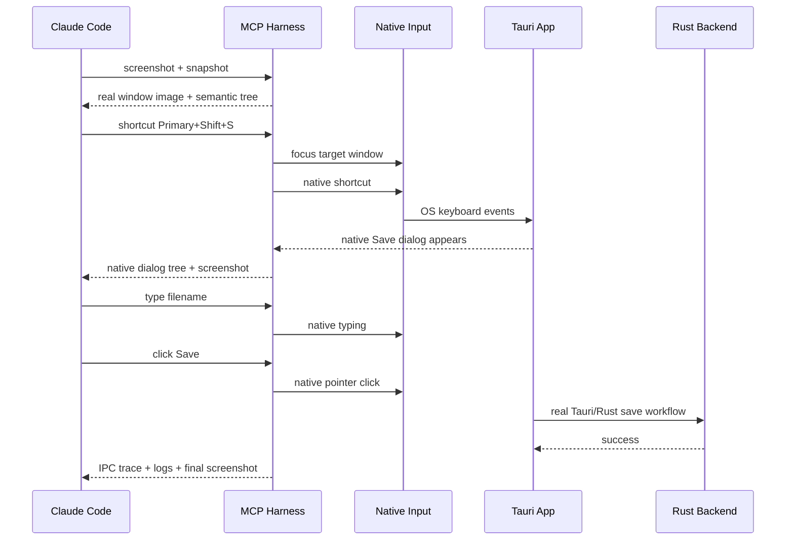
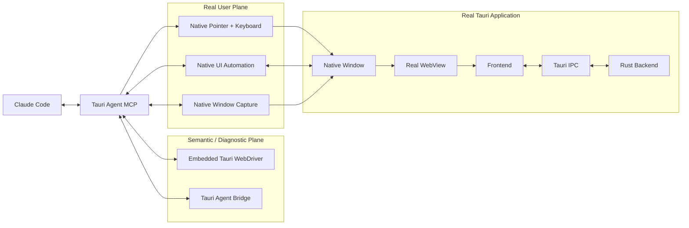

# Tauri v2 Agent-Driven Real-User Testing Harness

**Engineering Specification and Implementation Architecture**  
**Version:** 1.0  
**Date:** 2026-09-13  
**Status:** Proposed architecture  
**Primary target:** Claude Code and other MCP-capable coding agents  
**Application target:** Tauri v2 desktop applications

---

## 1. Executive summary

This document specifies a testing and interaction harness that allows an AI coding agent such as **Claude Code** to operate a **real running Tauri v2 desktop application** in substantially the same way as a human user.

The harness MUST operate on the native window launched by a command such as:

```bash
npm run tauri dev
```

It MUST NOT treat the Vite/React development server at `localhost:1420` as the application under test, because opening that URL in a normal browser does not reproduce the full Tauri runtime, Rust commands, Tauri IPC, native plugins, native windows, application menus, system dialogs, or platform behavior.

The central design decision is a **hybrid semantic + native-input architecture**:

1. **Semantic WebView automation** identifies UI elements using DOM/accessibility information and provides precise geometry.
2. **OS-native input injection** performs mouse, keyboard, drag, hover, wheel, and shortcut actions against the actual native Tauri window.
3. **Native window capture** provides screenshots of what a real user sees, rather than relying only on DOM-to-image rendering.
4. **Tauri-aware observability** captures frontend logs, backend logs, Tauri IPC, windows, and application state for debugging.
5. **MCP** exposes a compact, agent-friendly control surface to Claude Code.
6. **WebDriverIO + Tauri's embedded WebDriver support** remains the standardized deterministic E2E/regression layer.

The agent therefore receives the advantages of both Computer Use and structured test automation:

- it can **see the real application**;
- it can **move a cursor, hover, click, drag, scroll, type, and use keyboard shortcuts**;
- it can manipulate elements by semantic identity rather than guessing pixel coordinates;
- it can interact with canvas/3D/custom-rendered regions by coordinates when semantics are unavailable;
- it can inspect IPC and logs when behavior is wrong;
- it can convert successful interactions into deterministic regression tests.

The default verification mode MUST be **`real_user`**, in which UI acceptance is proven using native input. Direct DOM event dispatch, JavaScript evaluation, or direct Rust command invocation MUST be treated as diagnostic operations and MUST NOT count as proof that a user-facing workflow works.

---

## 2. Background and current ecosystem

Tauri currently recommends **WebdriverIO with `@wdio/tauri-service`** for WebDriver-based Tauri testing. Its default embedded provider runs a WebDriver server inside the application and supports Windows, Linux, and macOS, including macOS where traditional `tauri-driver` cannot directly drive WKWebView. The service also provides Tauri-specific execution, IPC mocking, and frontend/backend log capture when its companion plugin is enabled.

References:

- Tauri WebDriver documentation: https://v2.tauri.app/develop/tests/webdriver/
- WebdriverIO Tauri service: https://webdriver.io/docs/wdio-tauri-service/
- WebdriverIO Tauri plugin setup: https://webdriver.io/docs/desktop-testing/tauri/plugin-setup/

WebdriverIO also provides an MCP server capable of attaching to an existing W3C WebDriver endpoint, including a desktop WebView bridge such as Tauri. It can expose elements, accessibility information, screenshots, interactions, and session-to-code export to MCP clients such as Claude Code.

Reference:

- https://github.com/webdriverio/mcp

There are also Tauri-specific agent projects such as **mcp-server-tauri** and **tauri-pilot**. These demonstrate useful patterns including semantic snapshots, screenshots, IPC inspection, multi-window control, record/replay, agent references, and OS-level keyboard injection.

References:

- https://github.com/hypothesi/mcp-server-tauri
- https://github.com/mpiton/tauri-pilot

However, **no single WebView-only tool is sufficient for the strongest interpretation of “simulate a real user”**. Native menus, title bars, permission prompts, open/save dialogs, some global shortcuts, and true pointer behavior live outside the DOM. The proposed architecture therefore combines Tauri/WebView introspection with platform-native automation.

---

## 3. Goals

### 3.1 Primary goal

Enable a coding agent to autonomously test a Tauri v2 application by interacting with the **actual native application window** as a user would, while preserving access to Tauri-specific diagnostics.

### 3.2 Functional goals

The system MUST support:

- launching and stopping a Tauri development build;
- attaching to an already-running Tauri development build;
- taking screenshots of the real native application window;
- obtaining semantic UI information from the WebView;
- moving the visible cursor;
- hovering elements and arbitrary coordinates;
- left, middle, right, and double clicking;
- mouse-down and mouse-up as separate operations;
- dragging elements;
- dragging through an arbitrary path;
- press-and-hold and drop-target dwell;
- vertical and horizontal wheel scrolling;
- typing text;
- sending individual keys;
- holding and releasing modifiers;
- keyboard shortcut chords such as `Cmd+S`, `Ctrl+Shift+P`, `Escape`, and arrow-key navigation;
- application-level and, where supported, global shortcuts;
- focus management;
- multiple Tauri windows;
- WebView elements and canvas-like coordinate interaction;
- native menus and native system dialogs through an OS automation backend;
- frontend console logs;
- Rust/backend logs;
- passive Tauri IPC observation;
- optional direct IPC invocation for debugging only;
- before/after screenshots and semantic state changes;
- action recording and replay;
- export of stable regression tests.

### 3.3 Agent usability goals

The API MUST be optimized for AI agents rather than humans writing low-level WebDriver commands.

The agent SHOULD normally be able to say, conceptually:

```text
inspect the current window
hover the Save button
capture a screenshot with the tooltip visible
click Save
verify the Rust save command was invoked
press Cmd+Shift+S
interact with the native Save dialog
```

without knowing platform-specific automation APIs.

### 3.4 Quality goals

The system MUST prioritize:

- fidelity over raw test speed in `real_user` mode;
- deterministic element resolution;
- safe focus handling;
- correct coordinate transformation;
- high-fidelity screenshots;
- clear error reporting;
- traceability of every action;
- isolation from production builds;
- cross-platform abstraction without hiding unavoidable platform differences.

---

## 4. Non-goals

The initial system is NOT intended to:

- replace unit tests;
- replace Rust integration tests;
- replace frontend component tests;
- treat a browser opened at the frontend development port as equivalent to Tauri;
- guarantee physical hardware equivalence for every OS input device;
- automate UAC/secure-desktop surfaces that the operating system intentionally blocks;
- bypass OS security permissions;
- provide stealth or invisible user-input injection;
- ship testing backdoors in production builds;
- use direct Rust command invocation as proof that the corresponding UI works.

---

## 5. Terminology

### 5.1 Real Tauri application

A process created by Tauri containing:

- the actual Tauri runtime;
- the actual native WebView;
- the actual Rust backend;
- actual Tauri IPC;
- actual registered plugins;
- actual application windows.

### 5.2 Semantic automation

Interaction based on DOM, accessibility tree, roles, names, selectors, or element references.

### 5.3 Native input

Input that enters through the operating system's input or UI-automation path instead of JavaScript `dispatchEvent()` or direct DOM method calls.

### 5.4 Diagnostic action

An operation that helps inspect or debug the app but does not simulate a user, such as:

- execute JavaScript;
- invoke a Tauri command directly;
- set internal state;
- mock IPC;
- mutate DOM programmatically.

### 5.5 Authoritative screenshot

A screenshot captured from the actual native window/compositor rather than reconstructed from HTML.

---

## 6. Fidelity model

The harness MUST explicitly distinguish interaction fidelity.

### 6.1 `real_user` mode — default for acceptance

`real_user` MUST:

- use semantic inspection only to locate/understand targets;
- perform pointer and keyboard interaction through the native input adapter;
- focus the actual native application window before input;
- capture native screenshots;
- allow native dialogs/windows to participate in the flow.

Example:

```text
Find Save button using accessibility
        ↓
Obtain its current screen-space bounds
        ↓
Move OS cursor to center
        ↓
Native mouseDown
        ↓
Native mouseUp
        ↓
Observe DOM/IPC/log changes
        ↓
Native screenshot
```

### 6.2 `webview` mode — deterministic fast automation

Uses embedded WebDriver/WebView-level actions.

Appropriate for:

- CI regression tests;
- fast smoke tests;
- cases where native input is unavailable;
- deterministic repetitive interaction.

It MUST NOT be labeled equivalent to native input when validating native menus, dialogs, global shortcuts, or true pointer behavior.

### 6.3 `diagnostic` mode

May use:

- JavaScript evaluation;
- direct Tauri command execution;
- direct event emission;
- IPC mocking;
- internal state inspection.

Diagnostic actions MUST be marked in traces and MUST NOT satisfy a user-flow acceptance assertion by themselves.

---

## 7. High-level architecture



### 7.1 Design principle

**The semantic channel discovers. The native channel acts. The observability channel explains.**

This separation is mandatory because it prevents the test harness from confusing “I can call the implementation directly” with “the user can successfully perform the workflow.”

---

## 8. Major components

### 8.1 MCP control plane

Implement a single MCP server, provisionally named:

```text
tauri-agent-mcp
```

Responsibilities:

- manage session lifecycle;
- start/attach/reconnect to Tauri;
- expose agent tools;
- route actions to semantic or native backends;
- enforce fidelity rules;
- manage element references;
- correlate input with traces;
- store screenshots and recordings;
- normalize cross-platform errors;
- prevent unsafe production attachment by default.

Preferred implementation language: **TypeScript/Node.js**, because:

- Claude Code has excellent MCP interoperability with Node tooling;
- WebdriverIO is Node-native;
- platform tools can be launched as subprocesses;
- JSON-schema/MCP tool definitions are natural in TypeScript.

The MCP process MUST survive frontend hot reloads and SHOULD survive Tauri app restarts so that it can reconnect automatically.

---

### 8.2 Tauri agent bridge

A test-only Tauri plugin, provisionally:

```text
tauri-plugin-agent-bridge
```

Responsibilities:

- identify the running app instance;
- enumerate Tauri windows/WebViews;
- expose WebView geometry;
- report scale factor and display information;
- expose passive frontend/backend log streams;
- expose passive IPC tracing;
- optionally expose JavaScript evaluation for diagnostics;
- optionally expose direct command invocation for diagnostics;
- provide state needed for precise WebView-to-screen coordinate mapping.

It MUST NOT be present in production binaries.

The bridge SHOULD use a local Unix domain socket on macOS/Linux and a protected named pipe on Windows where practical. If TCP/WebSocket is used, it MUST bind only to loopback by default and MUST use a per-launch random authentication token.

---

### 8.3 Embedded WebDriver semantic backend

The system SHOULD use the current Tauri/WebdriverIO embedded WebDriver path as the standardized semantic backend.

Recommended components:

- `tauri-plugin-wdio-webdriver`;
- `tauri-plugin-wdio` where advanced Tauri integration/log forwarding is required;
- WebdriverIO client connection from the MCP host;
- optionally `@wdio/tauri-service` for formal tests.

The embedded endpoint is especially valuable because it provides a cross-platform WebDriver abstraction including macOS WKWebView support in the Tauri testing stack.

The MCP host SHOULD be able to attach to the endpoint as an externally managed WebDriver session rather than forcing WebdriverIO to own the app lifecycle.

---

### 8.4 Native input adapter

The native input adapter is the most important addition beyond normal WebDriver automation.

It MUST provide a uniform API across supported platforms while delegating to platform-appropriate implementations.

#### macOS

Preferred v1 backend:

- **Appium Mac2 / XCTest** for native UI interaction;
- ScreenCaptureKit for high-fidelity capture where a custom capture path is implemented.

Appium Mac2 currently supports macOS-native click, hover, click-and-drag, key input, screenshots, and W3C mouse actions. It is backed by Apple's XCTest framework.

Reference:

- https://github.com/appium/appium-mac2-driver

A later optimized backend MAY call CoreGraphics/Accessibility APIs directly to reduce latency and external process requirements, but this SHOULD NOT block v1.

Required permissions MUST be documented and validated at startup, including Accessibility and Screen Recording where necessary.

#### Windows

Preferred v1 backend:

- **Microsoft WinApp CLI** for UI inspection and real input injection.

Current WinApp CLI supports OS-level click, hover, drag, wheel scrolling, keyboard injection, screenshots, screen recording, touch, and pen. Its real-input verbs use the interactive desktop and the target must be foregrounded.

References:

- https://learn.microsoft.com/windows/apps/dev-tools/winapp-cli/ui-automation
- https://devblogs.microsoft.com/ifdef-windows/windows-app-development-cli-v0-5-0-expanded-ui-automation-js-ts-bindings-and-more/

Windows screenshot capture SHOULD use Windows Graphics Capture when available to preserve the actual DWM-composited surface.

#### Linux / Wayland

Preferred architecture:

- semantic native UI: AT-SPI where needed;
- input: libei via the XDG RemoteDesktop portal on Wayland;
- screenshot/capture: XDG Desktop Portal/PipeWire where appropriate;
- X11 fallback: XTest/enigo or equivalent.

libei is specifically designed for emulated input on the Wayland stack and feeds accepted events into the compositor input pipeline.

References:

- https://libinput.pages.freedesktop.org/libei/
- https://libinput.pages.freedesktop.org/libei/api/index.html

The Linux implementation MUST detect whether the session is Wayland or X11 and select the correct backend.

---

### 8.5 Native capture adapter

Native screenshots are an authoritative requirement.

#### macOS

Preferred capture:

- ScreenCaptureKit single-window capture using a filter for the Tauri window.

Apple supports filtering capture to one desktop-independent window.

References:

- https://developer.apple.com/documentation/screencapturekit/sccontentfilter
- https://developer.apple.com/documentation/screencapturekit/capturing-screen-content-in-macos

#### Windows

Preferred capture:

- Windows Graphics Capture of the target HWND/window;
- full-screen crop mode when tooltips, menus, or detached overlays need inclusion.

#### Linux

Preferred capture:

- XDG screenshot portal for compatible environments;
- active-window or compositor/PipeWire capture when supported;
- X11-specific window capture fallback.

The XDG Screenshot portal v3 defines screen, window, area, and active-window targets.

Reference:

- https://flatpak.github.io/xdg-desktop-portal/docs/doc-org.freedesktop.portal.Screenshot.html

---

## 9. Application launch model

### 9.1 Dedicated agent build mode

Do not enable agent instrumentation in every debug build by default.

Provide an explicit command such as:

```bash
npm run tauri:agent
```

Conceptually:

```json
{
  "scripts": {
    "tauri:agent": "tauri dev --features agent-testing"
  }
}
```

### 9.2 Cargo feature

Use an explicit feature:

```toml
[features]
default = []
agent-testing = [
  "dep:tauri-plugin-wdio-webdriver",
  "dep:tauri-plugin-wdio",
  "dep:tauri-plugin-agent-bridge"
]
```

Registration MUST be compile-time gated:

```rust
#[cfg(feature = "agent-testing")]
{
    // register testing/agent plugins
}
```

The final production build MUST NOT contain:

- WebDriver server;
- agent bridge;
- arbitrary JS evaluation endpoint;
- direct IPC execution endpoint;
- agent authentication token handling.

### 9.3 Agent environment

Suggested environment variables:

```text
TAURI_AGENT=1
TAURI_WEBDRIVER_PORT=4445
TAURI_AGENT_SESSION_ID=<uuid>
TAURI_AGENT_TOKEN=<random-secret>
```

The token MUST be generated per launch and communicated to the local MCP process without logging it into normal application logs.

---

## 10. Session lifecycle

### 10.1 Session states



### 10.2 Readiness criteria

The session MUST NOT report `Ready` until:

- Tauri process exists;
- at least one target window exists;
- native window identifier is known;
- semantic/WebDriver endpoint is reachable;
- coordinate mapping metadata is available;
- selected native input backend reports healthy;
- screenshot backend reports healthy or a clearly documented degraded mode is selected.

### 10.3 Hot reload

A frontend hot reload SHOULD preserve:

- native app process;
- native window association;
- MCP session;
- action history.

Semantic element references MAY become stale and MUST be revision-checked before reuse.

---

## 11. Window model

Every window MUST be represented with a normalized object similar to:

```json
{
  "id": "win-main",
  "tauriLabel": "main",
  "nativeId": "platform-specific-id",
  "title": "My Application",
  "pid": 12345,
  "focused": true,
  "visible": true,
  "minimized": false,
  "outerBounds": { "x": 100, "y": 80, "width": 1280, "height": 800 },
  "contentBounds": { "x": 100, "y": 108, "width": 1280, "height": 772 },
  "scaleFactor": 2.0,
  "displayId": "display-1",
  "webviews": ["webview-main"]
}
```

Required operations:

- list windows;
- inspect window;
- focus;
- activate/foreground;
- minimize;
- restore;
- maximize where supported;
- resize;
- move;
- close;
- switch active target.

The system MUST distinguish:

- Tauri application windows;
- Tauri WebViews;
- native system dialogs owned by the app;
- transient menus/popovers where the OS exposes them;
- unrelated windows.

---

## 12. Semantic UI model

### 12.1 Snapshot

The semantic snapshot SHOULD prioritize accessibility semantics over raw HTML.

Example:

```text
window "Project - OneCAD"
  toolbar
    button "New project" [ref=@e1]
    button "Open project" [ref=@e2]
    button "Save project" [ref=@e3]
  main
    region "Viewport" [ref=@e4]
    slider "Zoom" value="80" [ref=@e5]
```

### 12.2 Snapshot modes

Provide:

- `interactive` — actionable elements only;
- `accessibility` — full semantic tree;
- `dom` — selected DOM details for debugging;
- `diff` — differences since a previous revision.

The default for agents SHOULD be `interactive`.

### 12.3 Stable references

Element refs such as `@e3` MUST contain an internal fingerprint, not merely an array index.

Recommended fingerprint inputs:

1. `data-testid` if present;
2. accessibility role;
3. accessible name;
4. stable DOM id;
5. relevant label association;
6. selector fallback;
7. DOM ancestry fingerprint;
8. bounding rectangle only as a weak last-resort signal.

### 12.4 Stale reference protection

Every semantic state has a revision:

```text
revision = 184
```

Before an action, the target MUST be re-resolved.

If the element:

- disappeared;
- changed identity;
- moved unexpectedly while animating;
- is occluded;
- is outside the active target window;

then the action MUST fail safely rather than click stale coordinates.

---

## 13. Coordinate system and mapping

Correct coordinate mapping is a critical requirement.

### 13.1 Input coordinate spaces

The system must understand at least:

- DOM CSS pixels;
- WebView viewport coordinates;
- Tauri content-area coordinates;
- native window logical coordinates;
- global desktop coordinates;
- physical screenshot pixels;
- per-display scale factors;
- multi-monitor origins including negative coordinates.

### 13.2 Mapping pipeline



### 13.3 Required mapping inputs

The bridge MUST provide or allow calculation of:

- `getBoundingClientRect()`;
- current scroll offsets;
- `devicePixelRatio`;
- visual viewport scale/offset where relevant;
- WebView bounds inside the window;
- native window content origin;
- platform scale factor;
- display origin.

### 13.4 Calibration

On session start and after a meaningful geometry change, the system SHOULD run a lightweight calibration/consistency check.

Examples:

- compare WebView-reported dimensions against native content bounds;
- verify target screen point falls inside the native window;
- optionally move the cursor to a known safe target and confirm hover state.

### 13.5 Geometry invalidation

Recalculate mapping after:

- window resize;
- window move;
- display change;
- full-screen transition;
- display scale-factor change;
- WebView zoom change;
- layout-changing native titlebar mode;
- application entering/exiting maximized state.

---

## 14. Pointer and mouse requirements

### 14.1 Required primitive operations

The native input layer MUST expose:

```text
move
hover
button_down
button_up
click
double_click
right_click
middle_click
drag
drag_path
scroll
```

### 14.2 Pointer move

`pointer.move` MUST support:

- element ref;
- selector;
- window-relative coordinate;
- WebView-relative coordinate;
- global desktop coordinate;
- optional target offset;
- configurable duration;
- configurable path interpolation.

Example conceptual input:

```json
{
  "target": "@e42",
  "position": "center",
  "durationMs": 250
}
```

The system SHOULD emit intermediate native move events rather than teleport the pointer for workflows where hover/mousemove behavior matters.

### 14.3 Hover

`pointer.hover` MUST:

1. foreground/focus the target window if requested;
2. move to the target through native input;
3. emit no button-down event;
4. remain at the target for a configurable dwell period;
5. allow the app to render hover state or tooltip;
6. optionally capture a screenshot after settling.

Default dwell recommendation:

```text
500–800 ms
```

This is a policy default, not a hard protocol requirement.

### 14.4 Click

`pointer.click` MUST support:

- left/right/middle button;
- click count;
- down/up interval;
- optional modifier keys;
- target element or raw coordinate;
- target offsets.

A click in `real_user` mode MUST NOT call DOM `.click()`.

### 14.5 Drag

A drag MUST be represented as a real sequence:

```text
move to start
mouse down
optional hold
multiple intermediate move events
optional destination dwell
mouse up
```

Parameters:

```json
{
  "from": "@source",
  "to": "@destination",
  "button": "left",
  "holdMs": 100,
  "durationMs": 650,
  "steps": 20,
  "dwellMs": 150
}
```

### 14.6 Arbitrary drag path

Needed for:

- drawing;
- CAD view navigation;
- sliders;
- 3D camera manipulation;
- selection rectangles;
- custom canvas components.

Example:

```json
{
  "points": [
    { "x": 100, "y": 100 },
    { "x": 130, "y": 110 },
    { "x": 170, "y": 150 },
    { "x": 210, "y": 190 }
  ],
  "space": "webview",
  "button": "left",
  "durationMs": 900
}
```

### 14.7 Scroll

Support:

- vertical wheel;
- horizontal wheel;
- discrete steps;
- pixel/delta-like semantic amount;
- element-targeted scroll;
- coordinate-targeted scroll.

In `real_user` mode, the preferred path is native wheel input.

---

## 15. Keyboard requirements

### 15.1 Required primitives

```text
keyboard.type_text
keyboard.press
keyboard.key_down
keyboard.key_up
keyboard.shortcut
keyboard.release_all
```

### 15.2 Text entry

`type_text` MUST be distinct from clipboard paste.

Modes MAY include:

- native keystroke typing;
- paste via clipboard for large text when explicitly requested;
- WebDriver typing in non-real-user mode.

For user-fidelity verification, native key injection is preferred.

### 15.3 Shortcuts

Shortcut abstraction SHOULD support `Primary`:

```text
Primary+S
```

Mapping:

- macOS: `Command+S`;
- Windows: `Control+S`;
- Linux: `Control+S`.

It MUST also allow explicit platform modifiers:

- Command;
- Control;
- Option/Alt;
- Shift;
- Meta/Super;
- Function where backend support exists.

### 15.4 Key lifecycle safety

Every action must prevent stuck modifiers.

On action failure, timeout, reconnect, or session teardown:

```text
keyboard.release_all
```

MUST run best-effort.

### 15.5 Focus

Before keyboard input, the harness MUST verify:

- target app is foreground;
- expected window is active;
- intended element is focused when element focus matters.

If focus cannot be guaranteed, fail instead of sending keys to an unrelated application.

---

## 16. Native application surfaces

WebView DOM automation cannot fully cover native surfaces. The native automation adapter MUST handle or explicitly detect them.

### 16.1 Required native scenarios

- Open File dialog;
- Save File dialog;
- application menu bar;
- native context menus where applicable;
- permission prompts where the OS exposes automation access;
- titlebar controls;
- minimize/maximize/restore;
- native secondary windows;
- tray/menu-bar UI where feasible;
- system alerts owned by the app.

### 16.2 Native-element semantic tree

The MCP API SHOULD expose a normalized native tree for these surfaces:

```text
dialog "Save"
  textbox "Save As" [native-ref=@n1]
  pop-up-button "Where" [native-ref=@n2]
  button "Cancel" [native-ref=@n3]
  button "Save" [native-ref=@n4]
```

Native refs and WebView refs MUST use different namespaces.

### 16.3 Secure surfaces

If the OS intentionally prohibits input injection, return a clear structured error such as:

```text
SECURE_DESKTOP_NOT_AUTOMATABLE
```

Do not attempt bypasses.

---

## 17. Screenshot specification

### 17.1 Screenshot modes

Expose:

```text
window
webview
screen
region
window_context
```

#### `window`

Native window capture including actual rendered content and window chrome where available.

#### `webview`

Capture the actual WebView surface if the platform allows it. This is distinct from HTML reconstruction.

#### `screen`

Full display capture.

#### `region`

Explicit physical or logical region.

#### `window_context`

Capture enough of the screen around the app to include transient tooltips, menus, popovers, or dialogs that may not be part of the main window's composited surface.

### 17.2 Screenshot output

Each capture SHOULD produce:

```json
{
  "path": ".tauri-agent/artifacts/session-123/shot-0042.png",
  "width": 2560,
  "height": 1600,
  "pixelScale": 2,
  "captureMode": "window",
  "windowId": "win-main",
  "timestamp": "...",
  "cursorIncluded": false
}
```

### 17.3 Agent token efficiency

The MCP tool SHOULD return:

- a reduced-size inline preview for the agent;
- the path to the full-resolution PNG;
- metadata.

Never force full-resolution base64 into normal MCP text output unless explicitly requested.

### 17.4 Screenshot source of truth

For visual acceptance, native capture MUST be the source of truth.

DOM/SVG/canvas re-rendering MAY be used as a fallback or debugging artifact but MUST be labeled non-authoritative.

### 17.5 Automatic screenshots

Configurable policies:

- never;
- on failure;
- after every action;
- after state-changing actions only;
- explicit only.

Recommended local-agent default:

```text
after state-changing actions + on failure
```

---

## 18. Waiting and stabilization

Desktop applications are asynchronous. The agent must not capture state immediately after an action without allowing it to settle.

### 18.1 Wait strategies

Support:

- element exists;
- element visible;
- element hidden;
- text appears;
- text disappears;
- window appears;
- window closes;
- IPC command observed;
- IPC response observed;
- console event observed;
- DOM revision changes;
- DOM becomes stable;
- animation/frame stability heuristic;
- fixed short delay only as last resort.

### 18.2 Automatic settle

After normal actions, the harness SHOULD perform a bounded settle phase.

Possible heuristic:

1. wait for at least one animation frame;
2. sample semantic/layout revision;
3. wait a short quiet interval;
4. if mutation continues, continue until stable or timeout;
5. capture after-state even on timeout and return a warning.

Continuous animations MUST NOT block forever.

---

## 19. Tauri IPC observability

### 19.1 Passive monitoring

The harness SHOULD passively correlate Tauri IPC with user actions.

Example trace:

```text
A-102 click @e3 "Save project"
  ├─ pointer moved to (842, 116)
  ├─ mouse down
  ├─ mouse up
  ├─ invoke: save_project({ path: "..." })
  ├─ backend: INFO project saved
  ├─ invoke response: ok
  ├─ DOM: status changed "Saving" → "Saved"
  └─ screenshot: A-102-after.png
```

### 19.2 Direct invocation

A diagnostic tool MAY expose:

```text
debug.invoke_tauri_command
```

but it MUST:

- require `diagnostic` mode;
- be visually marked in traces;
- never satisfy a UI acceptance step by itself.

### 19.3 Mocking

Tauri IPC mocking MAY be used in targeted regression tests, but `real_user` acceptance SHOULD use the real backend unless the test explicitly concerns failure injection.

---

## 20. Logging and diagnostics

Capture and timestamp:

- WebView console log;
- JavaScript errors;
- unhandled promise rejections;
- Rust stdout/stderr;
- tracing/log crate output where available;
- WebDriver errors;
- native automation errors;
- focus changes;
- window lifecycle;
- IPC calls and responses.

Logs SHOULD be tagged with:

```text
sessionId
actionId
windowId
source
timestamp
severity
```

Secret-redaction rules MUST be configurable.

---

## 21. MCP tool surface

The MCP surface should be high-level and compact. Avoid exposing dozens of platform-specific commands directly to the agent.

### 21.1 Session/application

```text
session.start
session.status
session.stop
app.launch
app.restart
app.stop
```

### 21.2 Window

```text
window.list
window.inspect
window.focus
window.resize
window.move
window.close
```

### 21.3 Semantic UI

```text
ui.snapshot
ui.diff
ui.find
ui.inspect
```

### 21.4 Screenshot

```text
ui.screenshot
```

### 21.5 Pointer

```text
pointer.move
pointer.hover
pointer.click
pointer.down
pointer.up
pointer.drag
pointer.drag_path
pointer.scroll
```

### 21.6 Keyboard

```text
keyboard.type_text
keyboard.press
keyboard.shortcut
keyboard.down
keyboard.up
keyboard.release_all
```

### 21.7 Wait

```text
wait.for
```

### 21.8 Observability

```text
observe.logs
observe.ipc
observe.trace
```

### 21.9 Recording

```text
record.start
record.stop
record.replay
test.export
```

### 21.10 Diagnostics

```text
debug.eval_js
debug.invoke_tauri_command
debug.emit_tauri_event
```

Diagnostic tools SHOULD be grouped clearly so the agent understands they are not user actions.

---

## 22. Unified target model

Actions should accept a consistent target type.

Conceptual schema:

```ts
type Target =
  | { ref: string }
  | { testId: string }
  | { role: string; name?: string }
  | { text: string }
  | { css: string }
  | { xpath: string }
  | { point: { x: number; y: number; space: CoordinateSpace } };
```

Priority when agent supplies natural semantics:

1. current element ref;
2. role + accessible name;
3. test id;
4. stable id;
5. text;
6. CSS/XPath;
7. coordinate.

Raw screen coordinate SHOULD be a last resort except for canvas/3D interactions.

---

## 23. Action result contract

Every action SHOULD return a common envelope.

```json
{
  "actionId": "A-102",
  "status": "ok",
  "mode": "real_user",
  "windowId": "win-main",
  "target": {
    "ref": "@e3",
    "role": "button",
    "name": "Save project"
  },
  "resolvedPoint": { "x": 842, "y": 116, "space": "global" },
  "state": {
    "beforeRevision": 184,
    "afterRevision": 186
  },
  "effects": {
    "ipcCalls": 1,
    "consoleErrors": 0,
    "newWindows": 0
  },
  "screenshot": {
    "path": ".tauri-agent/artifacts/.../A-102-after.png"
  },
  "warnings": [],
  "timingsMs": {
    "resolve": 8,
    "input": 241,
    "settle": 172,
    "capture": 91
  }
}
```

This contract makes agent reasoning much easier than raw protocol responses.

---

## 24. Recording, replay, and regression export

### 24.1 Automatic action journal

Every MCP action MUST be journaled.

The journal MUST include enough information to replay semantically rather than merely replaying old coordinates.

### 24.2 Replay format

Use a simple declarative format such as YAML or JSON.

Example:

```yaml
name: save-current-project
mode: real_user
steps:
  - snapshot: {}
  - click:
      role: button
      name: Save project
  - wait:
      ipc: save_project
  - assert:
      text: Saved
  - screenshot:
      name: saved-state
```

### 24.3 WebDriverIO export

The system SHOULD support generating a deterministic WebdriverIO regression test from a successful session.

This may use WebdriverIO MCP/session code-generation concepts where useful.

The generated test SHOULD prefer semantic selectors and MUST NOT blindly export physical coordinates when a stable semantic selector exists.

### 24.4 Native acceptance replay

For bugs involving:

- hover;
- drag;
- keyboard shortcut;
- native dialog;
- titlebar;
- OS menu;

retain a `real_user` replay test in addition to any WebDriver test.

---

## 25. Claude Code operating policy

A project using this harness SHOULD include explicit agent instructions.

Suggested normative policy:

```text
When verifying Tauri UI behavior:

1. Test the real Tauri application, not localhost in a browser.
2. Start or attach to the agent-enabled Tauri build.
3. Begin with a native screenshot and semantic snapshot.
4. Use real_user actions by default.
5. Prefer role/name or test-id targeting over CSS and coordinates.
6. Use native pointer interaction for hover, click, drag, and scroll.
7. Use native keyboard input for keyboard behavior and shortcuts.
8. After significant state changes, inspect the resulting screenshot.
9. If behavior fails, inspect logs and passive IPC traces.
10. Do not use direct IPC or JavaScript execution to claim a user flow works.
11. Diagnostic direct invocation may be used only to isolate a problem.
12. Re-run the workflow through the UI after fixing the problem.
13. Convert important successful flows or bug reproductions into regression tests.
```

---

## 26. Example agent workflow

### Scenario: test Save with keyboard and native dialog



This test verifies far more than a browser test at port 1420:

- shortcut registration;
- focus;
- native dialog creation;
- text input;
- pointer interaction;
- Tauri IPC/Rust execution;
- final UI state.

---

## 27. Canvas, WebGL, CAD, and 3D application support

For CAD/3D applications, semantic DOM is often insufficient because the important interaction surface is a canvas.

The harness MUST therefore treat pixel/coordinate interaction as a first-class capability rather than merely a fallback error case.

Required functionality:

- native screenshot of canvas;
- move cursor to exact viewport coordinate;
- hover with dwell;
- left/middle/right-button drag;
- arbitrary drag paths;
- wheel zoom;
- modifier + drag combinations;
- keyboard shortcut + mouse combinations;
- press-and-hold;
- screenshot immediately after manipulation;
- optional visual region crop for model viewport.

Example:

```text
hold Shift
middle-button drag from (650,420) to (810,460)
release Shift
scroll +4 wheel steps over viewport center
capture viewport screenshot
```

The native backend is especially important here because applications may respond to trusted mouse-move streams, button state, pointer capture, wheel behavior, and shortcut modifiers.

---

## 28. Accessibility and application development guidelines

The harness will work better when the app is built with accessible semantics.

### 28.1 Preferred control markup

Prefer:

```html
<button
  aria-label="Save project"
  data-testid="project-save"
>
  ...
</button>
```

Avoid interaction-only anonymous containers such as:

```html
<div onclick="save()">
  ...
</div>
```

### 28.2 Locator priority

Application developers SHOULD provide `data-testid` only where semantic role/name is insufficient or unstable.

The preferred test locator is still the user-visible semantic contract:

```text
role=button, name="Save project"
```

because this also validates accessibility.

### 28.3 Canvas

Canvas-based tools SHOULD expose any practical semantic overlay/state information to the testing bridge, but the harness MUST remain capable of testing pure coordinate interactions.

---

## 29. Security model

### 29.1 Compile-out requirement

Agent/testing control surfaces MUST be compiled out of production builds.

This is stronger than simply checking `debug_assertions`.

Use an explicit Cargo feature.

### 29.2 Local-only transport

Default transport MUST be local-only:

- Unix domain socket with owner-only permissions on macOS/Linux; or
- named pipe with current-user ACL on Windows; or
- loopback TCP only when necessary.

Never bind control endpoints to `0.0.0.0` by default.

### 29.3 Authentication

Generate a random session token for every app launch.

The bridge MUST reject unauthenticated control clients.

### 29.4 Same-user validation

Where the OS exposes peer identity, validate the peer belongs to the same user.

### 29.5 Diagnostic endpoint permissions

Potentially dangerous operations MUST be separately gated:

- arbitrary JS evaluation;
- direct IPC command invocation;
- file/system state inspection;
- event injection.

### 29.6 Secret redaction

Traces and logs MAY contain:

- bearer tokens;
- API keys;
- user content;
- file paths;
- credentials.

Provide configurable redaction patterns before writing long-term artifacts.

---

## 30. Cross-platform capability matrix

| Capability | macOS | Windows | Linux Wayland | Linux X11 |
|---|---:|---:|---:|---:|
| Real Tauri WebView semantic access | Yes | Yes | Yes | Yes |
| Embedded Tauri WebDriver | Yes | Yes | Yes | Yes |
| Native window screenshot | Yes | Yes | Yes* | Yes |
| Real pointer move | Yes | Yes | Yes* | Yes |
| Hover | Yes | Yes | Yes* | Yes |
| Click / right-click | Yes | Yes | Yes* | Yes |
| Drag path | Yes | Yes | Yes* | Yes |
| Native keyboard input | Yes | Yes | Yes* | Yes |
| Shortcut chords | Yes | Yes | Yes* | Yes |
| Native UI tree | XCTest/AX | UIA | AT-SPI | AT-SPI |
| Native open/save dialog | Yes | Yes | Environment-dependent | Environment-dependent |
| Requires interactive desktop for real input | Yes | Yes | Yes | Yes |

`*` Wayland capability depends on compositor/portal support and granted RemoteDesktop/capture permissions.

---

## 31. CI strategy

### 31.1 Two test lanes

Use two distinct lanes.

#### Lane A — deterministic Tauri E2E

Use:

- `@wdio/tauri-service`;
- embedded WebDriver;
- semantic interactions;
- real Rust/Tauri backend.

Run frequently in CI.

#### Lane B — real-user desktop acceptance

Use:

- real GUI session;
- native input backend;
- native screenshots;
- native dialogs/menus where applicable.

Run:

- on self-hosted GUI runners;
- before releases;
- nightly;
- for regressions specifically involving native behavior.

### 31.2 Interactive desktop constraints

Real input cannot be assumed to work in a locked/headless session.

Windows WinApp CLI documentation explicitly distinguishes real-input operations from UIA-only operations and requires an unlocked interactive desktop for injected input.

macOS native UI automation similarly requires proper Accessibility permissions and exclusive control considerations.

Therefore the CI scheduler MUST ensure only one native input test owns a given interactive desktop at a time.

### 31.3 Parallelism

WebDriver semantic tests MAY run in parallel where supported.

Native HID tests SHOULD be serialized per desktop session.

---

## 32. Error model

Normalize failures into stable machine-readable codes.

Examples:

```text
APP_NOT_RUNNING
BRIDGE_UNAVAILABLE
WEBDRIVER_UNAVAILABLE
WINDOW_NOT_FOUND
WINDOW_NOT_FOREGROUND
ELEMENT_NOT_FOUND
ELEMENT_STALE
ELEMENT_MOVING
ELEMENT_OCCLUDED
POINT_OUTSIDE_WINDOW
FOCUS_FAILED
NATIVE_INPUT_PERMISSION_DENIED
SCREEN_CAPTURE_PERMISSION_DENIED
NO_INTERACTIVE_DESKTOP
SECURE_DESKTOP_NOT_AUTOMATABLE
PORTAL_PERMISSION_DENIED
ACTION_TIMEOUT
SETTLE_TIMEOUT
NATIVE_DIALOG_NOT_FOUND
UNSUPPORTED_PLATFORM_CAPABILITY
```

Errors SHOULD include:

- human explanation;
- suggested remediation;
- current screenshot when safe/useful;
- relevant logs;
- window state;
- target resolution information.

---

## 33. Performance and reliability targets

These are engineering targets rather than protocol guarantees.

### 33.1 Latency

On a local development machine, target:

- semantic snapshot: normally below 250 ms;
- semantic element resolution: normally below 100 ms;
- pointer dispatch overhead excluding configured motion duration: below 100 ms;
- native screenshot: normally below 500 ms;
- MCP orchestration overhead: small relative to OS action/capture time.

### 33.2 Reliability

For stable, visible semantic controls:

- target-resolution success should exceed 99% in repeated local runs;
- stale-coordinate clicks should be treated as failures, not silently executed;
- focus safety must prioritize avoiding input to the wrong application over completion speed.

### 33.3 Token efficiency

Default agent responses SHOULD return:

- compact semantic snapshots;
- diffs after actions;
- reduced screenshot previews;
- summarized IPC/log deltas;

while preserving full artifacts on disk.

---

## 34. Suggested repository structure

```text
project/
├── src/
├── src-tauri/
│   ├── Cargo.toml
│   ├── tauri.conf.json
│   ├── tauri.agent.conf.json
│   └── src/
│
├── tools/
│   └── tauri-agent/
│       ├── package.json
│       ├── src/
│       │   ├── mcp/
│       │   ├── session/
│       │   ├── semantic/
│       │   ├── trace/
│       │   ├── platform/
│       │   │   ├── macos/
│       │   │   ├── windows/
│       │   │   └── linux/
│       │   └── webdriver/
│       └── tests/
│
├── crates/
│   └── tauri-plugin-agent-bridge/
│
├── e2e/
│   ├── webdriver/
│   ├── real-user/
│   └── scenarios/
│
├── .tauri-agent/
│   └── artifacts/       # gitignored
│
├── .mcp.json
└── CLAUDE.md
```

---

## 35. Suggested configuration

Conceptual configuration:

```ts
export default {
  app: {
    command: "npm run tauri:agent",
    cwd: ".",
    readyTimeoutMs: 60_000
  },

  webdriver: {
    host: "127.0.0.1",
    port: 4445,
    browserName: "tauri"
  },

  interaction: {
    defaultMode: "real_user",
    settleTimeoutMs: 3_000,
    focusBeforeInput: true,
    rejectMovingTargets: true
  },

  screenshots: {
    backend: "native",
    auto: "state-changing-actions",
    previewMaxWidth: 1600,
    format: "png"
  },

  platform: {
    macos: {
      inputBackend: "appium-mac2",
      captureBackend: "screencapturekit"
    },
    windows: {
      inputBackend: "winapp",
      captureBackend: "windows-graphics-capture"
    },
    linux: {
      inputBackend: "auto",
      captureBackend: "auto"
    }
  },

  security: {
    localOnly: true,
    requireSessionToken: true,
    diagnosticsEnabled: true
  }
};
```

---

## 36. Technology decisions

### 36.1 Use WebDriverIO rather than Playwright as the standardized WebView backend

Reasoning:

- Tauri officially documents/recommends the WebdriverIO Tauri service;
- embedded WebDriver enables macOS support;
- WebdriverIO has Tauri-specific plugins;
- WebdriverIO has a current MCP server and session export;
- Playwright's strongest native WebView path is WebView2/Chromium-specific, while WKWebView is not CDP.

Playwright-like community bridges can remain optional integrations.

### 36.2 Do not use WebDriver alone for real-user acceptance

Reasoning:

- it does not fully cover native OS surfaces;
- it can bypass actual cursor behavior;
- native keyboard shortcuts/global shortcuts may have different behavior;
- window chrome and native dialogs require native automation.

### 36.3 Do not use pure pixel Computer Use as the primary architecture

Reasoning:

- fragile targeting;
- unnecessary token cost;
- no built-in IPC/log correlation;
- no semantic selectors;
- less deterministic.

Visual control remains important, but it should be enhanced by semantics.

### 36.4 Use hybrid semantic targeting + native actuation

This is the central architecture because it provides both:

- deterministic understanding;
- realistic input.

---

## 37. Implementation phases

### Phase 0 — architecture spike

Primary platform: macOS.

Goals:

- launch Tauri with embedded WebDriver;
- attach MCP controller;
- retrieve semantic snapshot;
- capture native screenshot;
- resolve an element to screen coordinates;
- native hover;
- native click;
- native drag;
- `Cmd+S` shortcut;
- observe resulting IPC/logs.

Exit criterion:

A Claude Code agent can operate a small test Tauri application without using the browser dev URL.

### Phase 1 — macOS production-quality local workflow

Implement:

- robust coordinate mapping;
- Appium Mac2 integration;
- ScreenCaptureKit capture;
- multi-window;
- native file dialogs;
- traces;
- record/replay;
- diagnostic IPC/log tools;
- stale-element protection;
- permission diagnostics.

### Phase 2 — Windows

Implement:

- WinApp CLI adapter;
- Windows Graphics Capture;
- UIA/native dialog support;
- shortcut mapping;
- multi-window/HWND handling.

### Phase 3 — Linux

Implement:

- session detection;
- Wayland libei/XDG RemoteDesktop adapter;
- XDG screenshot/capture integration;
- AT-SPI native UI semantics;
- X11 fallback.

### Phase 4 — regression export and CI

Implement:

- scenario files;
- WebDriverIO export;
- native acceptance runner;
- JUnit output;
- screenshot/video artifacts;
- failure bundles.

### Phase 5 — visual regression and advanced input

Potential additions:

- perceptual screenshot comparison;
- dynamic-region masks;
- video recording;
- touch/pen input;
- multi-monitor stress tests;
- IME input;
- richer canvas/3D gesture primitives.

---

## 38. Required acceptance tests for the harness itself

The harness MUST be tested against a dedicated Tauri fixture application containing representative controls and native features.

### 38.1 Pointer

- hover button and reveal tooltip;
- left click;
- right click;
- double click;
- press-and-hold;
- drag reorder item;
- drag slider;
- arbitrary canvas path;
- wheel scroll;
- horizontal scroll.

### 38.2 Keyboard

- type into text field;
- Shift-modified characters;
- arrow navigation;
- Escape;
- Tab focus traversal;
- `Primary+S`;
- `Primary+Shift+S`;
- key-down held while mouse dragging;
- recover after action failure without stuck modifier.

### 38.3 Screenshots

- main window normal DPI;
- HiDPI/Retina;
- tooltip visible;
- dropdown/popover;
- native dialog;
- custom font rendering;
- canvas/WebGL surface;
- moved window on secondary display.

### 38.4 Windowing

- create second Tauri window;
- switch target;
- resize;
- move;
- minimize/restore;
- close secondary window;
- ensure refs remain isolated by window.

### 38.5 IPC

- click triggers real Tauri invoke;
- trace captures command and response;
- failed Rust command is correlated with UI error;
- diagnostics can invoke command directly but action is marked diagnostic.

### 38.6 Native dialog

- open file dialog;
- inspect native elements;
- type path/name;
- confirm;
- verify Rust/frontend receives selected file.

### 38.7 Safety

- target moves before click -> action rejected/re-resolved;
- app loses foreground before key input -> no input sent;
- screenshot permission missing -> clear error;
- agent feature absent in production binary -> attach fails cleanly;
- control socket rejects wrong token/user.

---

## 39. Example success criteria for Claude Code

The following natural-language tasks SHOULD be achievable without manually writing a test script first:

### Example A — hover validation

```text
Open the Settings window. Hover every icon in the left toolbar and verify each one displays a tooltip. Capture a screenshot for any missing or visually clipped tooltip.
```

### Example B — drag validation

```text
Open a project, drag the second item above the first item using the real pointer, and verify the order persists after reopening the project.
```

### Example C — shortcut validation

```text
Make a change, press Cmd+S on macOS, verify a real save IPC command occurs, then confirm the unsaved indicator disappears.
```

### Example D — CAD viewport

```text
Move the cursor over the 3D viewport, orbit using the expected modifier and mouse button, zoom with the wheel, then take a native screenshot and verify the model remains visible and the toolbar is unaffected.
```

### Example E — native file picker

```text
Click Import, interact with the real operating-system file dialog, choose the fixture STEP file, and verify the imported model appears in the application.
```

---

## 40. Definition of done

Version 1 of the harness is complete when:

1. Claude Code can launch or attach to a real Tauri v2 dev application.
2. Claude can receive a semantic view of the active WebView.
3. Claude can receive a native screenshot of the active app window.
4. Claude can move the real cursor to a semantic element or coordinate.
5. Claude can hover and observe hover-only states.
6. Claude can click with left/right/middle buttons.
7. Claude can perform realistic drag and arbitrary drag paths.
8. Claude can wheel-scroll.
9. Claude can type with native keyboard input.
10. Claude can execute platform keyboard shortcuts.
11. Claude can interact with at least the platform's normal Open/Save dialog.
12. Claude can target multiple Tauri windows.
13. User actions can be correlated with frontend logs, Rust logs, and Tauri IPC.
14. Diagnostic direct IPC/JS operations are available but clearly separated from user actions.
15. Every action has a trace and optional before/after screenshot.
16. Important sessions can be replayed.
17. Successful flows can be exported into regression tests.
18. The agent bridge and automation server are absent from production builds.
19. The architecture works on macOS first and has defined adapters for Windows and Linux.
20. A real-user acceptance suite verifies cursor, hover, drag, shortcuts, screenshots, and native dialogs.

---

## 41. Final recommended architecture

The recommended long-term structure is:



The most important rule is:

> **Use structured semantics to understand the UI, but use native input to prove that the user can operate it.**

This gives coding agents substantially better capabilities than either browser-only E2E or generic screenshot-only Computer Use. The agent can see the rendered product, understand its controls semantically, exercise real native input, interact with OS surfaces, and inspect Tauri/Rust behavior when something fails.

---

## 42. Primary references

1. Tauri v2 — WebDriver testing  
   https://v2.tauri.app/develop/tests/webdriver/

2. WebdriverIO — Tauri Service  
   https://webdriver.io/docs/wdio-tauri-service/

3. WebdriverIO — Tauri Plugin Setup  
   https://webdriver.io/docs/desktop-testing/tauri/plugin-setup/

4. WebdriverIO MCP  
   https://github.com/webdriverio/mcp

5. MCP Server Tauri  
   https://github.com/hypothesi/mcp-server-tauri

6. Tauri Pilot  
   https://github.com/mpiton/tauri-pilot

7. Appium Mac2 Driver  
   https://github.com/appium/appium-mac2-driver

8. Microsoft WinApp CLI UI Automation  
   https://learn.microsoft.com/windows/apps/dev-tools/winapp-cli/ui-automation

9. Microsoft WinApp CLI v0.5.0 announcement  
   https://devblogs.microsoft.com/ifdef-windows/windows-app-development-cli-v0-5-0-expanded-ui-automation-js-ts-bindings-and-more/

10. Apple ScreenCaptureKit  
    https://developer.apple.com/documentation/screencapturekit

11. libei — Emulated Input  
    https://libinput.pages.freedesktop.org/libei/

12. XDG Desktop Portal Screenshot API  
    https://flatpak.github.io/xdg-desktop-portal/docs/doc-org.freedesktop.portal.Screenshot.html

---

**End of specification**
